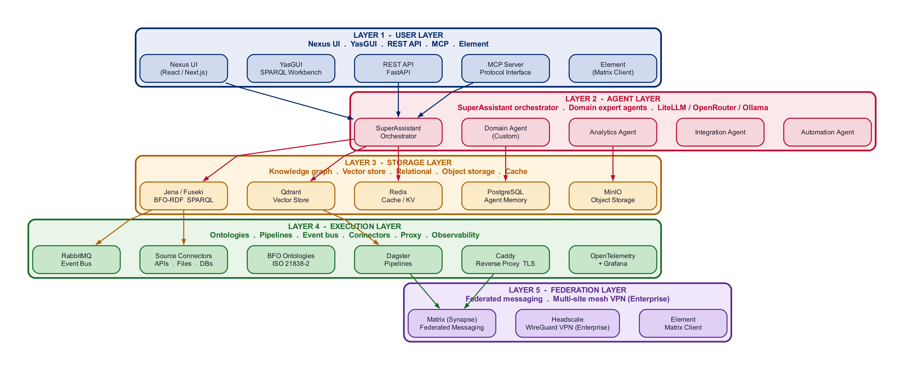

<div align="center">


# ABI

_Agentic Brain Infrastructure_

</div>

<div align="center">

[](https://github.com/jupyter-naas/abi/releases)
[](https://www.python.org/downloads/)
[](https://opensource.org/licenses/MIT)
[](https://fastapi.tiangolo.com/)

[](https://github.com/jupyter-naas/abi/stargazers)
[](https://github.com/jupyter-naas/abi/network/members)
[](https://github.com/jupyter-naas/abi/graphs/contributors)

</div>

> The open-source agentic intelligence platform. ABI is how NaasAI distributes. NaasAI is how ABI becomes a business.

⭐ **Star and follow to stay updated.**

---

## What ABI Is

ABI is an open-source agentic intelligence platform. It connects your organization's data, processes, and AI models into a single operating system you own outright.

Your analysts ask questions. Agents decompose them, collect data across sources, and return structured, sourced answers with a full audit trail. Every output links back to the question that triggered it. Every fact in the knowledge base has a provenance record: where it came from, when it was ingested, which model processed it.

No proprietary runtime. No vendor lock-in. No black box.

[NaasAI](https://naas.ai) builds on top of it. So can you.

---

## Architecture

**Five-Layer AI Operating System:**

| Layer                | Role                                                                                                                                                                                                                                                                               |
| -------------------- | ---------------------------------------------------------------------------------------------------------------------------------------------------------------------------------------------------------------------------------------------------------------------------------- |
| **User Layer**       | Nexus Web UI, YasGUI SPARQL workbench, REST API, MCP Protocol, Element (Matrix client)                                                                                                                                                                                             |
| **Agent Layer**      | SuperAssistant orchestrator + 20+ domain expert agents                                                                                                                                                                                                                             |
| **Storage Layer**    | Knowledge Graph (Jena/Fuseki), Vector DB (Qdrant), Relational (PostgreSQL), Object Storage (MinIO), Cache (Redis). BFO's shared formal vocabulary enables semantic federation: any system aligned to the same ontology can query and exchange knowledge without custom connectors. |
| **Execution Layer**  | BFO ontologies, Dagster pipelines, RabbitMQ event bus, source connectors, Caddy reverse proxy, OpenTelemetry observability                                                                                                                                                         |
| **Federation Layer** | Matrix/Synapse: decentralized, encrypted, multi-site messaging. Headscale WireGuard VPN mesh (Enterprise).                                                                                                                                                                         |

<div align="center">


_ABI five-layer architecture: User, Agent, Storage, Execution, Federation_

</div>

---

## Platform Capabilities

| Capability                       | Description                                                                              | ABI Implementation                                                                                                           |
| -------------------------------- | ---------------------------------------------------------------------------------------- | ---------------------------------------------------------------------------------------------------------------------------- |
| **01. Secure LLM Access**        | Model hosting, PII guardrails, multi-provider routing, validation and oversight          | LiteLLM proxy (OpenAI, Anthropic, Mistral, Google, Meta), OpenRouter gateway, Ollama / vLLM for fully air-gapped deployments |
| **02. Observability**            | Full trace pipeline from query to output, model performance tracking, usage metering     | OpenTelemetry + Prometheus + Grafana, per-query request tracing, model catalog with cost and latency tracking                |
| **03. Context Engineering**      | Structured ingestion of data, logic, and action context from heterogeneous sources       | Source connectors (APIs, files, databases, web), RabbitMQ async event bus, Dagster pipeline orchestration                    |
| **04. Ontology System**          | Formal knowledge representation linking all entities to a standards-based upper ontology | BFO ISO 21838-2 seven-bucket classification, Jena / Fuseki RDF triple store, SPARQL query interface                          |
| **05. Vector and Compute**       | Semantic search, embedding storage, multimodal compute for unstructured data             | Qdrant vector store, Jena SPARQL graph queries, MinIO document and object processing                                         |
| **06. Security and Governance**  | Role-based access, data classification marking, audit trails, compliance checkpoints     | Keycloak OIDC / RBAC / MFA (Enterprise), per-query audit log, BFO provenance chain on every assertion                        |
| **07. Agent Lifecycle**          | Building, orchestrating, and evaluating domain-specific AI agents                        | SuperAssistant orchestrator, 20+ domain expert agents, evaluation suites, MCP server integration                             |
| **08. Operational Automation**   | Scheduled, event-driven, and API-triggered automation workflows                          | RabbitMQ event triggers, Dagster scheduled and event-driven pipelines, FastAPI REST + WebSocket                              |
| **09. Development Environments** | Integrated tooling for agent development, testing, and extension                         | VS Code + MCP server, Python SDK, Jupyter notebooks, full local Docker stack                                                 |
| **10. Human+AI Applications**    | Decision-support interfaces combining AI outputs with human judgment                     | Nexus Web UI (React), YasGUI SPARQL workbench, Element Matrix client, analyst review workflows                               |
| **11. Package, Release, Deploy** | Containerized deployment, dependency management, environment promotion                   | Docker Compose + OpenTofu, Helm charts, hexagonal ports-and-adapters architecture                                            |
| **12. Enterprise Automation**    | End-to-end automated intelligence production from question to scored output              | Question decomposition engine, collection gap detection, human feedback loop, adaptive agent re-tasking                      |

---

## Quick Start

```bash
# Prerequisites: uv, Docker Desktop
curl -LsSf https://astral.sh/uv/install.sh | sh

# Clone and install
git clone https://github.com/jupyter-naas/abi.git
cd abi
uv sync --all-extras

# Start infrastructure
docker compose up -d postgres fuseki rabbitmq redis qdrant minio

# Start platform
uv run abi stack start
```

**Platform endpoints:**

- Service Portal (all UIs): http://localhost:8080
- YasGUI (SPARQL workbench): http://localhost:3000
- Nexus UI: http://localhost:3042
- Nexus API: http://localhost:9879
- MCP Server: http://localhost:8000
- Fuseki: http://localhost:3030
- Dagster: http://localhost:3001
- Element (Matrix client): http://localhost:8081
- Matrix (Synapse): http://localhost:8008

**CLI:**

```bash
uv run abi stack start|stop|status|logs
uv run abi chat
```

Full setup guide: [docs/get_started.md](./docs/get_started.md)

---

## Services

| Service        | Port       | Purpose                                 |
| -------------- | ---------- | --------------------------------------- |
| Service Portal | 8080       | Single-page navigation for all UIs      |
| YasGUI         | 3000       | SPARQL query workbench                  |
| Nexus Web      | 3042       | Analyst / user interface                |
| Nexus API      | 9879       | Platform REST API                       |
| MCP Server     | 8000       | MCP protocol (Claude Desktop / VS Code) |
| Caddy          | 80/443     | Reverse proxy / TLS                     |
| Dagster        | 3001       | Pipeline orchestration UI               |
| Fuseki         | 3030       | RDF knowledge graph (SPARQL)            |
| PostgreSQL     | 5432       | Structured state / agent memory         |
| Qdrant         | 6333       | Vector store                            |
| MinIO          | 9000/9001  | Object storage                          |
| RabbitMQ       | 5672/15672 | Event bus / management UI               |
| Redis          | 6379       | Cache / key-value store                 |
| Matrix/Synapse | 8008/8448  | Federated messaging                     |
| Element Web    | 8081       | Matrix client UI                        |

---

## Why ABI?

Proprietary intelligence platforms are a strategic dependency dressed as a product. When the contract ends or the vendor pivots, you have no exit: your data, your workflows, your institutional knowledge are locked in their runtime.

Linux solved this for operating systems. Red Hat proved it was a $34 billion business model. [NaasAI](https://naas.ai) is applying the same logic to agentic intelligence: ABI is the open, auditable, community-maintained foundation. NaasAI is the commercial layer (deployment, certification, support) for organizations that need it production-ready without carrying the operational weight.

**Built on international standards:**

- [ISO/IEC 21838-2:2021](https://www.iso.org/standard/74572.html): Basic Formal Ontology (BFO), the knowledge layer any auditor, partner, or coalition system can read independently
- [ISO/IEC 42001:2023](https://www.iso.org/standard/42001): AI Management Systems
- EU AI Act compliance-ready

**Active verticals:**

- High-stakes operational environments requiring doctrine-traceable, auditable decision support
- Biomedical research: federally-funded knowledge representation and clinical ontology alignment (two active NIH grants)
- Enterprise process automation: structured knowledge management at audit-grade compliance standards

---

## Research and Institutional Standing

ABI is a collaborative research effort maintained by:

- **[NaasAI](https://naas.ai)**: Applied AI platform and primary maintainer. Co-founded by Travis Oliphant (creator of NumPy, co-creator of SciPy, founder of Anaconda), whose mandate drove the research toward formal ontology as the only rigorous answer to data quality, vocabulary consistency, and traceability problems at organizational scale.
- **[University at Buffalo / NCOR](https://ncor.buffalo.edu/)**: National Center for Ontological Research. Academic home of BFO development, founded by Barry Smith (creator of BFO, co-author of ISO 21838-2). NaasAI works in direct technology partnership with John Beverley, the leading applied BFO researcher and primary custodian of the standard.
- **[OpenTeams](https://openteams.com/)**: Open source infrastructure and community scaling.
- **[Forvis Mazars](https://www.forvismazars.com/)**: Global professional services firm deploying ABI for enterprise knowledge management and structured intelligence workflows.
- **National Institutes of Health**: Technology Partner on two active grants applying the ABI ontological framework to biomedical knowledge representation.

---

## Documentation

| Section                                             | Contents                                             |
| --------------------------------------------------- | ---------------------------------------------------- |
| [Get Started](./docs/get_started.md)                | Installation, configuration, quickstart              |
| [Capabilities](./docs/capabilities/)                | Agents, ontologies, storage, pipelines, workflows    |
| [Developer Toolchain](./docs/developer_tool_chain/) | SPARQL, testing, dependency management               |
| [Distribution](./docs/distribution/)                | API deployment, MCP, marketplace                     |
| [Research](./docs/research/)                        | Ontology design, browser-use, architecture decisions |
| [Troubleshooting](./docs/troubleshooting/)          | Docker conflicts, common issues                      |

---

## Use It

Everything in this repository is free and MIT-licensed. No registration. No usage limits. No vendor lock-in.

|                       |                                                                                    |
| --------------------- | ---------------------------------------------------------------------------------- |
| Full five-layer stack | Agent orchestration, knowledge graph, vector store, pipelines, federated messaging |
| 100% open-source      | Every component MIT or permissive-licensed. Fork it, audit it, own it.             |
| Self-hosted           | Runs on your laptop, your server, your cloud, your edge node                       |
| Model-agnostic        | OpenAI, Anthropic, Google, Mistral, Meta, or fully air-gapped via Ollama / vLLM    |
| BFO-aligned           | ISO 21838-2 ontology grounding out of the box                                      |
| Community support     | GitHub Issues, Discussions, and contributor network                                |

---

## Work With NaasAI

For organizations that need the platform running in production without carrying the operational weight, NaasAI offers a support services agreement. The software stays MIT. You get the team behind it.

|                           |                                                                                                          |
| ------------------------- | -------------------------------------------------------------------------------------------------------- |
| Managed deployment        | Forward-deployed engineers. We configure, we ship, we stay on the problem.                               |
| Ontology certification    | NCOR-backed formal certification of BFO alignment for procurement, audit, and coalition interoperability |
| SLA and incident response | Dedicated support, upgrade management, and defined response commitments                                  |
| Compliance readiness      | EU AI Act, ISO 42001, and sector-specific frameworks: regulated industries, healthcare, financial services |

[support@naas.ai](mailto:support@naas.ai) · [naas.ai](https://naas.ai)

---

## Contributing

We welcome contributions. See [CONTRIBUTING.md](./CONTRIBUTING.md) for guidelines.

## License

MIT. See [LICENSE](https://opensource.org/licenses/MIT)
