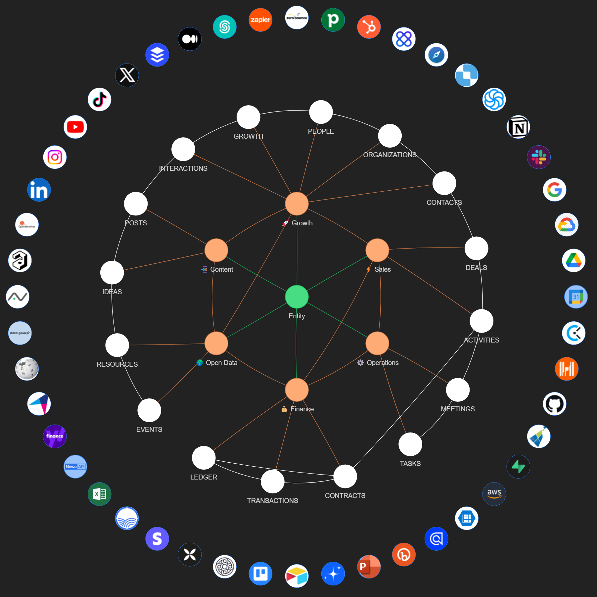

# ABI

The AI System for Everyday Business.



## Context

In the current landscape, numerous CEOs have recognized the power of chatGPT and expressed a desire to integrate it into their businesses. However, they often lack the necessary framework and guidance to do so effectively. This documentation section presents a solution that we are actively researching. Although still in the research stage, this particular solution is designed to create not an Artificial General Intelligence (AGI), but an Artificial Business Intelligence (ABI). The goal is to empower different companies to create and customize AI systems, enabling them to ride the current wave of AI advancements.

## Concepts

### ABI vs AGI

We aim at enabling businesses to create their own AI, an “Artificial Business Intelligence” (ABI) rather than pursuing Artificial General Intelligence (AGI). Here is why.

Unlike OpenAI, Naas does not aim at creating a system with human-like general intelligence that can perform any intellectual task. Naas acknowledges that AGI is a complex and challenging goal, requiring advancements in various AI domains. Instead, Naas adopts a more pragmatic approach by focusing on the practical application of AI techniques within specific business processes and domains. It leverages generative AI models and foundation engines to enhance business operations and decision-making without aiming to achieve the comprehensive intelligence of AGI.

ABI refers to applying AI techniques in business settings to enhance decision-making, automate processes, and generate business outcomes. Naas aims to create data products combined with AI to drive business success, such as increasing revenue and optimizing operations. It utilizes advanced algorithms, machine learning models, and data analysis and automation to provide valuable insights and improve efficiency within specific business domains.

While AGI aims for human-like general intelligence, Naas focuses on leveraging AI to drive business success through practical applications and domain-specific solutions

### Foundation Engines

Foundation Engines are pre-built data products that serve as a starting point for companies to build ABI and tailor it to their specific needs. These engines offer powerful data-driven solutions across various business functions, including content, growth, sales, operations, finance, and open data. By using these engines as a foundation, organizations can customize and expand upon them to create unique data products that address their specific challenges and drive new opportunities for growth and innovation.

Each Foundation Engine includes a set of plugins that can be used independently or combined to create even more powerful and comprehensive data products. These modules are designed to work seamlessly together, enabling organizations to build tailored solutions that leverage the full capabilities of the Naas platform.

### Plugins

Plugins within a Foundation Engine encompass workflows that exist within the various features of the engine. These plugins are modular components that can be independently utilized or combined to create comprehensive and specialized data products. Each plugin represents a specific workflow, addressing a particular aspect of the business process. By integrating these plugins, organizations can build tailored solutions that align with their unique requirements. The seamless integration of these workflows within the Foundation Engine enables businesses to leverage the full capabilities of the engine, optimizing their operations and driving efficient and effective decision-making.

## Solutions

We are continually improving and refining our six core engines, which are serving as robust data feeds for ABI:

**Content Engine: Increase Reach and Boost Engagement**

1. **Content Performance Analytics:** Monitor content engagement metrics, such as views, likes, and shares, to identify high-performing content and optimize your content strategy.
2. **AI-Driven Content Generation:** Leverage large language models to generate relevant and engaging content, reducing the time and effort required to create compelling material.
3. **Content Optimization Recommendations:** Receive AI-driven recommendations to improve content quality, readability, and SEO, driving increased audience engagement and reach.

**Growth Engine: Get Qualified Contacts**

1. **Social Media Listening and Analytics:** Monitor social media platforms for mentions, trends, and conversations relevant to your industry, helping you identify potential leads and influencers.
2. **AI-Powered Lead Scoring:** Utilize AI algorithms to score and prioritize leads, ensuring that your sales team focuses on the most promising opportunities.
3. **Network Expansion Strategies:** Receive AI-driven recommendations for expanding your network and increasing your total addressable market through targeted outreach and engagement.

**Sales Engine: Generate Deal Opportunities**

1. **CRM Data Visualization and Insights:** Visualize and analyze your CRM data, providing a clear overview of your sales pipeline and deal progress.
2. **Prospect Interaction Scoring:** Track and score prospect interactions, allowing you to focus on highly engaged leads and optimize your sales efforts.
3. **Product Analytics-Driven Signals:** Leverage product usage data to identify customer needs and pain points, enabling your sales team to tailor their approach and close deals more effectively.
4. **Meeting assistant & sales process optimization:** Transform your notes in actionable items to follow up with your prospect. Transform memos to close you deal and generate data on what works.

**Operations Engine: Create a Single Source of Truth and Automate Tedious Tasks**

1. **Company Activity Dashboard:** Monitor and visualize key company activities, providing a centralized overview of your organization’s performance.
2. **Data Integration and Automation:** Streamline and automate data workflows to eliminate manual tasks and ensure data consistency across your organization.
3. **AI-Powered Task Prioritization and Optimization:** Receive AI-driven recommendations for optimizing operations, helping your team focus on high-impact tasks and projects.

**Finance Engine: Visualize Financial Statements in Real-Time**

1. **Financial Transaction Tracking and Analysis:** Monitor and analyze financial transactions, providing real-time visibility into your organization’s financial health.
2. **AI-Driven Financial Forecasting:** Utilize AI algorithms to predict future financial performance, enabling proactive decision-making and resource allocation.
3. **Automated Financial Statement Generation:** Generate financial statements and reports with minimal manual intervention, streamlining financial reporting and analysis.

**Open Data Engine: Understand the World Around You**

1. **Financial Market Analysis:** Aggregate and analyze open financial market data to identify trends, risks, and opportunities that impact your organization.
2. **Health and Environmental Data Insights:** Monitor and visualize health and environmental data, enabling your organization to understand the implications of global trends and events.
3. **AI-Powered Trend Identification and Forecasting:** Leverage AI algorithms to identify emerging trends and forecast their impact on your organization, allowing you to make data-driven strategic decisions.

## Core Model

Naas provides robust Foundation Engines and Plugins, which constitute the core model of our data product solutions. These models are designed to facilitate distinct business functions and can be tailored to address the unique needs and challenges of your organization.

### Abstractions

The core model is based on six key abstraction items: Content, Interaction, Sequence, Task, Transaction, and Resource.

1. **Content**: At the heart of our core model is the creation and management of quality content. Our data product solutions enable organizations to generate, optimize, and disseminate content that effectively communicates their value proposition and engages their target audience.
2. **Interaction**: Our solutions also encompass growth marketing strategies to maximize audience interaction. Through strategic content distribution and audience engagement tactics, companies can enhance their visibility, attract and retain customers, and foster growth.
3. **Sequence**: We offer tools and methodologies to streamline the sales conversion process. Our Sequence abstraction allows organizations to guide potential customers through a structured sales funnel, from awareness to interest, decision, and finally, action.
4. **Task**: Operational efficiency is central to our core model. Our data product solutions provide companies with tools to manage their operational tasks effectively. This includes project management, task delegation, and tracking, all aimed at enhancing productivity and efficiency.
5. **Transaction**: Naas also provides solutions for effective financial management. With our Transaction abstraction, companies can manage their financial transactions efficiently, ensuring the financial health, profitability, and sustainability of their organization.
6. **Resource**: The final element of our core model is the leveraging of open data intelligence. Our Resource abstraction involves utilizing market research, competitor analysis, and customer behavior analysis to inform business strategies, drive innovation, and maintain a competitive edge.

Each abstraction item is the underlying data model of their respective engine: 

- Content: Content engine
- Interaction: Growth engine
- Sequence: Sales engine
- Task: Operation engine
- Transaction: Finance engine
- Resource: Open Data engine

### Relationship between Core Model, Foundation Engines, and Plugins

The relationship between plugins, engines, and the core model can be understood in the context of their roles in a system:

- **Core Model** is the fundamental structure that serves as the base for all operations. It encapsulates the main business abstractions and logic, providing the basis for the system’s functionality. It’s like the backbone of the system.
- **Foundation Engines** are built upon this Core Model. They provide pre-built data products that align with the abstractions of the Core Model, offering solutions for specific business functions like content, growth, sales, operations, finance, and open data. They leverage the Core Model to provide their services.
- **Plugins** are additional components that can be added to the Foundation Engines to enhance their functionality or provide new capabilities. They can either subscribe to the Core Model, meaning they adhere to and extend the system’s existing abstractions, or they can provide additional functionality not covered by the Core Model. Plugins offer flexibility and customization, allowing organizations to tailor their data products to their specific needs.

In summary, the Core Model provides the basic structure, the Foundation Engines use this structure to deliver specific business solutions, and the Plugins offer the ability to enhance these solutions or add new capabilities. 

### Core Model & Plugins Alignment

The notion of Plugins subscribing or not to the Core Model is a crucial aspect of Naas’s data product solutions. This feature provides a high degree of customization and flexibility to organizations, allowing them to tailor the data solutions to their specific needs.

**Plugin combined to Foundation Engines**

Plugins are modules or extensions added to the Foundation Engines they enhance their functionality or provide additional capabilities. Each Plugin is designed to perform a specific function and can be used independently or in combination with other Plugins and Foundation Engines.

When we say a Plugin “subscribes” to the Core Model, it means that the Plugin aligns with and supports the functionalities provided by the core abstraction items (Content, Interaction, Sequence, Task, Transaction, Resource). These Plugins will seamlessly integrate with the Core Model to expand upon its functionalities, creating a comprehensive and powerful data product solution. For instance, a Plugin that subscribes to the “Interaction” abstraction might provide advanced analytics for measuring user engagement and interaction.

**Standalone Plugin**

On the other hand, a Plugin that does not subscribe to the Core Model is one that provides functionalities outside the scope of the core abstraction items. These Plugins offer unique features that may not directly relate to the Core Model but can still add value to the overall data product solution. For example, a Plugin providing capabilities for real-time communication or chat functionality may not directly align with any of the core abstraction items, but it can still enhance the overall user experience and efficiency of the data solution.

Whether a Plugin subscribes to the Core Model or not, the key point is that it offers organizations the ability to customize their data product solutions and therefore their . By selecting and combining different Plugins, companies can create tailored solutions that best meet their specific business needs and goals.

## Building Your ABI

This section provides a step-by-step guide on how to build your Artificial Business Intelligence (ABI).

### Pre-requisites

The first step in building your ABI is to ensure that you have a GitHub account. 
If you do not yet have one, you can create it for free at GitHub's website. 
Once you have your account, you will need to create a new organization. 
This organization will serve as the home for your forked ABI repository. 

#### Forking the ABI Repository

To get started, you will need to fork this repository into your own GitHub organization. 
This essentially creates a copy of the repository that you can modify and manage independently of the original source. 

Here's how to fork the ABI repository:

1. Click on the "Fork" button. A new screen will appear asking where you want to fork the repository.
2. Select your GitHub organization from the list. The repository will then be forked to your organization, and you'll be redirected to your new, forked repository.

Now that you have forked the ABI repository, you can proceed with building your ABI in the custom folder of each engines.

### Pull / Push from main abi repository

**;TL/DR** 
```bash
# Add  remote
git remote add abi https://github.com/jupyter-naas/abi.git

# Push to main branch
git push abi main

# Pull from main branch
git pull abi main
```

---

Once you have your fork and own version of the ABI repository, you might want to be able to push/pull to/from the original abi repository to contribute back to the Open Source project.

To do that you need to add a new [git remote](https://git-scm.com/docs/git-remote). A git remote is just a reference to a "remote" location where the project is being hosted/stored.

For example you could have a local git repository, which is hosted on multiple platforms at the same time, so on Github, Gitlab and Bitbucket for example. But on your computer you only want to have a single directory with the project, from which you want to be able to push on a single or all platforms.

#### Create git remote

To create the git remote you just need to execute the following command, from the repository directory (you need to be in your flavoured ABI folder):

```bash
git remote add abi https://github.com/jupyter-naas/abi.git
```

This will create a new git remote named `abi` to which you are now able to push/pull.

#### Pull from abi remote

Now let's say on local you are on the `main` branch, and you want to pull the latest changes from the main branch of the original abi repository (so the `abi` git remote). You need to run:

```bash
git pull abi main
```

This is telling git to pull the `main` branch from the repository hosted at `https://git-scm.com/docs/git-remote`.

#### Push to abi remote

If you want to push to the original ABI project (you might not have the permissions to push to the main branch), but we will imagine that you have, then you just have to run:

```bash
git pull abi main
```

This is telling git to push to the `main` branch of the repository hosted at `https://git-scm.com/docs/git-remote`.

#### Git default remote

When you clone a git repository from Github or any other provider, it will always create a default remote for you, named, `origin`. You might already have asked yourself what this `origin` was. It's your default git remote.

This means that, assuming you are on the `main` branch, executing `git push` is the same as `git push origin main`.

So by default will just use:
- The branch you are actually on
- The `origin` remote. Even if other exists, it will always use `origin` by default.
- 
## Product Owners

* [Florent Ravenel](https://www.linkedin.com/in/florent-ravenel/) - florent@naas.ai
* [Jeremy Ravenel](https://www.linkedin.com/in/ACoAAAJHE7sB5OxuKHuzguZ9L6lfDHqw--cdnJg/) - jeremy@naas.ai
* [Maxime Jublou](https://www.linkedin.com/in/maximejublou/) - maxime@naas.ai


## Acknowledgments

* [Awesome Notebooks](https://github.com/jupyter-naas/awesome-notebooks)
* [Naas Drivers](https://github.com/jupyter-naas/drivers)
* [Naas](https://github.com/jupyter-naas/naas)
* [Naas Data Product](https://github.com/jupyter-naas/naas-data-product)


## Legal

This project is licensed under BSD 3-Clause License
