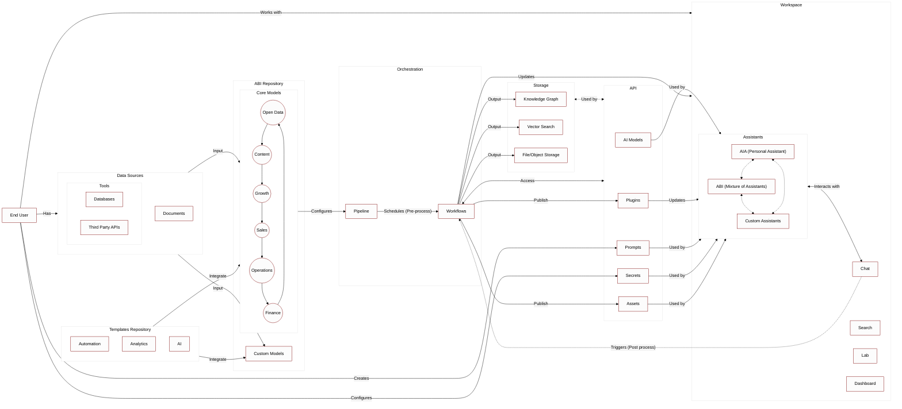

# ABI*: The AI system for your everyday business
*Augmented Business Intelligence


## Mixture of Assistants[]()

ABI is a mixture of AI-driven business intelligence assistants to power your business. This suite of assistants is designed by Naas core team and its design partners to cover business essentials with assistants focused on open data & market intelligence, content creation, growth marketing, sales conversion, operational efficiency and finance management. 

Together, they form a unified system that utilizes external data for richer business insights, enhances content performance and brand awareness, improves lead generation and qualification, streamlines operations and financial transactions. 

ABI's capabilities are further expanded through its integration with a variety of tools, APIs, both official and unofficial, enabling comprehensive data collection and enrichment.

More information in the [documentation](https://docs.naas.ai/usage/abi/introduction#mixture-of-assistants)

## How it works?

### Architecture

ABI is a combination of open source tools and proprietary technology. ABI relies on Naas Workspace and Naas API to function, requiring a token to run. 

We’re building the features of ChatGPT and its GPT Store with **Naas Workspace** and a power orchestration layer with **Naas API** using enterprise-grade, open source technologies.



If you don’t want to use Naas capabilities to run ABI, you can do it but it will require some code refactoring. Our aim is to give developers a openAI-like developer experience using open source tools.

### Installation

#### Local Setup

To set up the project locally, follow the steps below:

```bash
git clone https://github.com/jupyter-naas/abi.git
cd abi
make all
```

#### Requirements

- **Miniconda**: Ensure you have Miniconda installed. You can download it from [here](https://docs.anaconda.com/miniconda/).
- **Docker**: Make sure Docker is installed on your system.

#### Warning for Windows Users

If you are using Windows, you need to use WSL (Windows Subsystem for Linux) with an Ubuntu distribution. Additionally, ensure Docker is installed and properly configured to run within the WSL environment.

#### Accessing the `abi` Kernel

After completing the setup, the `abi` kernel will be installed. You can use this kernel in your VSCode or any other IDE that supports Jupyter kernels.

#### Setup a New Scheduler

To set up a new scheduler, follow these steps:

1. **Edit the `config.yaml` file:**
   
   In the `config.yaml` file, add a new scheduler configuration as shown below:

   ```yaml
   schedulers:
     - name: SchedulerName   # Name of the scheduler
       abi_version: latest   # Version of abi to use. Default is "latest"
       enabled: true         # Enable or disable the scheduler
       cron: '0 9 * * *'     # Cron expression
       steps:                # Steps to run
         - type: notebook    # Type of step. Default is "notebook"
           name: CI tests    # Name of the step
           enabled: true     # Enable or disable the step
           entrypoint: tests/ci.ipynb    # Entrypoint of the step
           environment_variables:        # Environment variables. Optional
             CUSTOM_ENV_VAR: Hello World!
           inputs:                         # Inputs to the step. Will be injected by papermill after the cell tagged "parameters". Optional
             message: "Hello scheduler!"
   ```

2. **Generate the GitHub Action configuration:**

   Once the `config.yaml` file is edited, execute the following command to generate the new GitHub Action configuration:

   ```bash
   make ci-generate-schedulers
   ```

   This will create the new GitHub Action configuration file in `.github/workflows/scheduler__<scheduler name>.yaml`.

3. **Commit and push the changes:**

   Add the new GitHub Action configuration file to the repository, commit the changes, and push to the remote repository:

   ```bash
   git add .github/workflows/scheduler__<scheduler name>.yaml
   git commit -m 'ci: Adding new scheduler ...'
   git push
   ```

By following these steps, you can successfully set up a new scheduler in your project.

## Build Your Own ABI

### Pre-requisites

The first step in building your ABI is to ensure that you have a GitHub account. If you do not yet have one, you can create one for free on GitHub's website. 

Once you have your account, you must create a new organization. This organization will serve as the home for your forked ABI repository.

### Fork ABI Repository

To get started, you must fork this repository into your own GitHub organization.
This will create a copy of the repository that you can modify and manage independently of the original source.

Here's how to fork the ABI repository:

1. Click on the "Fork" button. A new screen will appear, asking where you want to fork the repository.
2. Select your GitHub organization from the list. The repository will then be forked to your organization, and you'll be redirected to your new, forked repository.

Now that you have forked the ABI repository, you can build your own version of ABI in each engine's custom folder.

### Setup Git remote

Once you have forked and created your own version of the ABI repository, you need to establish a Git remote. 

This will enable you to push and pull to and from the original ABI repository. Doing so will allow you to update your project with the latest changes, or contribute back to the open-source project.

Execute the following commands in your terminal:

```bash
# Access your repo
cd "your_directory_name"

# Add  remote
git remote add abi https://github.com/jupyter-naas/abi.git

# Push to main branch
git push abi main

# Pull from main branch
git pull abi main

```

**About Git default remote**

When you clone a git repository from Github or any other provider, it will always create a default remote for you, named, `origin`. You might already have asked yourself what this `origin` was. It's your default git remote.

This means that, assuming you are on the `main` branch, executing `git push` is the same as `git push origin main`.

So by default will just use:

- The branch you are actually on
- The `origin` remote. Even if other exists, it will always use `origin` by default.

## Product Owners

* [Florent Ravenel](https://www.linkedin.com/in/florent-ravenel/) - florent@naas.ai
* [Jeremy Ravenel](https://www.linkedin.com/in/ACoAAAJHE7sB5OxuKHuzguZ9L6lfDHqw--cdnJg/) - jeremy@naas.ai
* [Maxime Jublou](https://www.linkedin.com/in/maximejublou/) - maxime@naas.ai

## Acknowledgments

* [Awesome Notebooks](https://github.com/jupyter-naas/awesome-notebooks)
* [Naas Drivers](https://github.com/jupyter-naas/drivers)
* [Naas Python](https://github.com/jupyter-naas/naas-python)
* [Naas](https://github.com/jupyter-naas/naas)
* [Naas Data Product](https://github.com/jupyter-naas/naas-data-product)

## Legal

This project is licensed under BSD 3-Clause License
