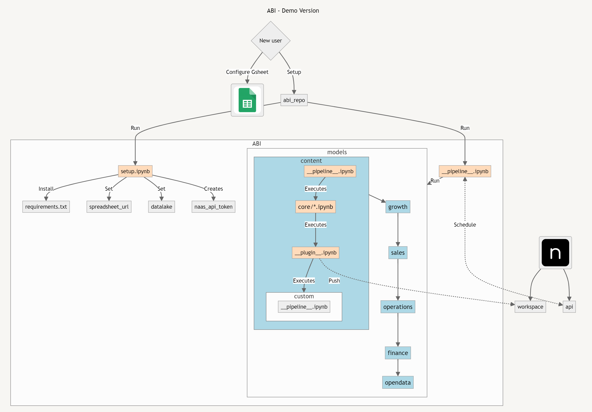

# ABI*: The AI system for your everyday business
*Augmented Business Intelligence


The Naas ABI system offers an innovative approach to Enterprise Data Management, addressing the challenges of integrating Artificial Intelligence (AI) into organizational workflows. By transforming Large Language Models (LLMs) and their Mixture of Experts (MoE) model into a unified Mixture of Assistants (MoA), the system aims to eliminate business silos by facilitating interconnection across business domains, with a focus on improving brand awareness, accelerating sales, and securing cash flow.

## Mixture of Assistants[](https://docs.naas.ai/usage/abi/introduction#mixture-of-assistants)

ABI is a mixture of AI-driven business intelligence assistants to power your business. This suite of assistants is designed by Naas core team and its design partners to cover business essentials with 6 assistants focused on content creation, growth marketing, sales conversion, operational efficiency, finance management and open data & market intelligence. Together, they form a unified system that enhances content performance and brand awareness, improves lead generation and qualification, streamlines operations and financial transactions, and utilizes external data for richer business insights. ABI's capabilities are further expanded through its integration with a variety of tools, APIs, both official and unofficial, enabling comprehensive data collection and enrichment.

## Standard Operating Procedures[](https://docs.naas.ai/usage/abi/introduction#standard-operating-procedures-sops)

ABI adheres to Standard Operating Procedures (SOPs) and connects to business tools via Python engines, following the ETL (Extract, Transform, Load) pipeline paradigm to preprocess data into domain-specific tables (content, marketing, sales, etc.). These tables are then post-processed by AI models for human conversations through a chat interface using plugins. Tools like PowerBI and Tableau can be integrated at as add-on plugins for classical data analysis and visualization.

ABI has two master workflows that form a strategic flywheel, driving continuous improvement and optimization across business domains:

### Content to Build Sales Pipeline

**📲 Content Assistant:** Helps users create content ideas and turn them into posts to raise awareness on social media among a target audience.

**🚀 Growth Assistant:** Analyze social interactions to identify and prioritize marketing qualified leads (MQLs) based on engagement levels and business fit.

**⚡️Sales Assistant:** Nurtures MQLs to sales qualified leads (SQLs) through personalized messaging, deal creation, automated sales activity logging and tasks suggestions aligned with customer profiles.

### Conversations to Optimize Cost and Secure Cash Flow

**⚙️ Operations Assistant:** Manages workflows from SQL to customer satisfaction and retention by capturing conversations, optimizing processes, and aggregating operational assets.

**💰 Finance Assistant:** Prepares contractual documents, invoices, and payment transactions to convert successful sales into secured revenue and cash flow.

**🌍 Open Data & Market Intelligence Assistant:** Integrates real-time market events and trends to enable proactive strategic adjustments, identify upsell opportunities, and prevent customer churn.

These processes dictate the foundational activities of the Assistants, offering a blueprint for data collection and process management. However, the true power of ABI lies in its adaptability; users are encouraged to tailor these SOPs to fit unique requirements, ensuring each Assistant's output aligns perfectly with specific operational goals.

## OBTs and Knowledge Graph[](https://docs.naas.ai/usage/abi/introduction#expanding-the-knowledge-base-with-obts-and-the-abi-knowledge-graph)

Each Assistant specializes in its domain and contributes to an ever-expanding Knowledge Graph through thanks to domain-specific OBTs (One Big Tables). These OBTs encapsulate data in a structured format, serving as the knowledge base for each Assistant. This structured data collection method ensures that every piece of information is captured and categorized via a common ontology, ready to be leveraged for insights, predictions, and strategic decision-making.

When SOPs are executed, Assistants perform their designated tasks and enrich the collective intelligence embodied by ABI's Unified Knowledge Graph, making it a living, learning ecosystem, a unified knowledge framework that enables a deeper understanding and interconnected view of business operations.

## Learn more about each ABI Assistant[](https://docs.naas.ai/usage/abi/introduction#learn-more-about-each-abi-assistant)

- For [Content Creation](https://docs.naas.ai/usage/abi/content-creation)
- For [Growth Marketing](https://docs.naas.ai/usage/abi/growth-marketing)
- For [Sales Conversion](https://docs.naas.ai/usage/abi/sales-conversion)
- For [Operations Efficiency](https://docs.naas.ai/usage/abi/operations-efficiency)
- For [Finance Management](https://docs.naas.ai/usage/abi/finance-management)
- For [Open Data & Market Intelligence](https://docs.naas.ai/usage/abi/opendata-intelligence)

## Customization[](https://docs.naas.ai/usage/abi/introduction#customization)

ABI’s architecture allows for extensive customization. Users can introduce new workflows or modify existing ones within the Naas ABI Repository without impacting the core models. This flexibility ensures your ABI system remains cutting-edge, automatically incorporating the latest updates while preserving your unique customizations.

ABI embodies the intersection of automation and intelligence, designed not just to perform tasks but to learn from them, continuously enhancing its capacity to drive business growth. Through its SOPs, OBTs, and the evolving Knowledge Graph, ABI offers a personalized, intelligent framework for tackling the complexities of modern business environments.

Learn more about ABI Customization with the sections below:

## How it works

ABI is a combination of open source tools and proprietary technology. ABI relies on Naas Workspace and Naas API to function, requiring a token to run. We’re building the features of ChatGPT and its GPT Store with **Naas Workspace and** a power orchestration layer with **Naas API** using enterprise-grade, open source products. If you don’t want to use Naas capabilities to run ABI, you can do it but it will require some code refactoring. Our aim is to give developers a openAI-like developer experience using open source tools.

### Installation

Only on Naas Lab for Pro users. working to make it possible to run it locally.

### Technical Workflow



### LinkedIn Content to Sales Workflow


## Build Your Own ABI

### Pre-requisites

The first step in building your ABI is to ensure that you have a GitHub account. If you do not yet have one, you can create one for free on GitHub's website. Once you have your account, you must create a new organization. This organization will serve as the home for your forked ABI repository.

### Forking the ABI Repository

To get started, you must fork this repository into your own GitHub organization.
This will create a copy of the repository that you can modify and manage independently of the original source.

Here's how to fork the ABI repository:

1. Click on the "Fork" button. A new screen will appear, asking where you want to fork the repository.
2. Select your GitHub organization from the list. The repository will then be forked to your organization, and you'll be redirected to your new, forked repository.

Now that you have forked the ABI repository, you can build your own version of ABI in each engine's custom folder.

### Pull and push from the main abi repository

**TL/DR**

```bash
# Add  remote
git remote add abi <https://github.com/jupyter-naas/abi.git>

# Push to main branch
git push abi main

# Pull from main branch
git pull abi main

```

Once you have your fork and own version of the ABI repository, you might want to be able to push/pull to/from the original abi repository to contribute back to the Open Source project.

To do that, you need to add a new [git remote](https://git-scm.com/docs/git-remote). A git remote is just a reference to a "remote" location where the project is being hosted/stored.

For example you could have a local git repository, which is hosted on multiple platforms at the same time, so on Github, Gitlab and Bitbucket for example. But on your computer you only want to have a single directory with the project, from which you want to be able to push on a single or all platforms.

#### Create git remote

To create the git remote you just need to execute the following command, from the repository directory (you need to be in your flavoured ABI folder):

```bash
git remote add abi <https://github.com/jupyter-naas/abi.git>
```

This will create a new git remote named `abi` to which you are now able to push/pull.

#### Pull from abi remote

Now let's say on local you are on the `main` branch, and you want to pull the latest changes from the main branch of the original abi repository (so the `abi` git remote). You need to run:

```bash
git pull abi main
```

This is telling git to pull the `main` branch from the repository hosted at `https://git-scm.com/docs/git-remote`.

#### Push to abi remote

If you want to push to the original ABI project (you might not have the permissions to push to the main branch), but we will imagine that you have, then you just have to run:

```bash
git pull abi main

```

This is telling git to push to the `main` branch of the repository hosted at `https://git-scm.com/docs/git-remote`.

#### Git default remote

When you clone a git repository from Github or any other provider, it will always create a default remote for you, named, `origin`. You might already have asked yourself what this `origin` was. It's your default git remote.

This means that, assuming you are on the `main` branch, executing `git push` is the same as `git push origin main`.

So by default will just use:

- The branch you are actually on
- The `origin` remote. Even if other exists, it will always use `origin` by default.

### Production


## Product Owners

* [Florent Ravenel](https://www.linkedin.com/in/florent-ravenel/) - florent@naas.ai
* [Jeremy Ravenel](https://www.linkedin.com/in/ACoAAAJHE7sB5OxuKHuzguZ9L6lfDHqw--cdnJg/) - jeremy@naas.ai
* [Maxime Jublou](https://www.linkedin.com/in/maximejublou/) - maxime@naas.ai


## Acknowledgments

* [Awesome Notebooks](https://github.com/jupyter-naas/awesome-notebooks)
* [Naas Drivers](https://github.com/jupyter-naas/drivers)
* [Naas](https://github.com/jupyter-naas/naas)
* [Naas Data Product](https://github.com/jupyter-naas/naas-data-product)


## Legal

This project is licensed under BSD 3-Clause License
