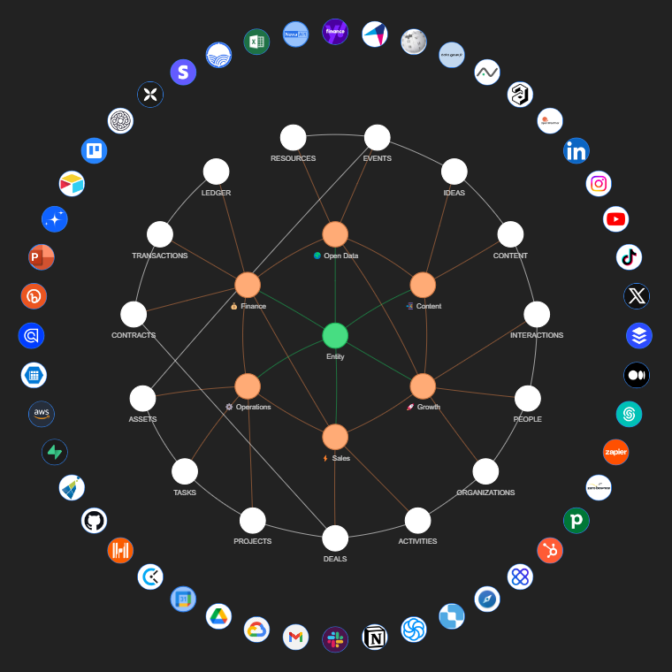

# ABI

**An API-driven organizational AI system backend offering assistants, ontology, integrations, workflows, and analytics in a unified framework.**



## Table of Contents

- [Overview](#overview)
  - [Key Features](#key-features)
  - [License](#license)
- [Getting Started](#getting-started)
  - [Prerequisites](#prerequisites)
  - [Installation Options](#installation-options)
  - [Environment Setup](#environment-setup)
    - [Environment Variables](#environment-variables)
    - [Config YAML](#config-yaml)
  - [Setup Git Remote](#setup-git-remote)
  - [Deploy API](#deploy-api)
    - [Setup Requirements](#setup-requirements)
    - [Monitoring](#monitoring)
- [Standard Operating Procedure](#standard-operating-procedure)
  - [Understanding User Intent](#understanding-user-intent)
  - [Ontology Mapping](#ontology-mapping)
  - [Component Development](#component-development)
  - [Solution Validation](#solution-validation)
  - [Production Deployment](#production-deployment)
- [Development Guide](#development-guide)
  - [Overview](#overview-1)
  - [Running Agents](#running-agents)
  - [Running Python Scripts](#running-python-scripts)
  - [Managing Dependencies](#managing-dependencies)
  - [Create new Integrations](#create-new-integrations)
  - [Pipelines](#pipelines)
  - [Create new Workflows](#create-new-workflows)
  - [Create new Assistants](#create-new-assistants)
  - [API Customization](#api-customization)
    - [Add new routes](#add-new-routes)
    - [Add new connections](#add-new-connections)
- [Additional Resources](#additional-resources)
- [Development Tools](#development-tools)
- [Help & Support](#help--support)

## Overview

The **ABI** (Augmented Business Intelligence) project is a Python-based backend framework designed to serve as the core infrastructure for building an Organizational AI System. This system empowers businesses to integrate, manage, and scale AI-driven operations with a focus on ontology, assistant-driven workflows, and analytics. Designed for flexibility and scalability, ABI provides a customizable framework suitable for organizations aiming to create intelligent, automated systems tailored to their needs.

### Key Features

- **Assistants**: Configurable AI assistants to handle specific organizational tasks and interact with users.
- **Ontology Management**: Define and manage data relationships, structures, and semantic elements.
- **Integrations**: Seamlessly connect to external data sources and APIs for unified data access.
- **Pipelines**: Define data processing pipelines to handle and transform data efficiently into the ontological layer.
- **Workflows**: Automate complex business processes and manage end-to-end workflows.
- **Analytics**: Access insights through integrated analytics and real-time data processing.
- **Data**: Handle diverse datasets and manage schema, versioning, deduplication, and change data capture.

### License
ABI Framework is open-source and available for non-production use under the [AGPL license](https://opensource.org/licenses/AGPL). For production deployments, a commercial license is required. Please contact us at support@naas.ai for details on licensing options.

## Getting Started

### Prerequisites

1. **Install [Docker Desktop](https://www.docker.com/products/docker-desktop/)**

### Installation Options

Choose one of the following options:

a. **Clone the Repository** (for personal use)
```bash
git clone https://github.com/jupyter-naas/abi.git
cd abi
```

b. **Fork the Repository** (to contribute changes)
```bash
# 1. Fork via GitHub UI
# 2. Clone your fork
git clone https://github.com/YOUR-USERNAME/abi.git
cd abi
```

c. **Create a Private Fork** (for private development)
```bash
# 1. Create private repository via GitHub UI
# 2. Clone your private repository
git clone https://github.com/YOUR-USERNAME/abi-private.git
cd abi-private
git remote add upstream https://github.com/jupyter-naas/abi.git
git pull --rebase upstream main
git push
```

### Environment Setup

#### Environment Variables

1. Copy this file to .env
```bash
cp .env.example .env
```
2. Replace placeholder values with your actual credentials
3. Uncomment (remove #) from lines you want to activate. The variables are used to configure the assistant.

Note: The .env file should never be committed to version control
as it contains sensitive credentials

#### Config YAML

1. Copy the example file to config.yaml
```bash
cp config.yaml.example config.yaml
```
2. Edit the file with your configuration
3. The config.yaml file is used to configure your workflows, pipelines and the API: 
- `workspace_id`: Workspace ID linked to all components: assistants, ontologies, pipelines, workflows, etc.
- `github_project_repository`: Your Github repository name (e.g. jupyter-naas/abi). It will be used in documentation and API as registry name.
- `github_support_repository`: A Github repository name (e.g. jupyter-naas/abi) to store support issues. It will be used by the support agent to create all requests or report bugs. It can be the same as `github_project_repository`.
- `github_project_id`: Your Github project number stored in Github URL (e.g. 1 for https://github.com/jupyter-naas/abi/projects/1). It will be used to assign all your issues to your github project.
- `api_title`: API title (e.g. ABI API) displayed in the documentation.
- `api_description`: API description (e.g. API for ABI, your Artifical Business Intelligence) displayed in the documentation.
- `logo_path`: Path to the logo (e.g. assets/logo.png) used in the API documentation.
- `favicon_path`: Path to the favicon (e.g. assets/favicon.ico) used in the API documentation.

### Setup Git Remote

Once you have forked and created your own version of the ABI repository, you need to establish a Git remote. 
This will enable you to push and pull to and from the original ABI repository. Doing so will allow you to update your project with the latest changes, or contribute back to the open-source project.

Execute the following commands in your terminal:

```bash
# Access your repo
cd "your_directory_name"

# Add  remote
git remote add abi https://github.com/jupyter-naas/abi.git

# Push to main branch
git push abi main

# Pull from main branch
git pull abi main

```

**About Git default remote**

When you clone a git repository from Github or any other provider, it will always create a default remote for you, named, `origin`. You might already have asked yourself what this `origin` was. It's your default git remote.

This means that, assuming you are on the `main` branch, executing `git push` is the same as `git push origin main`.

So by default will just use:

- The branch you are actually on
- The `origin` remote. Even if other exists, it will always use `origin` by default.

### Deploy API

The API deployment is automated through GitHub Actions.
Every time you push to the main branch with last commit message as `feat:` or `fix:`, the API will be deployed as follow:
1. A new container is built (via the "Build ABI Container" workflow)
2. The deployment workflow creates/updates a NAAS space with the latest container image
3. The API will be accessible through the NAAS platform once deployment is complete as the following URL: `https://<github_project_repository.name>-api.default.space.naas.ai/`

#### Setup Requirements

1. **Create a GitHub Classic Personal Access Token**:
   - Go to GitHub Settings > Developer Settings > Personal Access Tokens > Tokens (classic)
   - Generate a new token with the following permissions:
     - `repo` (Full control of private repositories)
     - `read:packages` and `write:packages` (For container registry access)
   - Copy the token value

2. **Get required API keys**:
   - OpenAI API key from [OpenAI Platform](https://platform.openai.com/api-keys)
   - NAAS Credentials JWT Token from your NAAS account

3. **Navigate to your repository's Settings > Secrets and variables > Actions and add the following secrets**:
   - `ACCESS_TOKEN`: Your GitHub Classic Personal Access Token
   - `OPENAI_API_KEY`: Your OpenAI API key
   - `NAAS_CREDENTIALS_JWT_TOKEN`: Your NAAS Credentials JWT Token
   - `ABI_API_KEY`: Your key to access the API

#### Monitoring

- Go to your repository's Actions tab
- Look for the "ABI API" workflow
- Check the latest workflow run for deployment status and logs

## Standard Operating Procedure

This standard procedure explain how to answer to user intent using the ABI framework.

### Understanding User Intent

Begin by identifying the user's business problem and core question they want answered. 
Understanding this clearly will help guide the solution design.
For example, **"What are my top priorities?"**

### Ontology Mapping

Map your business problem to ontological concepts:

1. Identify Domain Concepts
   - Use `src/core/ontologies/domain-level` ontology
   - Example for "What are my top priorities?":
     - Task (core concept)
     - Properties: assignee, creator, due date, status, priority, labels

2. Map to Application Concepts 
   - Use `src/core/ontologies/application-level` ontology
   - Map domain concepts to your tools:
     - Tasks → GitHub Issues, CRM Tasks, Marketing Campaigns
   - Create subclasses that inherit from domain classes:
     - abi:GitHubIssue ⊂ abi:Task
     - abi:GithubUser ⊂ abi:User
     - abi:GithubProject ⊂ abi:Project

3. Write SPARQL Query
   - Create query from `src/core/ontologies/ConsolidatedOntology.ttl`
   - Use schema to retrieve data from all relevant subclasses
   - Ensures solution remains tool-agnostic and reusable

### Component Development

Once you have your ontological concepts, build your solution in three steps:

1. **Integration**
   Create or update integrations in `src/custom/integrations` to connect with required data sources.
   Please checkout `src/core/integrations/GithubIntegration` or `src/core/integrations/GithubGraphqlIntegration` for more details.

2. **Pipeline**
   Create a pipeline to map data from integrations to ontological concepts. Keep mapping logic modular by:
   - Building small pipelines for specific data transformations
   - Combining smaller pipelines into larger ones as needed
   You will be able to use function to easily create mapping to ontology. 
   Please checkout `src/core/pipelines/operations/GithubIssuePipeline` for more details.

3. **Workflow**
   Create a workflow that uses pipeline results via SPARQL queries. 
   Workflows should focus on business logic rather than data transformation.
   Please checkout `src/core/workflows/operations/GetTopPrioritiesWorkflow` for more details.

#### Assistant Configuration
1. [Create or use an existing assistant](#create-assistant-single-agent) in `src/assistants`.
2. Setup the workflow that answer to the user intent as a tool in the assistant. We recommend to put the user intent as description of your workflow so the assistant can understand it better.
3. You can also add your pipelines and integrations function as tools if you want to trigger them from the assistant.

#### Solution Validation
1. Setup your assistant to validate your solution with your terminal. See [Chat with Assistant](#chat-with-assistant-in-terminal) for detailed instructions.
2. Ask the user intent and see if the solution is working as expected.
3. If not, you can update your assistant configuration, workflow, pipeline and integration and test again.

#### Production Deployment
Merge your branch into main.
- Your assistant will be deployed to production and you will be able to use it with API but also in Naas platform.
- Your workflows, pipelines and integrations will also be deployed as API.
- Your pipelines will schedule according to your configuration.

## Development Guide

### Overview

Project is divided into two main parts:
- `src`: Contains the core components of the framework, including integrations, pipelines, workflows, and assistants.
- `lib/abi`: Contains the shared libraries and utilities used across the project.

### Running Agents

You start an agent by running the following command:
```bash
make
```
Agent are connected to tools through integrations, workflows or pipelines.
You will only have a access to tools registered in .env file.
Remember to add your tools in .env file before starting an agent.

Here is the list of all agents you can start:
```bash
# Start default agent (chat-supervisor-agent) which can access to all domain agents and tools
make

# Or start a specific foundation agent:
make chat-support-agent     # Support agent

# Or start a specific domain agent:
make chat-content-agent      # Content agent
make chat-finance-agent      # Finance agent  
make chat-growth-agent       # Growth agent
make chat-opendata-agent     # Open Data agent
make chat-operations-agent   # Operations agent
make chat-sales-agent        # Sales agent

# Or start a specific custom agent (List available in Makefile)
make chat-airtable-agent     # Airtable agent
make chat-agicap-agent       # Agicap agent
make chat-aws-s3-agent       # AWS S3 agent
make chat-brevo-agent        # Brevo agent
make chat-clockify-agent     # Clockify agent
make chat-discord-agent      # Discord agent
make chat-github-agent       # Github agent
```
To change default agent please update: `.DEFAULT_GOAL := chat-supervisor-agent` in Makefile

### Running Python Scripts

To run a Python script, use the `__main__` block pattern in the script file and run by using the command `make sh` and then the script path: `poetry run python src/pipelines/abi/AbiApplicationPipeline.py`

Here is an example of how to run a pipeline in your terminal:

```python
# src/data/pipelines/YourPipeline.py
if __name__ == "__main__":
      from src import secret
      from src.core.integrations import YourIntegration
      from abi.services.ontology_store import OntologyStoreService
      
      # Setup dependencies
      integration = YourIntegration(YourIntegrationConfiguration(...))
      ontology_store = OntologyStoreService()
      
      # Create pipeline configuration
      config = YourPipelineConfiguration(
         integration=integration,
         ontology_store=ontology_store
      )
      
      # Initialize and run pipeline
      pipeline = YourPipeline(config)
      result = pipeline.run(YourPipelineParameters(
         parameter_1="test",
         parameter_2=123
      ))
      
      # Print results in Turtle format to verify ontology mapping
      print(result.serialize(format="turtle"))
```

Terminal command:
```bash
poetry run python src/pipelines/YourPipeline.py
```

### Managing Dependencies

If you need to add a new Python dependency to `src` project, you can use the following command:

#### Add a new Python dependency to `src` project

```bash
make add dep=<library-name>
```

This will automatically:
- Add the dependency to your `pyproject.toml`
- Update the `poetry.lock` file
- Install the package in your virtual environment

#### Add a new Python dependency to `lib/abi` project

```bash
make abi-add dep=<library-name>
```

### Create new Integrations

To create a new integration, follow these steps:

1. **Create Integration File**
   Create a new file in `src/custom/integrations/YourIntegration.py` using template: `examples/integrations/__IntegrationTemplate__.py`.

2. **Add Required Methods**
   Implement the necessary methods for your integration. Common patterns include:
   - Authentication methods
   - API endpoint wrappers
   - Data transformation utilities

3. **Add Configuration**
   If your integration requires API keys or other configuration:
   - Add the required variables to `.env.example`
   - Update your local `.env` file with actual values

4. **Test Integration**
   Create tests in `tests/integrations/` to verify your integration works as expected.

For more detailed examples, check the existing integrations in the `src/integrations/` directory.

### Pipelines

Pipelines in ABI are used to process and transform data. Here's how to create a new pipeline:

1. **Create Pipeline File**
   Create a new file in `src/custom/pipelines/YourPipeline.py` using template: `examples/pipelines/__PipelineTemplate__.py`.
   
3. **Implement Pipeline Logic**
   - Add your data processing logic in the `run()` method
   - Use the integration to fetch data
   - Transform data into RDF graph format
   - Store results in the ontology store if needed

4. **Test Pipeline**
   Create tests in `tests/pipelines/` to verify your pipeline:
   - Test data transformation
   - Test integration with ontology store
   - Test error handling

For examples, see existing pipelines in the `src/core/pipelines/` directory.

### Create new Workflows

To create a new workflow in ABI, follow these steps:

1. **Create Workflow File**
   Create a new file in `src/custom/workflows/YourWorkflow.py` using template: `examples/workflows/__WorkflowTemplate__.py`.

2. **Implement Workflow Logic**
   - Add your business logic in the `run()` method
   - Use integrations to interact with external services
   - Process and transform data as needed
   - Return results in the required format

3. **Test Workflow**
   Create tests in `tests/workflows/` to verify your workflow:
   - Test business logic
   - Test integration with external services
   - Test error handling
   - Test API endpoints

4. **Use the Workflow**
   The workflow can be used in multiple ways:
   - As a standalone script: `python -m src.core.workflows.YourWorkflow`
   - As an API endpoint: Import and use the `api()` function
   - As a LangChain tool: Import and use the `as_tool()` function

For examples, see existing workflows in the `src/workflows/` directory.

### Create new Assistants

To create a new assistant, follow these steps:

#### Create Assistant File
Create a new file in `src/custom/assistants/YourAssistant.py` using template: `examples/assistants/__TemplateAssistant__.py`.

#### Add Integrations, Workflows and Pipelines as tools
- Import necessary integrations, pipelines and workflows
- Configure integrations with required credentials
- Add tools using the `as_tools()` method (Class.as_tools(Configuration))

#### Chat with Assistant in Terminal
- Create function to run new assistant in `src/core/apps/terminal_agent/main.py` following the pattern of existing assistants
- Set function in pyproject.toml: `chat-<assistant-name>-agent = "src.core.apps.terminal_agent.main:run_<assistant-name>-agent"`
- Add new function in Makefile: `make chat-<assistant-name>-agent`
- Run new assistant: `make chat-<assistant-name>-agent`

### API Customization

#### Add new routes  

- Add route handlers in `src/api.py`
- Example: Adding a new assistant
- Import your assistant from `src/custom/assistants/YourAssistant.py`
- Add it to the `assistants_router` variable as follow:
```python
from src.core.assistants.custom.YourAssistant import create_your_assistant
your_assistant = create_your_assistant()
your_assistant.as_api(assistants_router)
```
Remember to add the `as_api()` method to your new assistant in its file.

#### Add new connections

The API will used the secrets stored in your github repository secrets.
If you want to add new secrets, you need to do the following:
1. **Navigate to your repository's Settings > Secrets and variables > Actions and add the new secrets**
2. **Open `.github/workflows/deploy_api.yml**
3. **Add your github secrets in the env section of the**: "Push latest abi container"
4. **Pass the secrets to space environment in `ENV_CONFIG`**
5. **Commit and push your changes**

## Additional Resources

- **lib/abi**: [lib/abi/README.md](lib/README.md)
- **src**: [src/README.md](src/README.md)

## Development Tools

For Cursor users there is the [.cursorrules](.cursorrules) file already configured to help you create new Integrations, Pipelines and Workflows.

More will be added as we add more components to the framework.

## Help & Support
For any questions or support requests, please reach out via [support@naas.ai](mailto:support@naas.ai) or on our [community forum](https://join.slack.com/t/naas-club/shared_invite/zt-2xmz8c3j8-OH3UAqvwsYkTR3BLRHGXeQ) on Slack.