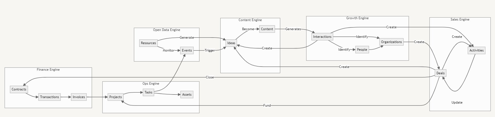
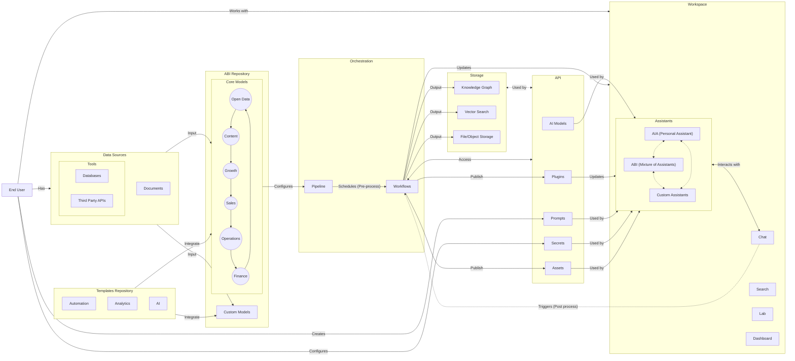
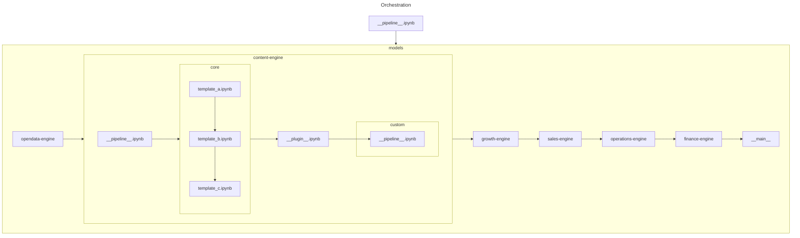
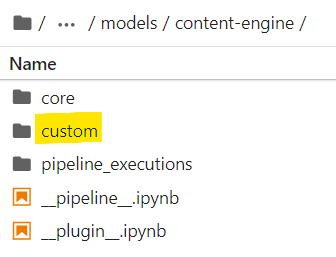
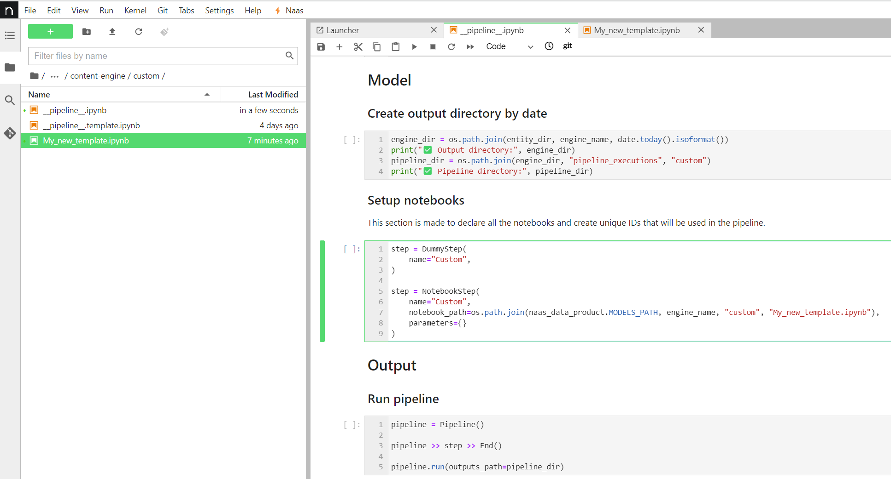
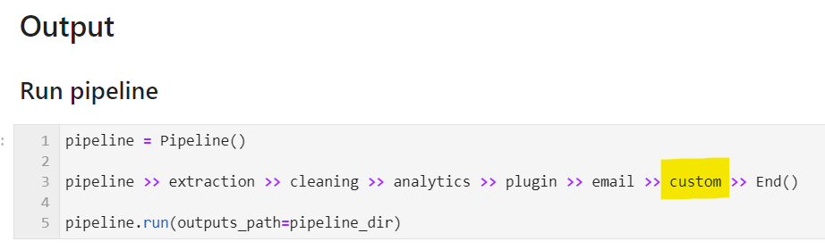

# ABI*: The AI system for your everyday business
*Augmented Business Intelligence


The Naas ABI system offers an innovative approach to Enterprise Data Management, addressing the challenges of integrating Artificial Intelligence (AI) into organizational workflows. By transforming Large Language Models (LLMs) and their Mixture of Experts (MoE) model into a unified Mixture of Assistants (MoA), the system aims to eliminate business silos by facilitating interconnection across business domains, with a focus on improving brand awareness, accelerating sales, and securing cash flow.

## Mixture of Assistants[](https://docs.naas.ai/usage/abi/introduction#mixture-of-assistants)

ABI is a mixture of AI-driven business intelligence assistants to power your business. This suite of assistants is designed by Naas core team and its design partners to cover business essentials with 6 assistants focused on open data & market intelligence, content creation, growth marketing, sales conversion, operational efficiency and finance management. 

Together, they form a unified system that utilizes external data for richer business insights, enhances content performance and brand awareness, improves lead generation and qualification, streamlines operations and financial transactions. 

ABI's capabilities are further expanded through its integration with a variety of tools, APIs, both official and unofficial, enabling comprehensive data collection and enrichment.

## Standard Operating Procedures[](https://docs.naas.ai/usage/abi/introduction#standard-operating-procedures-sops)

ABI adheres to Standard Operating Procedures (SOPs) and connects to business tools via Python engines, following the ETL (Extract, Transform, Load) pipeline paradigm to preprocess data into domain-specific tables (content, marketing, sales, etc.). These tables are then post-processed by AI models for human conversations through a chat interface using plugins. Tools like PowerBI and Tableau can be integrated at as add-on plugins for classical data analysis and visualization.

ABI has 3 master SOPs that form a strategic flywheel, driving continuous improvement and optimization across business domains:

### Open Data to Inform Strategic Decisions

**🌍 Open Data & Market Intelligence Assistant:** Integrates real-time events and trends to provide ideas for content strategy, contact suggestions for network growth, online presence for competition analysis, operations efficiency, and financial recommendations.

### Content to Build Sales Pipeline

**📲 Content Assistant:** Helps users create content ideas and turn them into posts to raise awareness on social media among a target audience.

**🚀 Growth Assistant:** Analyze social interactions to identify and prioritize marketing qualified leads (MQLs) based on engagement levels and business fit.

**⚡️Sales Assistant:** Nurtures MQLs to sales qualified leads (SQLs) through personalized messaging, deal creation, automated sales activity logging and tasks suggestions aligned with customer profiles.

### Conversations to Optimize Cost and Secure Cash Flow

**⚙️ Operations Assistant:** Manages workflows from SQL to customer satisfaction and retention by capturing conversations, optimizing processes, and aggregating operational assets.

**💰 Finance Assistant:** Prepares contractual documents, invoices, and payment transactions to convert successful sales into secured revenue and cash flow.

These processes dictate the foundational activities of the Assistants, offering a blueprint for data collection and process management. However, the true power of ABI lies in its adaptability; users are encouraged to tailor these SOPs to fit unique requirements, ensuring each Assistant's output aligns perfectly with specific operational goals.

## Data Tables and Knowledge Graph[](https://docs.naas.ai/usage/abi/introduction#expanding-the-knowledge-base-with-obts-and-the-abi-knowledge-graph)

### OBTs

Data tables are designed following the OBT(One Big Table) data modeling practice to store information related to specific business domains. 

OpenData:

- Resources: Resources to be monitored (Influencer X from LinkedIn).
- Events: Events tracked from resources (Post published by influencer X).

Content:

- Ideas: Ideas generated from events tracked in open data or manually input.
- Content: Content published on social networks by your entity (post on LinkedIn, article on Medium…).

Growth:

- Interactions: All interactions made by an individual or organization on a piece of content.
- People: Individuals identified as potential targets.
- Organizations: Organizations identified as potential targets.

Sales:

- Deals: Opportunities based on products or services sold by your company, linking a person and organization with you.
- Activities: Tasks to be performed to close a deal.

Operations:

- Conversations: Conversations tagged by domain to create specific outcomes.
- Projects: Projects with their properties.
- Tasks: Details of projects with timesheets.
- Assets: These are values created by Operations for customers. They could be tangible or intangible but must bring value to the customer.

Finance:

- Contracts: Contracts owned by your organization (revenue or costs).
- Transactions: Transactions with financial purposes.

### Connections between Data Tables

Data Tables are designed to feed one another and create a flywheel for your business.

→ For instance, I will monitor all AI-related events on Google (Open Data). 

→ This will generate ideas for creating content (Content). 

→ These contents will be published on social networks, creating interactions with individuals working in organizations (Growth). 

→ These people and companies will enrich my CRM system and be contacted by my sales team, possibly becoming deals (Sales). 

→ These deals will result in contracts, transactions, and invoices made by my finance team (Finance). 

→ The deals will also generate new projects for my operational teams. The projects will be tracked with tasks. At the end of the project, assets will be created for my clients (Operations) that could → become events published on content platforms (Open Data & Content), thus reinitiating the flywheel of my business.



### From OBTs to Knowledge

Each Assistant specializes in its domain and contributes to an ever-expanding Knowledge Graph through thanks to domain-specific the OBTs (One Big Tables). 

These OBTs encapsulate data in a structured format, serving as the knowledge base for each Assistant. This structured data collection method ensures that every piece of information is captured and categorized via a common ontology, ready to be leveraged for insights, predictions, and strategic decision-making.

When SOPs are executed, Assistants perform their designated tasks and enrich the collective intelligence embodied by ABI's Unified Knowledge Graph, making it a living, learning ecosystem, a unified knowledge framework that enables a deeper understanding and interconnected view of business operations.

## Customization[](https://docs.naas.ai/usage/abi/introduction#customization)

ABI’s architecture allows for extensive customization. Users can introduce new workflows or modify existing ones within the Naas ABI Repository without impacting the core models. This flexibility ensures your ABI system remains cutting-edge, automatically incorporating the latest updates while preserving your unique customizations.

ABI embodies the intersection of automation and intelligence, designed not just to perform tasks but to learn from them, continuously enhancing its capacity to drive business growth. Through its SOPs, OBTs, and the evolving Knowledge Graph, ABI offers a personalized, intelligent framework for tackling the complexities of modern business environments.

Learn more about ABI Customization with the sections below.

## How it works?

### Architecture

ABI is a combination of open source tools and proprietary technology. ABI relies on Naas Workspace and Naas API to function, requiring a token to run. 

We’re building the features of ChatGPT and its GPT Store with **Naas Workspace** and a power orchestration layer with **Naas API** using enterprise-grade, open source technologies.



If you don’t want to use Naas capabilities to run ABI, you can do it but it will require some code refactoring. Our aim is to give developers a openAI-like developer experience using open source tools.

### Orchestration

The main pipeline executes all engines in the following order: open data, content, growth, sales, operations, finance and main.

Each engine is configured by a pipeline that triggers core templates and plugins, as well as custom templates. 

Please refer to the 'Add custom workflows to main pipeline' section for more information on this topic.



### Installation

This feature is currently available exclusively on Naas Lab for Pro users. 

We are working to make it possible to run it locally.

- Clone repo https://github.com/jupyter-naas/abi.git
- Execute `setup.ipynb`
- Run `__pipeline__.ipynb`

### Build Your Own ABI

#### Pre-requisites

The first step in building your ABI is to ensure that you have a GitHub account. If you do not yet have one, you can create one for free on GitHub's website. 

Once you have your account, you must create a new organization. This organization will serve as the home for your forked ABI repository.

#### Fork ABI Repository

To get started, you must fork this repository into your own GitHub organization.
This will create a copy of the repository that you can modify and manage independently of the original source.

Here's how to fork the ABI repository:

1. Click on the "Fork" button. A new screen will appear, asking where you want to fork the repository.
2. Select your GitHub organization from the list. The repository will then be forked to your organization, and you'll be redirected to your new, forked repository.

Now that you have forked the ABI repository, you can build your own version of ABI in each engine's custom folder.

#### Setup Git remote

Once you have forked and created your own version of the ABI repository, you need to establish a Git remote. 

This will enable you to push and pull to and from the original ABI repository. Doing so will allow you to update your project with the latest changes, or contribute back to the open-source project.

Execute the following commands in your terminal:

```bash
# Access your repo
cd "your_directory_name"

# Add  remote
git remote add abi https://github.com/jupyter-naas/abi.git

# Push to main branch
git push abi main

# Pull from main branch
git pull abi main

```

**About Git default remote**

When you clone a git repository from Github or any other provider, it will always create a default remote for you, named, `origin`. You might already have asked yourself what this `origin` was. It's your default git remote.

This means that, assuming you are on the `main` branch, executing `git push` is the same as `git push origin main`.

So by default will just use:

- The branch you are actually on
- The `origin` remote. Even if other exists, it will always use `origin` by default.

#### Add custom workflow to main pipeline

Begin creating your own workflow by developing templates in the custom folders for each engine. 



Once they are ready to be integrated into the main pipeline:

- Duplicates **`__**pipeline__.template.ipynb` and rename it  **`__**pipeline__.ipynb`
- Configure your [notebook steps](https://docs.naas.ai/resources/developers/jobs/pipeline#notebookstep-pipeline)
- Test your custom pipeline
- Push your new notebooks to production



Your custom pipeline will be executed at the end of each engine's process.



If you're willing to share your workflows with the community, please feel free to contact us. 

We'd be delighted to incorporate them into the core models and acknowledge you as contributors to this project.

## Product Owners

* [Florent Ravenel](https://www.linkedin.com/in/florent-ravenel/) - florent@naas.ai
* [Jeremy Ravenel](https://www.linkedin.com/in/ACoAAAJHE7sB5OxuKHuzguZ9L6lfDHqw--cdnJg/) - jeremy@naas.ai
* [Maxime Jublou](https://www.linkedin.com/in/maximejublou/) - maxime@naas.ai

## Acknowledgments

* [Awesome Notebooks](https://github.com/jupyter-naas/awesome-notebooks)
* [Naas Drivers](https://github.com/jupyter-naas/drivers)
* [Naas Python](https://github.com/jupyter-naas/naas-python)
* [Naas](https://github.com/jupyter-naas/naas)
* [Naas Data Product](https://github.com/jupyter-naas/naas-data-product)

## Legal

This project is licensed under BSD 3-Clause License
