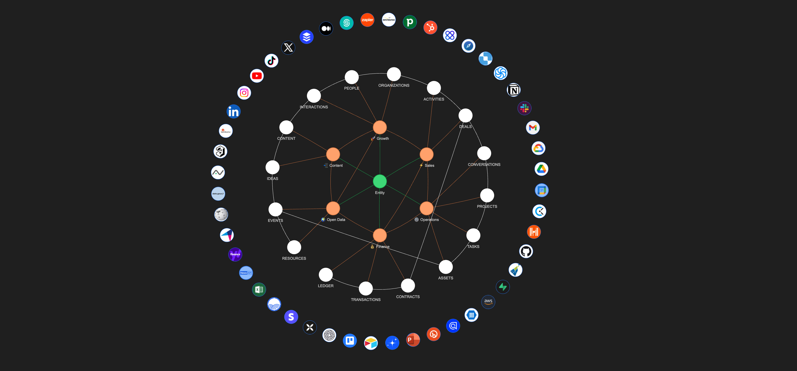

# ABI

**An API-driven organizational AI system backend offering assistants, ontology, integrations, workflows, and analytics in a unified framework.**



## Overview

The **ABI** (Augmented Business Intelligence) project is a Python-based backend framework designed to serve as the core infrastructure for building an Organizational AI System. This system empowers businesses to integrate, manage, and scale AI-driven operations with a focus on ontology, assistant-driven workflows, and analytics. Designed for flexibility and scalability, ABI provides a customizable framework suitable for organizations aiming to create intelligent, automated systems tailored to their needs.

### Key Features

- **Assistants**: Configurable AI assistants to handle specific organizational tasks and interact with users.
- **Ontology Management**: Define and manage data relationships, structures, and semantic elements.
- **Integrations**: Seamlessly connect to external data sources and APIs for unified data access.
- **Workflows**: Automate complex business processes and manage end-to-end workflows.
- **Analytics**: Access insights through integrated analytics and real-time data processing.
- **Data**: Handle diverse datasets and manage schema, versioning, deduplication, and change data capture.

### License
ABI Framework is open-source and available for non-production use under the [AGPL license](https://opensource.org/licenses/AGPL). For production deployments, a commercial license is required. Please contact us at support@naas.ai for details on licensing options.

## Setup Project

### Getting Started

1. **Prerequisites**
   - Install [Poetry](https://python-poetry.org/docs/#installation) for Python dependency management
   - Docker Desktop 

2. **Clone the Repository**
   ```bash
   git clone https://github.com/jupyter-naas/abi-framework.git
   cd abi-framework
   ```

3. **Set Up Environment**
   ```bash
   cp .env.example .env
   # Edit .env with your configuration
   ```

4. **Create Docker Container & Start Chatting**
   ```bash
   make
   ```

### Managing Dependencies

To add a new Python dependency to the project:

```bash
poetry add <library-name>
```

This will automatically:
- Add the dependency to your `pyproject.toml`
- Update the `poetry.lock` file
- Install the package in your virtual environment


## Contributing

1. Fork the repository.
2. Create a new branch with your feature or fix.
3. Open a pull request to the main branch.

## Support
For any questions or support requests, please reach out via support@naas.ai or on our [community forum](https://join.slack.com/t/naas-club/shared_invite/zt-1970s5rie-dXXkigAdEJYc~LPdQIEaLA) on Slack.