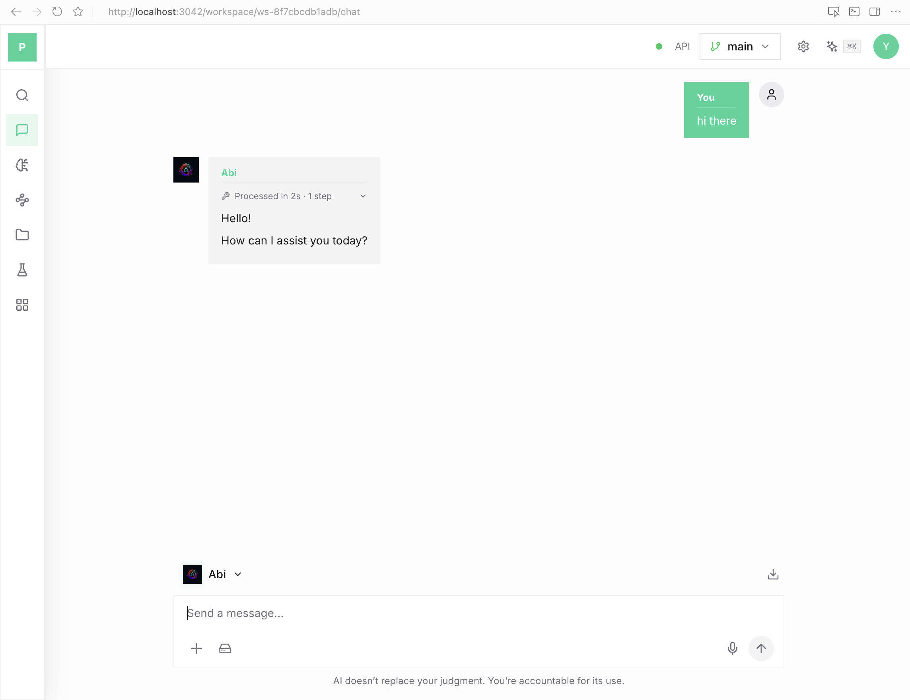
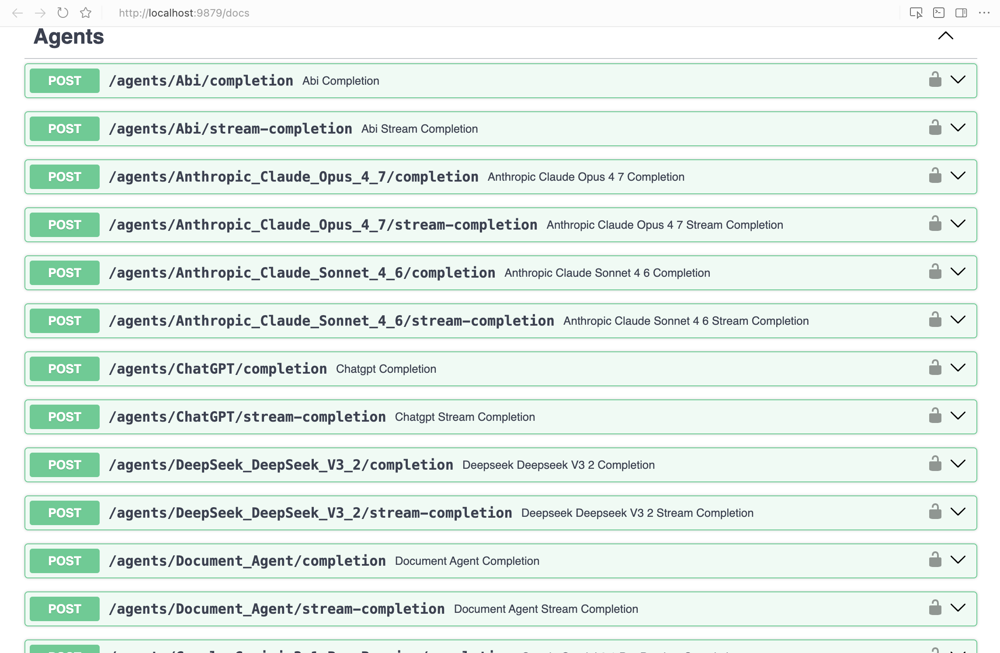
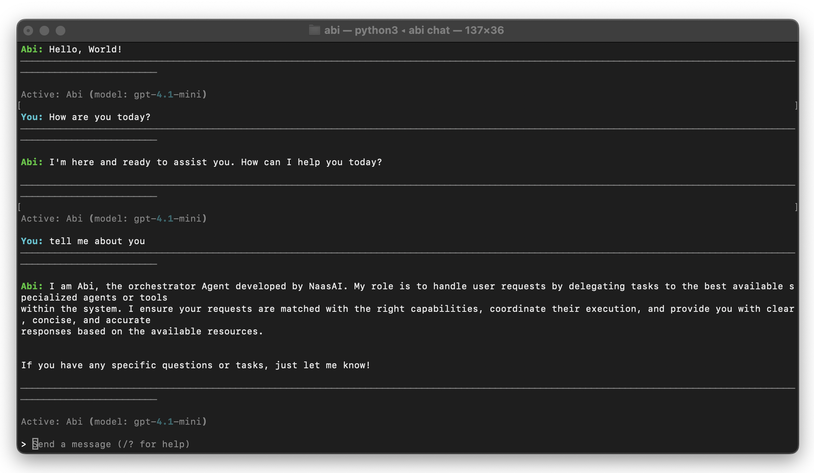

<div align="center">


# ABI

_Question Everything, Create your own AI System_

ABI (Agentic Brain Infrastructure) is the open-source AI Operating System that grounds LLMs in your organization's ontology to create tools that extend human capabilities. An open and accessible alternative to Palantir.

</div>

<div align="center">

[](https://github.com/jupyter-naas/abi/releases)
[](https://www.python.org/downloads/)
[](https://opensource.org/licenses/MIT)
[](https://fastapi.tiangolo.com/)

[](https://github.com/jupyter-naas/abi/stargazers)
[](https://github.com/jupyter-naas/abi/network/members)
[](https://github.com/jupyter-naas/abi/graphs/contributors)

</div>

## Why ABI?

Most AI platforms lock you in: proprietary data models, opaque pipelines, no exit. When the vendor changes pricing or discontinues a model, you have no contingency.

ABI is built for continuity and ownership. Every layer is swappable: LLM providers, infrastructure services, data adapters. Agents reason over context sources you control (knowledge graph, vector store, file system), so your data and logic stay yours regardless of what any upstream vendor does.

It also covers the full stack from ingestion to UI, so you are not stitching together five different tools. The knowledge graph is built on [ISO/IEC 21838-2 Basic Formal Ontology (BFO)](https://www.iso.org/standard/74572.html), the open top-level ontology standard used in biotech, defense, and enterprise. BFO-grounded data makes compliance with [ISO/IEC 42001:2023 AI Management Systems](https://www.iso.org/standard/42001) and the [EU AI Act (Regulation 2024/1689)](https://eur-lex.europa.eu/legal-content/EN/TXT/PDF/?uri=OJ:L_202401689) significantly easier, since traceability and auditability are built into the data model from the start.

## Quick Start

### Prerequisites

- Python 3.12+, Git, [uv](https://astral.sh/uv) (`curl -LsSf https://astral.sh/uv/install.sh | sh`)
- [Docker Desktop](https://www.docker.com/products/docker-desktop) (8GB+ RAM for full stack)
- LLM API keys: any OpenAI-compatible provider (OpenAI, OpenRouter, or equivalent)

### Get started

```bash
uv tool install naas-abi-cli --force --upgrade

abi new project my_ai   # replace "my_ai" with your project name
cd my_ai
abi start
```

### Web UI

The main interface. Chat with Abi, switch agents, manage your workspace, and access your knowledge graph. Open [http://localhost:3042](http://localhost:3042) and log in with `admin@example.com` / `Admin1234!`.

<div align="center">
  
</div>

### API

Every agent is exposed as a REST endpoint. Useful for integrating ABI into your own tools, triggering agents from scripts, or building on top of the platform. Explore the full reference at [http://localhost:9879/docs](http://localhost:9879/docs).

<div align="center">
  
</div>

### CLI

Run `abi chat` to talk to Abi directly from your terminal. No browser needed.

<div align="center">
  
</div>

```bash
abi start            # Start the full stack and open the browser
abi stop             # Stop all running services
abi chat             # Chat with Abi in the terminal
abi logs             # Tail logs from a service (e.g. abi logs abi)
abi stack status     # Check health of all running containers
abi config validate  # Check your config.yaml for errors
abi new module       # Scaffold a new module
abi new agent        # Scaffold a new agent
abi new workflow     # Scaffold a new workflow
```

## How It Works

Everything in ABI is organized around **modules**. A module models a domain, connects to its data sources, and exposes intelligent capabilities on top. You enable one with a single line in `config.yaml`.

A module bundles:

- **Agents**: LLM-powered agents that reason over the knowledge graph and dispatch to the right domain capability
- **Applications**: web UI, REST API, and CLI surfaces that expose module capabilities to end users and operators
- **Integrations**: connectors to external APIs (GitHub, Salesforce, LinkedIn, Notion, ...) that pull data into the module
- **Ontologies**: OWL/Turtle files that define the domain as typed entities and relationships in a knowledge graph
- **Orchestrations**: Dagster-based schedules, jobs, and event sensors that automate module execution
- **Pipelines**: operations that read and write RDF triples to the knowledge graph (add, merge, insert)
- **Workflows**: structured callable tools exposed to agents and users that query or act on the knowledge graph

Each infrastructure concern is abstracted as a port with a swappable adapter. Change the adapter in `config.yaml`, no module code changes needed. The community edition ships every service as a Docker container. Enterprise deployments swap each adapter for a managed cloud service or run the whole stack on Kubernetes.

- **Triple store** (knowledge graph): Community: Apache Fuseki / Enterprise: Amazon Neptune, Stardog, Ontotext GraphDB
- **Vector store** (semantic search): Community: Qdrant / Enterprise: Pinecone, Weaviate, pgvector, Azure AI Search
- **Relational store** (agent memory): Community: PostgreSQL / Enterprise: Amazon RDS, Azure Database, Cloud SQL
- **Object storage** (files and artifacts): Community: MinIO / Enterprise: Amazon S3, Azure Blob Storage, Google Cloud Storage
- **Message bus** (async task routing): Community: RabbitMQ / Enterprise: Amazon MQ, Azure Service Bus, Google Pub/Sub
- **Cache** (sessions and hot data): Community: Redis / Enterprise: Amazon ElastiCache, Azure Cache for Redis, Memorystore
- **Orchestration** (schedules and sensors): Community: Dagster / Enterprise: Dagster Cloud, Airflow on MWAA, Cloud Composer

The **Context Engine** wires all these services at startup and routes every request to the right agent. **Abi** acts as the supervisor: it reads the intent behind each request and dispatches to the right domain agent or answers directly from the knowledge graph, vector store, or file system.

Start with the marketplace modules to get running immediately, then use `abi new module` to model your own domain. Full architecture reference: [The ABI Stack](https://docs.naas.ai/architecture/the-stack).

## Repository Layout

**Your project** (created with `abi new project my_ai`):

```
my_ai/
├── src/
│   └── my_ai/                 # Your module (agents, integrations, ontologies, ...)
├── config.yaml                # Base module and service configuration
├── config.local.yaml          # Local overrides (ports, credentials, enabled modules)
├── config.remote.yaml         # Remote/production overrides
├── docker-compose.yml         # Local stack definition (generated)
├── pyproject.toml             # Python project, naas-abi-* installed as dependencies
└── .env                       # Secrets and environment variables
```

**This repo** (for contributors):

```
abi/
├── libs/
│   ├── naas-abi-core/         # Infrastructure adapters (storage, vector DB, message bus, SPARQL)
│   ├── naas-abi/              # Core agents, ontologies, and the Nexus app (API + web UI)
│   ├── naas-abi-cli/          # The abi CLI
│   └── naas-abi-marketplace/  # Domain modules and third-party integrations
├── docs/site/                 # Docusaurus documentation site
├── docker/                    # Caddy, Dagster, Postgres, and service configs
├── scripts/                   # Utility scripts (sync, export, datastore, docs generation)
├── config.local.yaml          # Module and service configuration (local)
├── config.yaml                # Module and service configuration (base)
└── docker-compose.yml         # Local stack definition
```

## Production Deployment

### Self-Hosted

Copy your `.env` and config files to the target server, then run:

```bash
docker compose -f docker-compose.yml up -d
```

All services (PostgreSQL, Fuseki, Qdrant, MinIO, RabbitMQ, Redis, Dagster) start as containers. For production workloads, swap the Docker adapters for managed cloud services as described in [How It Works](#how-it-works).

### Managed Hosting

Need a hosted, managed deployment? [Get started on naas.ai](https://naas.ai) or reach out to the team directly.

## Research & Development

Collaborative effort between:

- **[NaasAI](https://naas.ai)** - Applied AI Research Lab
- **[OpenTeams](https://openteams.com/)** - Open SaaS Infrastructure
- **[University at Buffalo](https://www.buffalo.edu/)** - Research University
- **[NCOR](https://ncor.buffalo.edu/)** - National Center for Ontological Research
- **[Forvis Mazars](https://www.forvismazars.com/)** - Global Audit & Consulting

## Contributing

We welcome contributions. Open an issue or pull request to get started.

## License

MIT License - see [LICENSE](LICENSE)

For enterprise support or managed hosting, visit [naas.ai](https://naas.ai).

---

⭐ If ABI is useful to you, star the repo to help others find it.
