<div align="center">


# ABI
*Agentic Brain Infrastructure*
</div>

<div align="center">

[](https://github.com/jupyter-naas/abi/releases)
[](https://www.python.org/downloads/)
[](https://opensource.org/licenses/MIT)
[](https://fastapi.tiangolo.com/)


[](https://github.com/jupyter-naas/abi/stargazers)
[](https://github.com/jupyter-naas/abi/network/members)
[](https://github.com/jupyter-naas/abi/graphs/contributors)

</div>

> A multi-agent AI System that uses ontologies to unify data, AI models, and workflows. 
⭐ **Star and follow to stay updated!**

## Overview

**ABI** (Agentic Brain Infrastructure) is an AI Operating System that uses intent-driven routing to match user requests with pre-configured responses and actions. When you make a request, ABI identifies your intent and triggers the appropriate response - whether that's a direct answer, tool usage, or routing to a specific AI agent.

The system combines multiple AI models (ChatGPT, Claude, Gemini, Grok, Llama, Mistral) with a semantic knowledge graph to map intents to actions, enabling intelligent routing based on what you're trying to accomplish.

### Architecture: AI Operating System

```mermaid
graph TD
    %% === USER INTERACTION LAYER ===
    USER["👤 User"] <-->|"uses"| APPS["📱 Apps<br/>Chat | API | Dashboard"]
    APPS <-->|"talks to"| ABI["🧠 ABI<br/>AI SuperAssistant"]
    
    %% === CORE INTELLIGENCE ===
    ABI <-->|"queries"| OXIGRAPH[("🧠 Semantic Knowledge Graph<br/>Information, Relations & Reasoning")]
    ABI <-->|"searches"| VECTORDB[("🔍 Vector DB<br/>Embeddings")]
    ABI <-->|"stores in"| POSTGRES[("🐘 PostgreSQL<br/>Memory")]
    
    %% === EXECUTION LAYER ===
    ABI -->|"coordinates"| AGENTS["🎯 Agents<br/>General & Domain Experts"]
    ABI -->|"runs"| WORKFLOWS["🔄 Workflows<br/>Processes"] 
    ABI -->|"creates"| ANALYTICS["📊 Analytics<br/>Dashboards & Reports"]
    
    AGENTS -->|"uses"| MODELS["🤖 AI Models<br/>Open & Closed Source"]
    AGENTS <-->|"works with"| WORKFLOWS
    
    %% === DATA PIPELINE ===
    INTEGRATIONS["🔌 Integrations<br/>APIs, Files"] -->|"feeds data to"| PIPELINES["⚙️ Pipelines<br/>Data → Semantic"]
    ONTOLOGIES["📚 Ontologies<br/>BFO Structure"] -->|"structures"| PIPELINES
    PIPELINES -->|"saves to"| OXIGRAPH
    PIPELINES -->|"indexes in"| VECTORDB
    
    %% === KINETIC ACTIONS ===
    OXIGRAPH -.->|"triggers"| WORKFLOWS
    OXIGRAPH -.->|"activates"| AGENTS
    
    %% === FILE GENERATION ===
    AGENTS -->|"creates files"| STORAGE[("💾 Storage<br/>Files")]
    WORKFLOWS -->|"generates files"| STORAGE
    PIPELINES -->|"outputs files"| STORAGE
    STORAGE -->|"serves to"| APPS
    
    %% === STYLING ===
    classDef user fill:#2c3e50,stroke:#fff,stroke-width:2px,color:#fff
    classDef abi fill:#e74c3c,stroke:#fff,stroke-width:3px,color:#fff
    classDef apps fill:#9b59b6,stroke:#fff,stroke-width:2px,color:#fff
    classDef agents fill:#3498db,stroke:#fff,stroke-width:2px,color:#fff
    classDef workflows fill:#1abc9c,stroke:#fff,stroke-width:2px,color:#fff
    classDef integrations fill:#f39c12,stroke:#fff,stroke-width:2px,color:#fff
    classDef ontologies fill:#27ae60,stroke:#fff,stroke-width:2px,color:#fff
    classDef pipelines fill:#e67e22,stroke:#fff,stroke-width:2px,color:#fff
    classDef analytics fill:#8e44ad,stroke:#fff,stroke-width:2px,color:#fff
    classDef models fill:#e91e63,stroke:#fff,stroke-width:2px,color:#fff
    classDef infrastructure fill:#95a5a6,stroke:#fff,stroke-width:2px,color:#fff
    
    class USER user
    class ABI abi
    class APPS apps
    class AGENTS agents
    class WORKFLOWS workflows
    class INTEGRATIONS integrations
    class ONTOLOGIES ontologies
    class PIPELINES pipelines
    class ANALYTICS analytics
    class MODELS models
    class OXIGRAPH,VECTORDB,POSTGRES,STORAGE infrastructure
```



## How ABI Works

**ABI is your intelligent AI SuperAssistant** that connects you to the right tools and expertise for any task.

**What ABI Does:**
- **Smart Routing**: Automatically picks the best AI model (ChatGPT, Claude, local models) based on your specific needs
- **Context Memory**: Remembers your ongoing conversations so you never have to repeat yourself
- **Expert Access**: Connects you to 20+ domain expert agents (Software Engineer, Content Creator, Data Analyst, etc.)
- **Workflow Automation**: Triggers business processes and data pipelines based on your requests
- **Multi-Interface**: Works through chat, API, web dashboard, or integrates with Claude Desktop

**Simple Process**: Ask ABI anything → It analyzes your request → Routes to the best agent/tool → Delivers complete results

**Technical Foundation**: 
- **Oxigraph**: Semantic knowledge graph with 50,000+ RDF triples in BFO-compliant ontologies
- **Vector Database**: Stores intent embeddings for semantic similarity matching
- **SPARQL + Vector Search**: Combines structured queries with semantic similarity for accurate intent matching
- **Ontologies (BFO Top-Level)**: Provide classes, properties, relations, and logic for pipelines to accurately model reality
- **External Integrations**: Connect to APIs, systems, databases, tools, and applications
- **Object Storage**: Agents, workflows, and pipelines can generate files (reports, documents, etc.) 

Built with international standards and regulatory frameworks as guiding principles, including [ISO/IEC 42001:2023 (AI Management Systems)](https://www.iso.org/standard/42001), [ISO/IEC 21838-2:2021 (Basic Formal Ontology)](https://www.iso.org/standard/74572.html), and forward-compatibility with emerging regulations like the EU AI Act, ABI provides a customizable framework suitable for individuals and organizations aiming to create intelligent, automated systems aligned to their needs.

## Why ABI?

**Ontology-Based AI to Preserve the Freedom to Reason**: The convergence of semantic alignment and kinetic action through ontology-driven systems represents one of the most powerful technologies ever created. When such transformative capabilities exist behind closed doors or within a single organization's control, it threatens the fundamental freedom to reason and act independently. We believe this power should be distributed, not concentrated - because the ability to understand, reason about, and act upon complex information is a cornerstone of human autonomy and democratic society.

**Core Capabilities for the Innovation Community:**
- **Ontology-Driven Intelligence**: Semantic understanding that connects data, meaning, and action
- **Knowledge Graph Operations**: Real-time reasoning over complex, interconnected information
- **Automated Decision Systems**: AI that understands context and triggers appropriate responses
- **Semantic Data Integration**: Connect disparate systems through shared understanding, not just APIs

**The Open Source Advantage:**
- **Research & Education**: Academic institutions and researchers can explore ontological AI without barriers
- **Innovation Acceleration**: Developers can build upon proven semantic architectures
- **Community Collaboration**: Collective advancement of ontology-based AI methodologies
- **Accessible Entry Point**: Learn and experiment with enterprise-grade semantic technologies

## Who is this for?

**For innovators who want to own their AI**:

- **👤 Individuals**: Run locally, choose your models, own your data
- **⚡ Pro**: Automate workflows, optimize AI costs
- **👥 Teams**: Share knowledge, build custom agents
- **🏢 Enterprise**: Replace consultants, integrate data, avoid vendor lock-in

**For cloud users**, we offer **Naas AI Credits** that aggregate multiple AI models on our platform - giving you access to ChatGPT, Claude, Gemini, and more through a single, cost-optimized interface. Available for anyone with a [naas.ai](https://naas.ai) workspace account.

**ABI Local & Open Source** + **[Naas.ai Cloud](https://naas.ai)** = Complete AI Operating System

- **🏠 Local**: Open source, privacy-first, full control
- **☁️ Cloud**: Managed infrastructure, marketplace, enterprise features  
- **🔗 Hybrid**: Start local, scale cloud, seamless migration

## Key Features
<div align="left">


### 🤖 **Multi-Agent System**

- **ABI Agent**: Central orchestrator with intelligent routing across all AI models
- **AI Model Agents**: ChatGPT, Claude, Gemini, Grok, Llama, Mistral, Perplexity
- **Local Agents**: Privacy-focused Qwen, DeepSeek, Gemma (via Ollama)

<br>
<br>

<div align="left">


### 🏪 **Marketplace Modules**

- **Domain Expert Agents**: 20+ specialized agents (Software Engineer, Content Creator, Data Engineer, Accountant, Project Manager, etc.)
- **Application Integrations**: GitHub, LinkedIn, Google Search, PostgreSQL, ArXiv, Naas, Git, PowerPoint, and more
- **Modular Architecture**: Enable/disable any module via `config.yaml``

<br>
<br>

<div align="left">


### 🧠 **Knowledge Management**

- **Semantic Knowledge Graph**: BFO-compliant ontologies with Oxigraph backend
- **SPARQL Queries**: 30+ optimized queries for intelligent agent routing
- **Vector Search**: Intent matching via embeddings and similarity search

<br>
<br>

<div align="left">


- **Workflows**: Automated business processes and task orchestration
- **Pipelines**: Data processing and semantic transformation (via Dagster)
- **Event-Driven**: Automatic triggers when new data enters knowledge graph

<br>
<br>

### 🌐 **Multiple Interfaces**
- **Terminal**: Interactive chat with any agent
- **REST API**: HTTP endpoints for all agents and workflows  
- **MCP Protocol**: Integration with Claude Desktop and VS Code
- **Web UI**: Knowledge graph explorer and SPARQL editor

## Quick Start

```bash
git clone https://github.com/jupyter-naas/abi.git
cd abi
make
```

**What happens:**
1. **Setup wizard** walks you through configuration (API keys, preferences)
2. **Local services** start automatically (knowledge graph, database)
3. **ABI chat** opens - your AI SuperAssistant that routes to the best model for each task

**Chat commands:**
- `@claude analyze this data` - Route to Claude for analysis
- `@qwen write some code` - Use local Qwen for privacy
- `make chat agent=ChatGPTAgent` - Run ChatGPT directly
- `/?` - Show all available agents and commands
- `/exit` - End session

**Other interfaces:**
```bash
make api                # REST API (http://localhost:9879)
make oxigraph-explorer  # Knowledge graph browser
```

## Research & Development

ABI is in active R&D and deploying projects with collaboration between:

- **[NaasAI](https://naas.ai)** - Applied Research Lab focused on creating universal data & AI platform that can connect the needs of individuals and organizations
- **[OpenTeams](https://openteams.com/)** - Open SaaS infrastructure platform led by Python ecosystem pioneers, providing enterprise-grade open source AI/ML solutions and packaging expertise
- **[University at Buffalo](https://www.buffalo.edu/)** - Research university providing academic foundation and institutional support
- **[National Center for Ontological Research (NCOR)](https://ncor.buffalo.edu/)** - Leading research center for ontological foundations and formal knowledge representation
- **[Forvis Mazars](https://www.forvismazars.com/)** - Global audit and consulting firm providing governance and risk management expertise

This collaborative effort aims to better manage and control the way we use AI in society, ensuring responsible development and deployment of agentic AI systems through rigorous research, international standards compliance, and professional oversight.

## Funding & Support

ABI development is supported through:

- **Applied Research Grants** - Funding for ontological AI research and development
- **Academic Partnership** - University at Buffalo research collaboration and institutional support
- **Industry Partnerships** - Strategic partnerships including Quansight, Forvis Mazars, VSquared AI, and other enterprise collaborators
- **Open Source Community** - Community contributions, collaborative development, and infrastructure support from OpenTeams

*For funding opportunities, research partnerships, or enterprise support, contact us at support@naas.ai*

## Contributing

We welcome contributions! Please read the [contributing guidelines](./CONTRIBUTING.md) for more information.

## License
ABI Framework is open-source and available for use under the [MIT license](https://opensource.org/licenses/MIT). Professionals and enterprises are encouraged to contact our support for custom services as this project evolves rapidly at support@naas.ai

