<div align="center">


# ABI
*Agentic Brain Infrastructure*
</div>

<div align="center">

[](https://github.com/jupyter-naas/abi/releases)
[](https://www.python.org/downloads/)
[](https://opensource.org/licenses/MIT)
[](https://fastapi.tiangolo.com/)


[](https://github.com/jupyter-naas/abi/stargazers)
[](https://github.com/jupyter-naas/abi/network/members)
[](https://github.com/jupyter-naas/abi/graphs/contributors)

</div>

> A multi-agent AI System that uses ontologies to unify data, AI models, and workflows. 
⭐ **Star and follow to stay updated!**

## Requirements

**System:**
- **Python 3.10+** - Core runtime (auto-installed via uv)
- **uv package manager** - Fast Python installer ([auto-setup instructions](https://docs.astral.sh/uv/getting-started/installation/))
- **Docker Desktop** - Auto-starts if not running (macOS/Linux)
- **Git** - For cloning the repository

**Hardware:**
- **8GB+ RAM** - For local AI models and knowledge graph
- **10GB+ disk space** - For Docker images and models

**Optional (for cloud modes):**
- OpenAI API key
- Anthropic API key  
- Google AI API key
- Other LLM provider keys

## Quick Start

```bash
git clone https://github.com/jupyter-naas/abi.git
cd abi
make
```

**What happens:**
1. **Auto-infrastructure** - Docker Desktop, PostgreSQL, Oxigraph, and AI models start automatically
2. **Setup wizard** - Choose your AI mode (Airgap/Local/Cloud) and configure preferences  
3. **ABI chat** - Your AI SuperAssistant that routes to the best model for each task

**Chat interface:**
- **Natural conversation** - Just talk to ABI, it routes to the best agent automatically
- **Agent routing** - `@claude help me analyze` or `ask qwen to code this`
- **Commands** - `/?` (help), `/reset` (fresh start), `/exit` (end session)
- **Direct agents** - `make chat agent=ClaudeAgent` to bypass ABI routing

**Services running:**
- **Oxigraph** (Knowledge Graph): http://localhost:7878
- **YasGUI** (SPARQL Editor): http://localhost:3000  
- **PostgreSQL** (Agent Memory): localhost:5432
- **Dagster** (Orchestration): http://localhost:3001

## Overview

**ABI** (Agentic Brain Infrastructure) is an AI Operating System that uses intent-driven routing to match user requests with pre-configured responses and actions. When you make a request, ABI identifies your intent and triggers the appropriate response - whether that's a direct answer, tool usage, or routing to a specific AI agent.

The system combines multiple AI models (ChatGPT, Claude, Gemini, Grok, Llama, Mistral) with a semantic knowledge graph to map intents to actions, enabling intelligent routing based on what you're trying to accomplish.

### Architecture: AI Operating System

```mermaid
graph TD
    %% === USER INTERACTION LAYER ===
    USER["👤 User"] <-->|"uses"| APPS["📱 Apps<br/>Chat | API | Dashboard"]
    APPS <-->|"talks to"| AGENTS

    %% === AGENTS LAYER ===
    subgraph AGENTS["Multi-Agents System"]
        ABI["🧠 ABI<br/>AI SuperAssistant"]
        CUSTOM_AGENTS["🎯 Agents<br/>Application & Domain Experts"]
        ABI -->|"coordinates"| CUSTOM_AGENTS
    end
    
    %% === STORAGE LAYER ===
    subgraph STORAGE["Storage"]
        MEMORY[("🐘 Memory<br/>Persisting context")]
        TRIPLESTORE[("🧠 Semantic Knowledge Graph<br/>Information, Relations & Reasoning")]
        VECTORDB[("🔍 Vector DB<br/>Embeddings")]
        FILES[("💾 Object Storage<br/>Files")]
    end
    
    AGENTS <-->|"query"| TRIPLESTORE
    AGENTS <-->|"search"| VECTORDB
    AGENTS <-->|"retrieve"| FILES
    AGENTS <-->|"access"| MEMORY
    FILES -->|"index in"| VECTORDB
    MEMORY -->|"index in"| VECTORDB

    %% === EXECUTION LAYER ===
    subgraph C["Components"]
        MODELS["🤖 AI Models<br/>Open & Closed Source"]
        ANALYTICS["📊 Analytics<br/>Dashboards & Reports"] 
        WORKFLOWS["🔄 Workflows<br/>Processes"]
        ONTOLOGIES["📚 Ontologies<br/>BFO Structure"]
        PIPELINES["⚙️ Pipelines<br/>Data → Semantic"]
        INTEGRATIONS["🔌 Integrations<br/>APIs, Files"]
    end
    AGENTS <-->|"use"| ONTOLOGIES
    AGENTS -->|"execute"| INTEGRATIONS["🔌 Integrations<br/>APIs, Exports"]
    AGENTS -->|"execute"| PIPELINES["⚙️ Pipelines<br/>Data → Semantic"]
    AGENTS -->|"access"| ANALYTICS["📊 Analytics<br/>Dashboards & Reports"]
    AGENTS -->|"execute"| WORKFLOWS["🔄 Workflows<br/>Processes"] 
    AGENTS -->|"use"| MODELS["🤖 AI Models<br/>Open & Closed Source"]

    %% === DATA PIPELINE ===
    ONTOLOGIES-->|"structure"| PIPELINES
    PIPELINES-->|"use"| WORKFLOWS
    PIPELINES-->|"use"| INTEGRATIONS
    PIPELINES -->|"create triples"| TRIPLESTORE
    WORKFLOWS-->|"use"| INTEGRATIONS
    
    %% === KINETIC ACTIONS ===
    TRIPLESTORE -.->|"trigger"| PIPELINES
    TRIPLESTORE -.->|"trigger"| WORKFLOWS
    TRIPLESTORE -.->|"trigger"| INTEGRATIONS
    
    %% === FILE GENERATION ===
    WORKFLOWS -->|"create"| FILES
    WORKFLOWS -->|"generate"| ANALYTICS
    INTEGRATIONS -->|"create"| FILES
    
    %% === STYLING ===
    classDef user fill:#2c3e50,stroke:#fff,stroke-width:2px,color:#fff
    classDef abi fill:#e74c3c,stroke:#fff,stroke-width:3px,color:#fff
    classDef apps fill:#9b59b6,stroke:#fff,stroke-width:2px,color:#fff
    classDef agents fill:#3498db,stroke:#fff,stroke-width:2px,color:#fff
    classDef workflows fill:#1abc9c,stroke:#fff,stroke-width:2px,color:#fff
    classDef integrations fill:#f39c12,stroke:#fff,stroke-width:2px,color:#fff
    classDef ontologies fill:#27ae60,stroke:#fff,stroke-width:2px,color:#fff
    classDef pipelines fill:#e67e22,stroke:#fff,stroke-width:2px,color:#fff
    classDef analytics fill:#8e44ad,stroke:#fff,stroke-width:2px,color:#fff
    classDef models fill:#e91e63,stroke:#fff,stroke-width:2px,color:#fff
    classDef infrastructure fill:#95a5a6,stroke:#fff,stroke-width:2px,color:#fff
    
    class USER user
    class ABI abi
    class APPS apps
    class CUSTOM_AGENTS agents
    class WORKFLOWS workflows
    class INTEGRATIONS integrations
    class ONTOLOGIES ontologies
    class PIPELINES pipelines
    class ANALYTICS analytics
    class MODELS models
    class TRIPLESTORE,VECTORDB,MEMORY,FILES infrastructure
```



## How ABI Works

**ABI is an AI Operating System** that orchestrates intelligent agents, data systems, and workflows through semantic understanding and automated reasoning.

### 🔄 **Four-Layer Architecture**

**1. User Interaction Layer**
- **Multiple Interfaces**: Chat, REST API, Web Dashboard, MCP Protocol (Claude Desktop integration)
- **Universal Access**: Single entry point to all AI capabilities and domain expertise

**2. Agent Orchestration Layer** using LangGraph agents
- **ABI SuperAssistant**: Central coordinator that analyzes requests and routes to optimal resources
- **AI Model Agents**: Access to ChatGPT, Claude, Gemini, Grok, Llama, Mistral, and local models
- **Domains Expert Agents**: 20+ specialized agents (Software Engineer, Data Analyst, Content Creator, etc.)
- **Applications Expert Agents**: 20+ specialized agents (GitHub, Google, LinkedIn, Powerpoint, etc.)

**3. Adaptive Storage Layer** based on Hexagonal architecture
- **Semantic Knowledge Graph**: RDF triples in BFO-compliant ontologies for reasoning and relationships (default: Oxygraph)
- **Vector Database**: Intent embeddings for semantic similarity matching and context understanding (default: Qdrant)
- **Memory System**: For conversation history and persistent context (default: PostgresSQL)
- **File Storage**: Generated reports, documents, and workflow outputs (default: AWS S3)

**4. Execution Components Layer**
- **Ontologies**: BFO-structured knowledge that defines how data relates and flows
- **Pipelines**: Automated data processing that transforms raw information into semantic knowledge
- **Workflows**: Business process automation triggered by user requests or system events
- **Integrations**: Connections to external APIs, databases, and applications
- **Analytics**: Real-time dashboards and reporting capabilities

### ⚡ **Intelligent Request Flow**

1. **Request Analysis**: ABI receives your request through any interface
2. **Semantic Understanding**: Vector search and SPARQL queries identify intent and context
3. **Agent Routing**: Knowledge graph determines the best agent/model combination
4. **Resource Coordination**: Agents access ontologies, trigger workflows, and use integrations as needed
5. **Knowledge Creation**: Results are stored back into the knowledge graph for future reasoning
6. **Kinetic Actions**: System automatically triggers related processes and workflows based on new knowledge

## Why ABI?

**Ontology-Based AI to Preserve the Freedom to Reason**: The convergence of semantic alignment and kinetic action through ontology-driven systems represents one of the most powerful technologies ever created. When such transformative capabilities exist behind closed doors or within a single organization's control, it threatens the fundamental freedom to reason and act independently. We believe this power should be distributed, not concentrated - because the ability to understand, reason about, and act upon complex information is a cornerstone of human autonomy and democratic society.

**Core Capabilities for the Innovation Community:**
- **Ontology-Driven Intelligence**: Semantic understanding that connects data, meaning, and action
- **Knowledge Graph Operations**: Real-time reasoning over complex, interconnected information
- **Automated Decision Systems**: AI that understands context and triggers appropriate responses
- **Semantic Data Integration**: Connect disparate systems through shared understanding, not just APIs

**The Open Source Advantage:**
- **Research & Education**: Academic institutions and researchers can explore ontological AI without barriers
- **Innovation Acceleration**: Developers can build upon proven semantic architectures
- **Community Collaboration**: Collective advancement of ontology-based AI methodologies
- **Accessible Entry Point**: Learn and experiment with enterprise-grade semantic technologies

Moreover, this project is built with international standards and regulatory frameworks as guiding principles, including [ISO/IEC 42001:2023 (AI Management Systems)](https://www.iso.org/standard/42001), [ISO/IEC 21838-2:2021 (Basic Formal Ontology)](https://www.iso.org/standard/74572.html), and forward-compatibility with emerging regulations like the EU AI Act, ABI provides a customizable framework suitable for individuals and organizations aiming to create intelligent, automated systems aligned to their needs.

## Who is this for?

**For innovators who want to own their AI**:

- **👤 Individuals**: Run locally, choose your models, own your data
- **⚡ Pro**: Automate workflows, optimize AI costs
- **👥 Teams**: Share knowledge, build custom agents
- **🏢 Enterprise**: Deploy organization-wide, integrate legacy systems, maintain full control

**ABI Local & Open Source** + **[Naas.ai Cloud](https://naas.ai)** = Complete AI Operating System

- **🏠 Local**: Open source, privacy-first, full control
- **☁️ Cloud**: Managed infrastructure, marketplace, enterprise features  
- **🔗 Hybrid**: Start local, scale cloud, seamless migration

**For cloud users**, we offer **Naas AI Credits** that aggregate multiple AI models on our platform - giving you access to ChatGPT, Claude, Gemini, and more through a single, cost-optimized interface. Available for anyone with a [naas.ai](https://naas.ai) workspace account.

## Key Features

### 🤖 **Multi-Models**

- **Supervisor**: ABI, a Supervisor Agent with intelligent routing across all AI models.
- **Cloud**: ChatGPT, Claude, Gemini, Grok, Llama, Mistral, Perplexity
- **Local**: Privacy-focused Qwen, DeepSeek, Gemma (via Ollama)

<div align="left">


### 🏪 **Marketplace**

- **Domain Expert Agents**: 20+ specialized agents (Software Engineer, Content Creator, Data Engineer, Accountant, Project Manager, etc.)
- **Applications Module**: GitHub, LinkedIn, Google Search, PostgreSQL, ArXiv, Naas, Git, PowerPoint, and more
- **Modular Architecture**: Enable/disable any module via `config.yaml`

<div align="left">


### 🧠 **Knowledge Management**

- **Semantic Knowledge Graph**: BFO-compliant ontologies with Oxigraph backend
- **SPARQL Queries**: 30+ optimized queries for intelligent agent routing
- **Vector Search**: Intent matching via embeddings and similarity search
- **Object Storage**: File storage and retrieval with MinIO compatibility
- **Memory**: Persistent context and conversation history storage
- 
<div align="left">


### ⚙️ **Automation & Orchestration**
- **Integrations**: Seamless connectivity with external APIs and data export capabilities
- **Workflows**: End-to-end automation of complex business processes with intelligent task orchestration
- **Pipelines**: Data processing and semantic transformation
- **Event-Driven**: Real-time reactivity with automatic triggers based on knowledge graph updates
- **Cache System**: Intelligent caching layer to optimize API usage and manage rate limits efficiently

<div align="left">


### 🌐 **Multiple Interfaces**
- **Terminal**: Interactive chat with any agent
- **REST API**: HTTP endpoints for all agents and workflows  
- **MCP Protocol**: Integration with Claude Desktop and VS Code
- **Web UI**: Knowledge graph explorer and SPARQL editor

**Other interfaces:**
```bash
make api                # REST API (http://localhost:9879)
make oxigraph-explorer  # Knowledge graph browser
```

## Research & Development

ABI is in active R&D and deploying projects with collaboration between:

- **[NaasAI](https://naas.ai)** - Applied Research Lab focused on creating universal data & AI platform that can connect the needs of individuals and organizations
- **[OpenTeams](https://openteams.com/)** - Open SaaS infrastructure platform led by Python ecosystem pioneers, providing enterprise-grade open source AI/ML solutions and packaging expertise
- **[University at Buffalo](https://www.buffalo.edu/)** - Research university providing academic foundation and institutional support
- **[National Center for Ontological Research (NCOR)](https://ncor.buffalo.edu/)** - Leading research center for ontological foundations and formal knowledge representation
- **[Forvis Mazars](https://www.forvismazars.com/)** - Global audit and consulting firm providing governance and risk management expertise

This collaborative effort aims to better manage and control the way we use AI in society, ensuring responsible development and deployment of agentic AI systems through rigorous research, international standards compliance, and professional oversight.

## Funding & Support

ABI development is supported through:

- **Applied Research Grants** - Funding for ontological AI research and development
- **Academic Partnership** - University at Buffalo research collaboration and institutional support
- **Industry Partnerships** - Strategic partnerships including Quansight, Forvis Mazars, VSquared AI, and other enterprise collaborators
- **Open Source Community** - Community contributions, collaborative development, and infrastructure support from OpenTeams

*For funding opportunities, research partnerships, or enterprise support, contact us at support@naas.ai*

## Contributing

We welcome contributions! Please read the [contributing guidelines](./CONTRIBUTING.md) for more information.

## License
ABI Framework is open-source and available for use under the [MIT license](https://opensource.org/licenses/MIT). Professionals and enterprises are encouraged to contact our support for custom services as this project evolves rapidly at support@naas.ai

