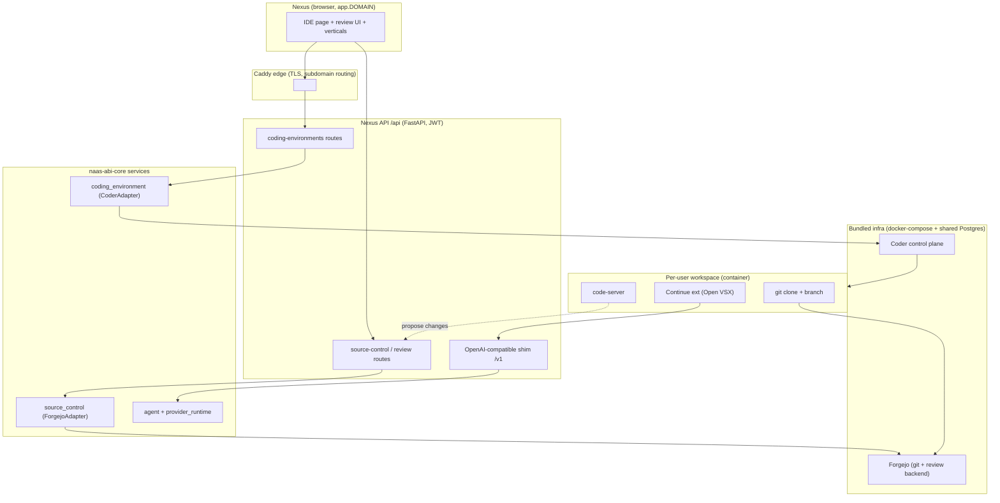

# RFC: In-app coding workspaces (Nexus IDE)

| | |
|---|---|
| **Status** | Draft — for review |
| **Author** | Maxime Jublou (with Claude) |
| **Date** | 2026-06-23 |
| **Scope** | `naas-abi-core`, `naas-abi` (Nexus web + API), deploy stack |
| **Target reference** | [Palantir Foundry Code Workspaces](https://www.palantir.com/docs/foundry/code-workspaces/overview) |

## 1. TL;DR

Ship a browser IDE *inside* Nexus so users can do real development from the app: spin up
isolated per-user environments (start / pause / resume), work on branches, talk to abi
(and generic) agents from inside the editor, and **review and merge changes without ever
leaving Nexus for GitHub/GitLab**. The editor is VS Code in the browser, orchestrated by
**Coder**; agents reach the editor through an **OpenAI-compatible shim + the Continue
extension**; git and code review are backed by a **self-hosted Forgejo** with a review UI
we build inside Nexus on its API. Everything sits behind the existing Caddy edge and
shared Postgres, and is modelled as swappable hexagonal core services so the backends stay
replaceable.

We build the **horizontal** capabilities first; bespoke **verticals** (locked-down UIs for
less-technical users) are composed on top of the same ports, on demand.

## 2. Goals / non-goals

**Goals**
- Per-user coding environments with lifecycle control (provision / start / stop / resume / delete).
- Branch-based development; one workspace per branch.
- In-editor chat with abi agents and generic agent backends.
- **In-app code review** (inline diff, comments, required approvals, required checks) — users never go to a third-party git host.
- A dedicated Nexus IDE/review UI, while keeping the underlying tools' native UIs reachable.
- Composable primitives so verticals can be built later without backend changes.

**Non-goals (for the horizontal milestones)**
- Building the bespoke vertical webapps themselves (Phase 4, on demand).
- Multi-region / large-scale autoscaling of workspace compute (start single-node; k8s template later).
- User work happens on a **branch of the abi monorepo** (across one or more modules) authored in Nexus; the in-app Forgejo is authoritative and **mirrors to GitHub in the background** (decided, §7.3).

## 2.1 Unit of work: a workspace = a branch on the monorepo

The codebase stays a **single monorepo** (one authoritative Forgejo repo, mirrored to GitHub), and a
**workspace is a branch** on it. abi *modules* are the logical surface users work on, but they live as
**directories inside the monorepo — not separate repos** — so a single workspace can touch **one or
several modules at once**, and **agents have access to the whole codebase** (a primary reason to keep it
a monorepo). This is the central organizing concept and shapes the rest of the design:
- **Repo:** the abi **monorepo** — a single authoritative Forgejo repo, background-mirrored to GitHub. No repo-per-module.
- **Isolation:** **one branch per workspace**; provisioning a workspace creates/checks out its branch.
- **Agents:** the full monorepo is checked out in the workspace, so agents (via Continue + the workspace
  filesystem) see **everything**, across all modules.
- **Templates:** the default Coder template pre-installs the **abi SDK + tooling** and clones the monorepo on the workspace's branch.
- **Review:** a proposal is a branch's diff against `main` and may span multiple modules.
- **Verticals:** a vertical is a locked-down view that *targets* a module's surface but still operates on a
  branch of the monorepo.

## 3. Requirements → design mapping

| Requirement | Mechanism |
|---|---|
| Work on different branches | Single monorepo in Forgejo; **one branch per workspace** (Coder isolates each); branch protection on `main` |
| Talk to agents (abi + generic) in the IDE | OpenAI-compatible shim on abi + Continue extension (Open VSX), pre-configured per workspace |
| Per-user spin up / pause / resume | `coding_environment` core service (`provision`/`start`/`stop`/`delete`) via `CoderAdapter`, exposed as per-user API |
| Customizable UI for verticals | Composable views over the `coding_environment` + `agent` + `source_control` ports |
| Integrated git, branch + review, enforce best practices | `source_control` core service + `ForgejoAdapter`; Nexus review UI; required approvals + required checks before merge |

## 4. Background — what already exists

This is **not** a greenfield. A verified foundation exists (currently **uncommitted** in
worktree `vigilant-goldberg-b4be3a` — landing it is Phase 0):

- **`coding_environment` core service** — `libs/naas-abi-core/naas_abi_core/services/coding_environment/`
  - Port `ICodingEnvironmentAdapter` (`CodingEnvironmentPorts.py`): `ensure_user`, `list_templates`,
    `provision`, `start`, `stop`, `delete`, `get_status`, `get_access`. Normalized DTOs
    (`WorkspaceStatus`, `WorkspaceAccess`) + a normalized error taxonomy.
  - Domain `CodingEnvironmentService.py` with fail-safe events + `wait_until_ready`.
  - Secondary adapters: `CoderAdapter` (**verified live vs Coder OSS v2.34.1**),
    `CodeServerComposeAdapter` (shared editor, simpler), `InMemoryAdapter` (fake for tests).
  - Event ontology (`WorkspaceProvisioned/Started/Stopped/Deleted/...`), factory, config model.
  - `EngineConfiguration_CodingEnvironmentService.py` wires it into the engine via the nested
    `GenericLoader` pattern (adapters: `coder` / `code_server` / `in_memory` / `custom`).
  - ~33 passing unit tests.
- **`coder_prototype/`** — a runnable harness (compose + Caddy + Terraform template + scripts)
  that proved the headless control-plane flow and the embedding boundary end-to-end.
- **Stack changes** already prototyped: a `code-server` service in `docker-compose.yml` and a
  `code-server.${PUBLIC_WEB_HOST}` route in `.deploy/docker/Caddyfile`.

**Nexus app architecture** (integration surface):
- Frontend: Next.js (App Router) under `libs/naas-abi/naas_abi/apps/nexus/apps/web`. Existing
  iframe-embed precedent (`/app-html` routes + CSP `frame-ancestors`). *(Exact sidebar/auth-store
  insertion points to be confirmed during Phase 1 — the survey of those was a fast pass.)*
- API: FastAPI under `libs/naas-abi/naas_abi/apps/nexus/apps/api/app`; `create_app()` in `main.py`,
  routers registered in `api/router.py`, hexagonal services per feature
  (`services/<feature>/adapters/primary/<feature>__primary_adapter__FastAPI.py`). Auth is JWT bearer;
  per-route identity via `get_current_user_required` and `require_workspace_access`
  (`services/auth/.../auth__primary_adapter__dependencies.py`). Core services reached via
  `ABIModule.get_instance().engine.services.<name>`.
- Agents: callable over HTTP today via `/api/chat/stream` (custom SSE), abi-to-abi
  `/agents/{name}/stream-completion`, and an MCP server (`naas_abi_core/apps/mcp/mcp_server.py`).
  Provider routing lives in `services/provider_runtime.py`. abi does **not** expose OpenAI
  `/v1/chat/completions` — hence the shim.

## 5. Reference model — how Palantir Foundry does it

Foundry validates the exact pattern we want (sourced from official docs, see §15):
- It runs its **own internal git host**; users never leave Foundry to review code (external GitHub is opt-in mirror only).
- **The editor only "proposes"; a web app reviews.** In browser VS Code you commit/branch from the
  Source Control panel and hit **"Propose changes"**, opening a Pull request ("Proposal" platform-wide).
  Line-by-line diffs, per-file approve/reject, comments, required approvals (user/group), required CI
  "Checks", and custom checks for best-practice enforcement all live in the web UI.
- Branching: modified GitFlow, protected `master`, branch protection requiring reviews + checks.

Design principle we adopt: **own the git layer → embed VS Code over it → keep the entire review
experience in our own UI; the editor only initiates commit / branch / propose.**

## 6. Target architecture



Everything new is a thin layer over the existing edge + Postgres. Coder, Forgejo, and the
editor each keep their native UIs (reachable for power users / debugging) while Nexus provides
the dedicated experience.

## 7. Detailed design

### 7.1 Coding environments (Coder backbone)

**Deployment.** Add a `coder` service to `docker-compose.yml` pointed at the existing Postgres
(new `.deploy/docker/postgres/initdb/00X-create-coder-db.sql` → `CREATE DATABASE coder;`). Route
`coder.${PUBLIC_WEB_HOST}` + `*.coder.${PUBLIC_WEB_HOST}` through Caddy (preserve `Host`, forward
WebSocket upgrade) under wildcard TLS — Caddy is the same-registrable-domain + WS layer the
embedding needs. Coder needs Docker access for the workspace template; dev uses a `docker.sock`
mount (run as needed), prod moves to a socket-proxy or a k8s template (§9).

**Service exposure.** The `coding_environment` core service is selected via `config.yaml`:

```yaml
services:
  coding_environment:
    coding_environment_adapter:
      adapter: "coder"
      config:
        access_url: "https://coder.${PUBLIC_WEB_HOST}"
        wildcard_access_url: "*.coder.${PUBLIC_WEB_HOST}"
        admin_token: "{{ secret.CODER_ADMIN_TOKEN }}"
        organization: "default"
        default_template_id: "abi-workspace"
        default_token_lifetime_seconds: 3600
        workspace_autostop_ms: 3600000
```

New Nexus API router `services/coding_environments/adapters/primary/coding_environments__primary_adapter__FastAPI.py`,
registered in `api/router.py`, resolving the core service via `ABIModule.get_instance().engine.services.coding_environment`:

| Method | Route | Purpose |
|---|---|---|
| `GET` | `/api/coding-environments` | List the current user's environments |
| `POST` | `/api/coding-environments` | Provision (monorepo template + branch) → returns env id (async) |
| `GET` | `/api/coding-environments/{id}` | Status (phase, agent_ready, autostop) |
| `POST` | `/api/coding-environments/{id}/start` | Resume |
| `POST` | `/api/coding-environments/{id}/stop` | Pause |
| `DELETE`| `/api/coding-environments/{id}` | Delete |
| `GET` | `/api/coding-environments/{id}/access` | Mint scoped access → embeddable editor URL |

All gated by `get_current_user_required` + `require_workspace_access`. Identity: map the Nexus
user → a Coder user via `ensure_user(external_id=nexus_user_id, email, username)` (idempotent;
`login_type:"none"`, verified working on v2.34.1). Store the mapping in Nexus Postgres (§10).

**Async provisioning.** Builds take 10–60s. `POST` returns immediately with the env id and
`phase=provisioning`; the frontend polls `GET /{id}` (or subscribes via the existing Socket.IO)
until `phase=running, agent_ready=true`. The domain already exposes `wait_until_ready`; the API
layer wraps it in a background task / bus job rather than blocking the request.

**Embedding & security (the load-bearing part, already de-risked).**
- Editor served on a subdomain of the **same registrable domain** as Nexus over HTTPS, so the
  session cookie is first-party inside the iframe (schemeful same-site). This is why Caddy hosts
  `*.coder.${PUBLIC_WEB_HOST}`.
- Coder sends CSP `frame-ancestors 'self'`; open it for the Nexus origin via
  `CODER_ADDITIONAL_CSP_POLICY`. code-server sends no framing headers.
- Token → cookie redemption: `get_access` returns a URL carrying `?coder_session_token=<scoped>`;
  the browser redeems it into a first-party `coder_*_session_token` cookie. The minted token is a
  **scoped** `application_connect` token (verified body shape: `{token_name, lifetime, scope:"application_connect"}`,
  with a basic-token fallback) — **never** the admin token.
- **Remaining empirical bar:** the cross-browser (Chrome + Safari, default settings) cookie/redemption
  test in a real browser over the HTTPS edge. This is the single open verification from the prototype
  and is a Phase-1 acceptance gate.

**Cost control.** `workspace_autostop_ms` (idle autostop) + a per-user quota enforced in the API
before `provision`. Surface "stopped" environments as resumable in the UI.

### 7.2 Agents in the editor (OpenAI-compatible shim + Continue)

**Why a shim.** Continue talks to OpenAI-compatible endpoints or custom providers; abi exposes
agents over its own API, not `/v1/chat/completions`. We add a thin inbound shim that reuses the
existing agent invocation path (`provider_runtime` / agent service) — no new agent logic.

**Shim.** New primary adapter `services/openai_gateway/adapters/primary/openai_gateway__primary_adapter__FastAPI.py`
exposing:
- `POST /v1/chat/completions` (supports `stream:true` → OpenAI SSE chunk format)
- `GET /v1/models` (lists abi agents + enabled generic backends)

Design points:
- **Auth:** `Authorization: Bearer <scoped-token>` — a per-user, per-workspace token minted at
  provision time and injected into the workspace's Continue config. Maps back to the Nexus user;
  scoped to chat only.
- **Model routing:** the OpenAI `model` field is a namespaced id — `abi:<agent_id>` routes to an abi
  agent; `openai:<model>` / `anthropic:<model>` / … route through `provider_runtime` to generic
  backends. This is how "generic other backends" are supported uniformly.
- **Translation:** map OpenAI request → agent invocation; translate the abi SSE stream → OpenAI
  `chat.completion.chunk` deltas.

**Workspace wiring.** The workspace image (Coder template / code-server image) ships with the **abi SDK
+ tooling** and, from **Open VSX**, **Continue and the Forgejo review extension** (Coder/code-server use Open VSX, *not* the MS
Marketplace — a hard constraint on every extension we depend on; Continue is published there).
The template writes `~/.continue/config.json` pointing `apiBase` at the in-network shim URL with the
per-workspace token, listing abi agents (and allowed generic models) as selectable models.

### 7.3 Source control + in-app review (Forgejo + Nexus review UI)

**Backend.** Self-host **Forgejo** (lightweight Go binary) as the git + review backend: add a
`forgejo` service to `docker-compose.yml` (own DB on shared Postgres), route
`git.${PUBLIC_WEB_HOST}` through Caddy. Forgejo gives a GitHub-shaped review+merge REST API,
branch protection (`required_approvals`, `status_check_contexts[]`), and **Forgejo Actions** to run
checks. **A single Forgejo repo holds the abi monorepo** (one branch per workspace), and Forgejo is the
**source of truth** with an **automatic background mirror to GitHub** (durability/portability; users never
leave Nexus for it). *(Decided: Forgejo, API-only — §13.)*

**New core service** `libs/naas-abi-core/naas_abi_core/services/source_control/` — mirrors the
`coding_environment` shape exactly (port + normalized DTOs + error taxonomy + domain events +
factory + `EngineConfiguration_SourceControlService.py` with a `GenericLoader`). Port sketch:

```python
class ISourceControlAdapter(ABC):
    def ensure_user(self, *, external_id, email, username) -> str: ...
    def ensure_repo(self, *, owner, name) -> Repo: ...
    def list_branches(self, *, repo_id) -> list[Branch]: ...
    def create_branch(self, *, repo_id, name, from_ref) -> Branch: ...
    def get_diff(self, *, repo_id, base, head) -> Diff: ...
    def create_proposal(self, *, repo_id, title, body, source, target, reviewers) -> Proposal: ...
    def list_proposals(self, *, repo_id, state) -> list[Proposal]: ...
    def get_proposal(self, *, repo_id, number) -> Proposal: ...  # diff + comments + checks + approvals
    def comment(self, *, repo_id, number, path, line, body) -> Comment: ...
    def review(self, *, repo_id, number, event, body) -> Review: ...  # APPROVE | REQUEST_CHANGES | COMMENT
    def get_checks(self, *, repo_id, number) -> list[Check]: ...
    def set_branch_protection(self, *, repo_id, branch, required_approvals, required_checks) -> None: ...
    def merge(self, *, repo_id, number, method) -> MergeResult: ...
    def mint_git_token(self, *, user_id) -> str: ...  # scoped, short-lived, for workspace git auth
```

Adapters: `ForgejoAdapter` (REST), `InMemoryAdapter` (fake for tests + generic adapter test, same
convention as `coding_environment`). Swappable to Gerrit/GitHub later without touching the UI.

**Nexus review UI.** Built in Nexus (Next.js) on top of new `services/source_control/...__FastAPI.py`
routes — *not* an iframe of Forgejo (all forges set `X-Frame-Options`/CSP and ship vendor chrome;
building our own UI is the only clean "never leave Nexus" path and matches Foundry). The UI is the
"Proposal" experience: list proposals, inline diff with comments/threads, per-file approve,
required-approval + required-check status, and a merge action gated on policy.

**Editor → review handoff (Foundry pattern).** The workspace clones from Forgejo with a scoped git
token, works on a branch-per-workspace. The user commits/pushes from the VS Code Source Control
panel; "propose changes" creates a proposal (via the API). Heavy review happens in the Nexus UI.
The Forgejo Open VSX extension is offered for power users who prefer in-editor review.

**Enforcement.** Branch protection on `main`: required approvals (user/group) + required status
checks (Forgejo Actions) must pass before `merge` succeeds — this is "enforce best practices,"
mirroring Foundry's required checks + `ci/foundry-publish`.

**Monorepo review UX (consequences of the branch-per-workspace model).** Because a proposal is a
whole-branch diff against `main`, it may span **multiple modules**; the Nexus review UI should offer
**module-scoped filtering** of the diff so reviewers can focus per module. And because many workspaces
branch off the same monorepo, **merge conflicts on shared files** are more likely than with isolated
per-module repos — the review flow needs first-class **conflict surfacing + resolution UX** (rebase/merge
from `main`), not just an approve gate.

### 7.4 Vertical UI framework (Phase 4, on demand)

The three ports (`coding_environment`, `agent`/shim, `source_control`) are the primitives. A vertical
is a Next.js view that composes a **locked-down** subset: e.g. an embedded editor scoped to a
**module's surface on a branch**, a constrained agent panel, and a one-click "propose" — hiding the
full IDE for less-technical users. No backend changes; verticals are configuration + UI over the same ports.

## 8. Security model (consolidated)

- **Identity mapping:** Nexus user (JWT) → Coder user (`login_type:none`) + Forgejo user, persisted
  in Nexus Postgres. All provisioning uses admin tokens server-side; users only ever receive
  **scoped, short-lived** tokens (editor access, chat shim, git).
- **Token scoping:** editor = `application_connect`; chat = chat-only shim token; git = scoped repo
  token. None of these is an admin token. Redemption converts the editor token into a first-party
  cookie inside the iframe.
- **Network:** Coder/Forgejo/shim are internal services on `abi-network`; only Caddy is public.
  Workspaces reach the shim and Forgejo over the internal network.
- **docker.sock risk:** Coder's Docker template needs host Docker access — fine for dev, but lock
  down via a socket-proxy or move to a k8s template before exposing to untrusted users (§12).
- **Secrets:** `CODER_ADMIN_TOKEN`, `FORGEJO_ADMIN_TOKEN` via the existing dotenv `SecretService`
  (`{{ secret.X }}`).

## 9. Persistence (Nexus Postgres)

New tables (Nexus-side; the forges remain the source of truth for their own state):
- `coding_environments` — `(id, nexus_user_id, workspace_id, name, repo_id, branch, backend_workspace_id, phase, created_at, last_active_at, autostop_at)`
- `forge_identities` — `(nexus_user_id, coder_user_id, forgejo_user_id)`
- Proposals/diffs/comments are read live from the `source_control` service (Forgejo API); cache only
  if needed for performance.

## 10. Phased delivery plan

Each phase is an independently shippable increment. Acceptance criteria are concrete gates.

**Phase 0 — Land the foundation** *(hours, low risk)*
- Bring the uncommitted `coding_environment` service + `coder_prototype/` from
  `vigilant-goldberg-b4be3a` onto a clean branch; open a PR.
- ✅ Done when: tests pass in CI; the service is on a reviewable branch.

**Phase 1 — Per-user environments end-to-end**
- `coder` service in compose + Caddy wildcard route + Coder DB; `coding_environment` configured with
  the `coder` adapter; per-user API routes; Nexus IDE page (list/create/start/stop + embedded editor
  via token redemption); async provisioning + polling/Socket.IO.
- ✅ Done when: a user provisions, pauses, and resumes their own workspace from Nexus and edits code
  in the embedded editor; **cross-browser cookie/redemption test passes in Chrome + Safari**;
  autostop + quota enforced.

**Phase 2 — Agents in the editor**
- OpenAI-compatible shim (`/v1/chat/completions`, `/v1/models`) reusing `provider_runtime`; per-workspace
  scoped chat token; Continue (Open VSX) baked into the template and pre-configured.
- ✅ Done when: from inside a workspace, a user chats with an abi agent and with at least one generic
  backend via Continue; model list reflects available agents.

**Phase 3 — Source control + in-app review**
- `forgejo` service in compose + Caddy route; `source_control` core service (port + `ForgejoAdapter` +
  `InMemoryAdapter` + events + config); workspace clones from Forgejo, branch-per-workspace; Nexus
  review UI (proposals: inline diff, comments, per-file approve, checks); branch protection.
- ✅ Done when: a user branches in a workspace, pushes, opens a proposal, another user reviews +
  comments + approves in Nexus, required checks run via Forgejo Actions, and merge to protected `main`
  is blocked until approvals + checks pass — all without leaving Nexus.

**Phase 4 — Vertical UI framework** *(on demand)*
- Composable, locked-down views over the three ports + a first vertical as a reference.

**Cross-cutting:** autostop/quotas, secrets, RBAC, observability via the event ontologies, CI check
runner (Forgejo Actions or reuse Dagster).

## 11. Risks & mitigations

| Risk | Mitigation |
|---|---|
| Cross-browser iframe cookie/redemption fails in Safari | Same-registrable-domain HTTPS strategy (already designed); Phase-1 gate runs the real-browser test; fallback = proxy editor under a subpath of the parent origin |
| `docker.sock` privilege on Coder | dev-only mount; socket-proxy / k8s template before untrusted multi-tenant use |
| Coder is **AGPLv3** | Run unmodified behind its API; conscious licensing decision for a hosted product (§13) |
| Open VSX gap for a needed extension | Verify every editor dependency is on Open VSX before relying on it (Continue ✓, Forgejo ext ✓) |
| Provisioning latency hurts UX | Async + polling/Socket.IO; pre-warmed/idle-resume; clear progress UI |
| Build-our-own review UI is real work | Code to the GitHub-shaped Forgejo API (most-cloned shape); start minimal (diff + comment + approve + merge), expand |
| Frontend insertion points uncertain | Confirm sidebar/auth-store/routing conventions at the start of Phase 1 before building |
| Whole-branch proposals span many modules | Module-scoped diff filtering in the Nexus review UI (Phase 3) |
| Concurrent workspaces collide on shared monorepo files | First-class merge-conflict surfacing + resolution UX in the review flow; encourage small, short-lived branches |

## 12. Open questions / decisions

1. ~~**Source of truth**~~ **DECIDED:** Forgejo is authoritative, with an automatic **background mirror
   to GitHub** for durability/portability; users never leave Nexus.
2. ~~**Forgejo vs Gitea**~~ **DECIDED:** **Forgejo, API-only** (copyleft not triggered by API calls;
   non-profit governance).
3. **Compute backend for prod:** docker.sock template (dev) → socket-proxy or k8s (prod). When?
4. **Check runner:** Forgejo Actions vs reusing Dagster for required checks.
5. **Coder AGPL:** confirm acceptable for the hosted offering (legal).
6. **Monorepo ↔ mirror + branch naming:** how the single monorepo is mirrored to GitHub, the
   branch-per-workspace naming scheme, branch lifecycle/cleanup, and how a workspace's branch maps to one
   or more module directories.

## 13. Licensing

- **Coder** — AGPLv3. Running unmodified behind its API is the intended use; bundling into a hosted
  product is a conscious decision to confirm.
- **Forgejo** — GPLv3+ (since v9.0). **Decision: Forgejo, API-only** — we do not fork/patch the
  server/templates, so copyleft is not triggered. (**Gitea**, MIT, would be the choice if we ever expect
  to fork.)
- **code-server** — MIT. **Continue** — Apache-2.0 (on Open VSX).
- Editor extensions must come from **Open VSX** (code-server/Coder do not use the MS Marketplace).

## 14. Appendix — key paths

| Concern | Path |
|---|---|
| Coding env service | `libs/naas-abi-core/naas_abi_core/services/coding_environment/` |
| Coding env config model | `libs/naas-abi-core/.../engine/engine_configuration/EngineConfiguration_CodingEnvironmentService.py` |
| New source_control service | `libs/naas-abi-core/naas_abi_core/services/source_control/` *(to create)* |
| Nexus API app | `libs/naas-abi/naas_abi/apps/nexus/apps/api/app/` (`main.py`, `api/router.py`) |
| API auth deps | `.../apps/api/app/services/auth/adapters/primary/auth__primary_adapter__dependencies.py` |
| Provider routing | `.../apps/api/app/services/provider_runtime.py` |
| Nexus web | `libs/naas-abi/naas_abi/apps/nexus/apps/web/` |
| MCP server | `libs/naas-abi-core/naas_abi_core/apps/mcp/mcp_server.py` |
| Deploy | `docker-compose.yml`, `.deploy/docker/Caddyfile`, `coder_prototype/` |

## 15. References

- Foundry Code Workspaces — https://www.palantir.com/docs/foundry/code-workspaces/overview
- Foundry Code Repositories (overview / navigation / branch-settings / custom checks) — https://www.palantir.com/docs/foundry/code-repositories/overview
- Foundry branching / proposals — https://www.palantir.com/docs/foundry/foundry-branching/core-concepts
- Foundry VS Code — https://www.palantir.com/docs/foundry/vs-code/overview
- Forgejo API usage — https://forgejo.org/docs/latest/user/api-usage/ ; Gitea API — https://docs.gitea.com/api/
- Gitea protected branches — https://docs.gitea.com/usage/access-control/protected-branches
- Gerrit REST / submit requirements — https://gerrit-review.googlesource.com/Documentation/rest-api-changes.html
- GitLab approvals are Premium+ — https://docs.gitlab.com/api/merge_request_approvals/
- Coder uses Open VSX — https://blogs.eclipse.org/post/paul-buck/coder-why-they-chose-open-vsx-registry
- Continue / Forgejo / Gerrit extensions on Open VSX — https://open-vsx.org/
