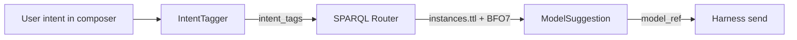

# Desktop ABI model router

## Status

Accepted

## Date

2026-07-10

## Context

ABI Desktop users bring their own models: local Ollama installs and cloud provider APIs. Today they pick a model manually from a dropdown. The product vision is **ABI as an intelligent model router**: the user types intent in chat, and the system suggests the best local vs cloud model based on TTL that describes each model's realizable BFO7 processes and hosting site.

Iteration 1 delivered BFO7 section routing (chat → plan, code → build) over Oxigraph. Iteration 3 adds task-aware **model** routing on the same graph stack, without importing `naas_abi` or `naas_abi_core`.

## Decision

1. **Router layer over Oxigraph + BFO7 realizabilities**

   - Extend `ontology/desktop-routing.ttl` with `abi:LanguageModel`, `abi:hostedAt`, `abi:supportsTools`, `abi:canRealize`, `abi:modelRef`, and site individuals `abi:SiteLocal` / `abi:SiteCloud` (aligned with `BFO7Buckets.ttl` `abi:` namespace).
   - Scaffolded `instances.ttl` seeds example `LanguageModel` individuals per org/model context.
   - `DesktopGraph.suggest_models(intent_tags, prefer_local)` runs SPARQL over the active context graph, filters tool-capable models, ranks by process match count and hosting preference.

2. **Intent tagging (phased)**

   - **MVP**: rule-based `tag_intent_from_text()` maps composer keywords to intent tags (`code`, `plan`, `summarize`, `general`), then to BFO7 process IRIs (`bfo:BFO_0000015` process, `bfo:BFO_0000023` role).
   - **V2**: LLM intent tagger replaces keyword rules; same SPARQL router and TTL contract.

3. **API and UI**

   - `POST /api/router/suggest` body `{ "text": "refactor this python file", "prefer_local": true }` returns `{ intent_tags, suggestions: [{ model_ref, label, hosted_at, score, reason, matched_processes }] }`.
   - Chat/Code composer debounces input and shows suggestion chips above the composer; click applies the model chip and `@ollama:…` or cloud ref.

## Architecture

## Phased rollout

| Phase | IntentTagger | Router | UI |
|-------|----------------|--------|-----|
| MVP (this iteration) | Keyword rules in `graph.py` | SPARQL over `instances.ttl` | Debounced chips in `app.js` |
| V2 | LLM classification | Same SPARQL + richer process TTL | Persist user overrides, graph panel |

## Consequences

- Model routing is data-driven: edit `instances.ttl` to add/remove models without code changes.
- Local vs cloud tradeoff is explicit via `abi:hostedAt` and `prefer_local`.
- Only models with `abi:supportsTools true` are suggested (opencode agents require tools).
- V2 can add per-process subclasses from Nexus process TTL without changing the API shape.
- Bundle stays self-contained: router vocab ships in `desktop/ontology/`.

## Related

- `docs/adr/20260710_desktop-bfo7-routing-graph.md`
- `docs/adr/20260710_desktop-org-model-workspace.md`
