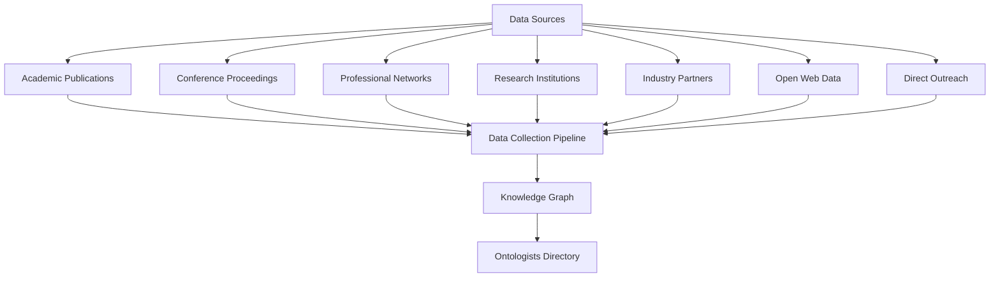

# Ontologists Directory

## Overview

The Ontologists Directory is a global initiative to identify, catalog, and build a structured knowledge base of ontology practitioners, researchers, and experts worldwide. This directory will serve as a foundational resource for fostering collaboration, knowledge sharing, and advanced AI applications within the ontology community.

## Goals and Objectives

- **Map the Ontology Ecosystem**: Create a comprehensive, global map of ontologists across academia, industry, and government sectors.
- **Foster Collaboration**: Enable connections between ontologists working in similar domains or complementary areas.
- **Knowledge Discovery**: Identify patterns, trends, and gaps in ontology development across domains and regions.
- **Support AI Grounding**: Develop a knowledge base that can ground AI models in domain-specific ontological expertise.
- **Build Community**: Create a platform for knowledge exchange and mentorship within the ontology community.

## Data Collection Strategy

The collection of ontologist data will follow a multi-pronged approach:

### Primary Data Sources

1. **Academic Publications**: Scan ontology-related journals, conferences, and publications to identify authors.
2. **Conference Attendees**: Parse attendance lists from ontology conferences like FOIS, ICBO, and Applied Ontology.
3. **Professional Networks**: Analyze LinkedIn, ResearchGate, and academic platforms using the appropriate API access.
4. **Research Institution Websites**: Extract information from universities and research centers working on ontologies.
5. **Industry Partners**: Collect data from companies specializing in semantic technologies.
6. **Open Web Scanning**: Implement web crawling to discover ontologists through their online presence.
7. **Direct Outreach**: Create submission forms for voluntary registration in the directory.

## Ontological Structure

The Ontologists Directory will be structured using a domain-specific ontology aligned with the Common Core Ontologies already present in the framework:

### Core Classes
- Person (inherits from cco:ont00001262)
- OntologyExpertise (specialization of abi:ProfessionalSkills)
- OntologyDomain (aligned with cco:ont00001048)
- ResearchInstitution (subclass of cco:ont00001180)
- OntologyProject (subclass of abi:Project)
- OntologyPublication (subclass of cco:ont00000958)

### Key Relationships
- hasExpertise (Person to OntologyExpertise)
- specializesIn (Person to OntologyDomain)
- affiliatedWith (Person to Organization)
- hasContributedTo (Person to OntologyProject)
- hasAuthored (Person to OntologyPublication)
- collaboratesWith (Person to Person)
- mentors (Person to Person)

## Agent Architecture

We will implement an **Ontologists Directory Agent** using functional programming principles that leverages this data to provide intelligent services to the ontology community.

### Agent Capabilities

1. **Knowledge Discovery**
   - Find ontologists by domain, expertise, geographic location, or organization
   - Identify collaborations and research networks
   - Map the evolution of ontology domains over time

2. **Expertise Matching**
   - Match domain problems with relevant ontologists
   - Suggest potential collaborations based on complementary expertise
   - Identify mentorship opportunities between senior and junior ontologists

3. **Research Insights**
   - Analyze research trends in ontology development
   - Identify gaps in ontology coverage across domains
   - Track the influence and adoption of specific ontologies

4. **Community Building**
   - Facilitate connections between ontologists in similar domains
   - Support the formation of working groups around emerging ontology challenges
   - Enable knowledge transfer across disciplines

## Implementation Workflow

The implementation will follow a phased approach:

### Phase 1: Infrastructure and Data Models
- Design the ontologist ontology extending the framework's Common Core Ontologies
- Set up the knowledge graph infrastructure
- Implement the data collection pipelines
- Develop privacy controls and consent mechanisms

### Phase 2: Data Collection and Processing
- Deploy data collection agents across all identified sources
- Process and normalize collected data
- Map entities to the ontology and establish relationships
- Perform initial quality control and validation

### Phase 3: Agent Development
- Implement the core agent capabilities using functional programming patterns
- Develop query interfaces and search functionality
- Create the recommendation engine for expertise matching
- Build visualization components for network analysis

### Phase 4: Community Engagement
- Launch a public interface for ontologists to claim and update their profiles
- Implement feedback mechanisms for continuous improvement
- Develop community features for collaboration and knowledge sharing
- Open data access APIs for research and application development

## Privacy and Ethical Considerations

The Ontologists Directory will adhere to strict privacy guidelines:

- All publicly collected data will comply with applicable data protection regulations
- Ontologists will have full control over their profile information
- Explicit consent will be required for inclusion in recommendation systems
- Transparent data usage policies and access controls

## Expected Impact

The Ontologists Directory and its associated agent will:

1. Accelerate ontology development through improved collaboration
2. Reduce redundant effort by making existing expertise more discoverable
3. Support more effective grounding of AI systems in domain ontologies
4. Facilitate interdisciplinary applications of ontology approaches
5. Create a stronger, more connected global community of ontology practitioners

## Conclusion

The Ontologists Directory represents a vital resource for advancing the field of ontology and its applications. By mapping the global landscape of ontology expertise and deploying intelligent agents to leverage this knowledge, we can accelerate progress in semantic technologies, knowledge engineering, and AI grounding.
