# ABI Installation & Configuration

**ABI** (Agentic Brain Infrastructure) is an AI Network development framework. The open source platform enables intelligent, multi-agent systems that run on any device - from servers to phones to edge devices. Your entire AI Network is defined in a single configuration file.

## What is ABI?

**Key Benefits:**
- **Configuration-Driven** - Define your entire AI Network in a single file
- **Zero Code Changes** - Modify agent behavior through configuration
- **Intelligent Routing** - Commands automatically reach the right agents
- **Portable** - Run on servers, phones, tablets, and edge devices
- **Open Source** - Complete transparency and open to community contributions

## When to Use ABI

**Use ABI when you need:**
- Custom AI agents for specific processes
- Portable deployment across different devices
- Local data processing for sensitive information
- Full control over AI models and deployment
- Development environment for platform integrations

**Use the Naas.ai cloud platform when you need:**
- Quick start without setup
- Team collaboration and sharing
- Managed infrastructure and scaling

Most users start with the cloud platform and add ABI for customization later.

## Portable Deployment

Deploy the same configuration across different devices and environments:

**Development**
- Develop and test locally on your machine
- Full control over data and processing
- Offline capabilities

**Cloud Infrastructure**  
- Deploy to cloud servers for scaling
- Leverage cloud compute for heavy workloads
- Integrate with cloud services

**Mobile and Edge Devices**
- Run on phones, tablets, and IoT devices
- Distributed processing at the network edge
- Bring AI capabilities closer to users

The same configuration file works everywhere.

## Prerequisites

Before installing ABI, ensure you have:

- **[Docker Desktop](https://www.docker.com/products/docker-desktop/)** - Required for Oxigraph triple store
- **[uv](https://docs.astral.sh/uv/getting-started/installation/)** - Python package manager
- **Python 3.11+** - For running ABI components
- **Git** - For cloning repositories

## Installation Options

Choose the approach that best fits your needs:

### 1. Clone Repository (Recommended)
Best for: Exploring ABI and following tutorials

```bash
git clone https://github.com/jupyter-naas/abi.git
cd abi
```

### 2. Fork Repository
Best for: Contributing back to the project

```bash
# 1. Fork via GitHub UI: https://github.com/jupyter-naas/abi/fork
# 2. Clone your fork
git clone https://github.com/YOUR-USERNAME/abi.git
cd abi
```

### 3. Private Fork
Best for: Private customization with upstream sync

```bash
# 1. Create private repository via GitHub UI
# 2. Clone your private repository
git clone https://github.com/YOUR-USERNAME/abi-private.git
cd abi-private

# 3. Add upstream for updates
git remote add upstream https://github.com/jupyter-naas/abi.git
git pull --rebase upstream main
git push
```

## Environment Setup

### 1. Configure Environment Variables

Copy the example environment file:

```bash
cp .env.example .env
```

Edit `.env` with your preferred editor and configure at least one AI model provider:

```bash
# OpenAI (recommended for getting started)
OPENAI_API_KEY=sk-your-openai-api-key

# Anthropic Claude
ANTHROPIC_API_KEY=your-anthropic-api-key

# Google Gemini  
GOOGLE_API_KEY=your-google-api-key

# Mistral
MISTRAL_API_KEY=your-mistral-api-key
```

**Note:** The .env file should never be committed to version control as it contains sensitive credentials.

### 2. Configure AI Network

ABI uses a single `config.yaml` file to define your AI Network. The main sections include:

**System Configuration:**
- `workspace_id`: Naas Platform workspace ID for storage and publishing
- `github_project_repository`: Your GitHub repository (e.g. "jupyter-naas/abi")
- `api_title`: API title displayed in documentation
- `storage_name` and `space_name`: Storage configuration

**AI Network Configuration:**
The `ai_network` section defines your agents:

```yaml
ai_network:
  # ABI Orchestrator with centralized intent mapping
  abi:
    enabled: true
    description: "Multi-agent orchestrator"
    strengths: "Orchestration, strategic advisory"
    use_when: "Identity, strategy, coordination"
    intent_mapping:
      raw_intents:
        "what is your name": "My name is ABI"
        "who are you": "I am ABI, developed by NaasAI"
      tool_intents:
        open_knowledge_graph_explorer:
          - "show knowledge graph"
          - "sparql query"
        check_ai_network_config:
          - "list agents"
          - "agent status"
      agent_intents:
        chatgpt:
          - "use chatgpt"
          - "web search"
        claude:
          - "use claude"
          - "anthropic"

  # Foundation AI Models
  chatgpt:
    enabled: true
    description: "OpenAI ChatGPT"
    strengths: "General conversation, coding"
    use_when: "General tasks, coding help"

  claude:
    enabled: true
    description: "Anthropic Claude"
    strengths: "Analysis, writing"
    use_when: "Detailed analysis"

  # Disabled agents (ready for activation)
  llama:
    enabled: false
    description: "Meta Llama"
    strengths: "Local, private"
    use_when: "Private tasks"
```

## Configuration-Driven Architecture

ABI uses a single configuration file to define your AI Network:

```mermaid
graph LR
    User["User Input<br/>'use claude for analysis'"] --> ABI["ABI Orchestrator<br/>Intent Routing"]
    
    ABI --> Claude["Claude Agent<br/>Analysis & Writing"]
    ABI --> ChatGPT["ChatGPT Agent<br/>General & Coding"]
    ABI --> Gemini["Gemini Agent<br/>Multimodal"]
    ABI --> Tools["Tools<br/>Knowledge Graph<br/>Config Check"]
    
    Config["config.yaml<br/>• Agent definitions<br/>• Intent mappings<br/>• Enable/disable"] -.-> ABI
    
    Claude --> Response1["Detailed analysis response"]
    ChatGPT --> Response2["Code or general response"]
    Gemini --> Response3["Image/multimodal response"]
    Tools --> Response4["System information"]
    
    style ABI fill:#e1f5fe
    style Config fill:#f0f0f0
    style User fill:#e8f5e8
```



- **Single Source**: Your entire AI Network in one config.yaml file
- **Intelligent Routing**: Commands automatically reach the appropriate agents
- **Intent Mapping**: Support for direct responses, tool routing, and agent routing
- **Agent Control**: Enable/disable agents with a config change
- **No Code Changes**: Modify behavior through configuration

### Agent Definition Structure

Each agent contains:
- **enabled**: Boolean flag for activation
- **description**: Brief agent description
- **strengths**: Core capabilities
- **use_when**: Recommended use cases

### ABI Intent Mapping Types

The ABI agent contains centralized intent mapping with three types:
- **raw_intents**: Direct text responses (key-value pairs)
- **tool_intents**: Route to specific tools/functions
- **agent_intents**: Route to specific agents

**Benefits:**
- **Agent Control**: Change `enabled: true/false` to activate/deactivate agents
- **Configuration-Based**: All agent behavior controlled through config.yaml
- **Consistent Management**: Unified agent identification across your AI Network
- **Dynamic Mapping**: Add new intents and behaviors through configuration

## Quick Start

### Start Your First Agent

Once configured, start chatting with the core ABI agent:

```bash
make chat-abi-agent
```

This command will:
1. Set up the environment and install Python dependencies
2. Start Docker services (Oxigraph triple store)
3. Initialize the knowledge graph with base ontologies
4. Launch the interactive agent in your terminal

The first run may take a few minutes as it downloads and starts the Oxigraph Docker container.

### Expected Output

You should see something like:

```
🚀 Starting ABI Agent...
🐳 Starting Oxigraph triple store...
🧠 Initializing knowledge graph...
💬 ABI Agent ready! Type your message below:

ABI Agent: Hello! I'm your ABI agent. I can help you with:
- Building custom AI agents
- Managing ontologies and knowledge graphs  
- Creating integrations with external services
- Developing workflows and pipelines

What would you like to work on today?

You: 
```

## Verification

### Test Core Functionality

Try these commands to verify your installation:

```bash
# Test agent interaction
echo "What agents are available?" | make chat-abi-agent-prompt

# Test API server (in another terminal)
make api
# Then visit http://localhost:8000/docs

# Check services are running
docker ps
```

You should see the Oxigraph container running on port 7878.

## Troubleshooting

### Common Issues

**Docker not running?**
```bash
# Start Docker Desktop and verify
docker --version
docker ps
```

**Python dependencies failing?**
```bash
# Ensure uv is installed and updated
uv --version
uv self update

# Clean and reinstall
rm -rf .venv
make setup
```

**Oxigraph connection errors?**
```bash
# Check if container is running
docker ps | grep oxigraph

# Restart if needed
docker-compose down
docker-compose up -d oxigraph
```

**Agent not responding?**
```bash
# Check environment variables
cat .env | grep API_KEY

# Verify API key validity
curl -H "Authorization: Bearer $OPENAI_API_KEY" \
     https://api.openai.com/v1/models
```

## Next Steps

Now that ABI is installed, explore its capabilities:

### Explore Built-in Agents
```bash
# Chat with different specialized agents
make chat-growth-agent
make chat-finance-agent  
make chat-content-agent
```

### Learn the System
- **Explore the knowledge graph**: `make chat-ontology-agent`
- **Build custom agents**: Follow our agent development guides
- **Add integrations**: Connect to external services
- **Create workflows**: Automate complex processes

### Development Tools

ABI includes comprehensive development tools:

```bash
# Core functionality
make chat-abi-agent          # Main agent interface
make api                     # Start API server
make setup                   # Install dependencies

# Development
make lint                    # Code linting
make format                  # Code formatting
make test                    # Run test suite

# Ontology management
make ontology-update         # Update knowledge graph
make ontology-backup         # Backup ontologies
```

## Getting Help

**Documentation:**
- [ABI Repository](https://github.com/jupyter-naas/abi) - Full documentation
- [Agent Development](https://github.com/jupyter-naas/abi/docs) - Creating custom agents

**Community Support:**
- [GitHub Discussions](https://github.com/jupyter-naas/abi/discussions) - Community Q&A
- [GitHub Issues](https://github.com/jupyter-naas/abi/issues) - Bug reports and feature requests

**Direct Support:**
- Email: support@naas.ai

## Updating ABI

Keep your ABI installation current:

### Regular Updates
```bash
# Pull latest changes
git pull origin main

# Update dependencies
make setup

# Restart services
make chat-abi-agent
```

### For Private Forks
```bash
# Sync with upstream
git fetch upstream
git rebase upstream/main
git push origin main

# Update dependencies
make setup
```

Your ABI installation is now ready! Start building custom AI solutions with complete configuration-driven flexibility.
