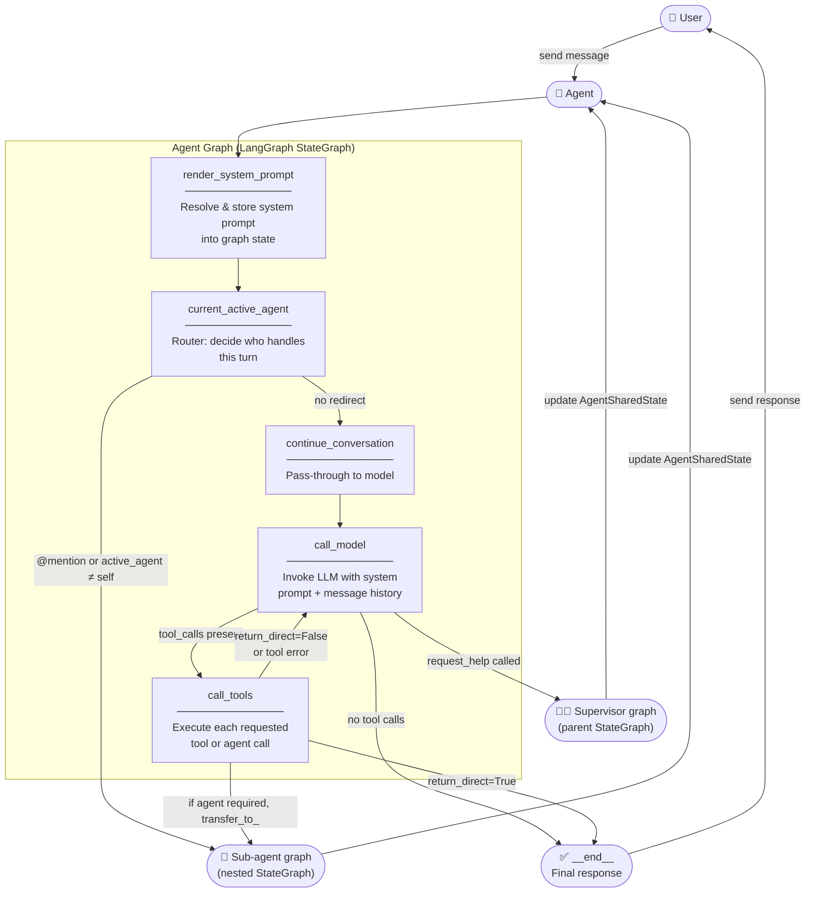
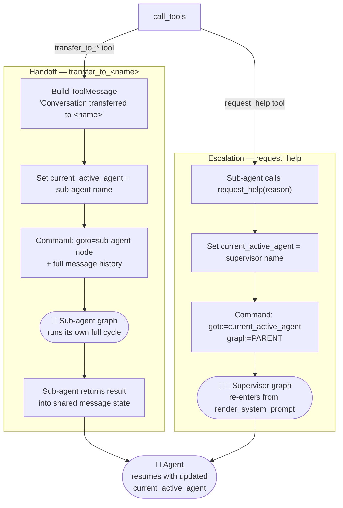

# Agent Execution Flow

> How an `Agent` processes a message from input to final response.

---

## Graph Overview



---

## Agent Handling

When `call_tools` encounters a **handoff tool** (`transfer_to_*`) or a **`request_help`** call, control leaves the current graph and delegates to another agent. The shared `AgentSharedState` is updated so the correct agent resumes on the next turn.



### How sub-agents are registered
Every `Agent` passed in `tools=[]` or `agents=[]` is converted into a `transfer_to_<name>` handoff tool at init time. The sub-agent's compiled graph is also added as a **named node** in the parent graph, so `Command(goto=agent_name)` can reach it directly.

```
agents=[AnalyticsAgent, ReportAgent]
  └─► structured_tools += [transfer_to_AnalyticsAgent, transfer_to_ReportAgent]
  └─► graph.add_node("AnalyticsAgent", AnalyticsAgent.graph)
  └─► graph.add_node("ReportAgent",    ReportAgent.graph)
```

### Sub-agent system prompt injection
When a sub-agent is activated, `current_active_agent` prepends a **SUPERVISOR SYSTEM PROMPT** block to its system prompt at runtime:

```
SUPERVISOR SYSTEM PROMPT:
  Remember, you are a specialized agent working under <supervisor>.
  Stay focused on your role. Use `request_help` if uncertain.

SUBAGENT SYSTEM PROMPT:
  <original sub-agent system prompt>
```

---

## Step-by-Step

### 1. `render_system_prompt`
Evaluates the system prompt — either a static string or a callable that receives the current message history. The resolved string is written into the graph state so every downstream node can read it.

### 2. `current_active_agent`
Pure routing node. Three possible outcomes:

| Condition | Destination |
|---|---|
| Last human message starts with `@agent_name` | Jump directly to that sub-agent's graph node |
| `state.current_active_agent` is set and ≠ self | Resume the stored active sub-agent |
| Neither | Fall through to `continue_conversation` |

If this agent is itself a sub-agent (has a supervisor), a `SUPERVISOR SYSTEM PROMPT` block is prepended to the resolved system prompt, instructing it to stay focused and escalate via `request_help` when uncertain. The current date is also injected here if not already present.

### 3. `continue_conversation`
Thin pass-through. Exists as an explicit node so the graph can be patched (via the optional `patcher` callable) between routing and model invocation without changing the core flow.

### 4. `call_model`
Builds the final message list — `[SystemMessage(system_prompt)] + history` — and calls the bound LLM (`_chat_model_with_tools`).

| Response type | Next step |
|---|---|
| Has `tool_calls` | → `call_tools` |
| Plain text response | → `__end__` |
| OpenAI `responses/v1` format | Special parse, then `__end__` |

### 5. `call_tools`
Iterates over each tool call in the last AI message and dispatches:

| Tool type | Behaviour |
|---|---|
| **Regular tool** (`return_direct=False`) | Execute → send result back to `call_model` for interpretation |
| **Regular tool** (`return_direct=True`) | Execute → wrap result as `AIMessage` → `__end__` |
| **Handoff tool** (`transfer_to_<name>`) | Navigate to the named sub-agent node in this graph |
| **`request_help`** | Set `current_active_agent` to supervisor → escalate to parent graph |
| **Tool error** | Capture error as `ToolMessage` → loop back to `call_model` |

---

## Key Concepts

### Memory / Checkpointer
Every conversation is persisted per `thread_id`. Backed by **PostgreSQL** (if `POSTGRES_URL` is set) or an **in-memory** `MemorySaver`. This lets the agent resume multi-turn conversations.

### Tool Binding
At init time, all structured tools **and** native tools are bound to the LLM via `bind_tools(...)`. If the model does not support tool calling, it falls back to plain chat with no tool access.

### Sub-agents as Tools
When an `Agent` is passed as a tool (or in `agents=[]`), it is automatically converted to a `transfer_to_<name>` handoff tool. The supervisor agent calls this tool to delegate a task; the sub-agent runs its own full graph and returns the result.

### Default Tools (always injected)
| Tool | Purpose |
|---|---|
| `get_time_date` | Returns current datetime for a given timezone |
| `list_tools_available` | Lists all tools the agent can use |
| `list_subagents_available` | Lists all available sub-agents |
| `list_intents_available` | Lists configured intents |
| `request_help` *(sub-agents only)* | Escalates to supervisor when stuck |
| `get_current_active_agent` *(multi-agent only)* | Returns active agent name |
| `get_supervisor_agent` *(multi-agent only)* | Returns supervisor name |

### Event Streaming
Every significant moment emits a typed event into an `_event_queue`:
- `ToolUsageEvent` — model requested a tool call
- `ToolResponseEvent` — tool returned a result
- `AIMessageEvent` — model produced a text response
- `FinalStateEvent` — graph execution finished

These events power the SSE `stream_invoke` endpoint (`tool_usage` / `tool_response` / `ai_message` / `message` / `done`).

---

## Graph Compilation

```python
graph = StateGraph(ABIAgentState)          # state = messages + system_prompt
# nodes added: render_system_prompt, current_active_agent,
#              continue_conversation, call_model, call_tools,
#              + one node per sub-agent (sub-graph)
if patcher:
    graph = patcher(graph)                 # optional hook to modify topology
self.graph = graph.compile(checkpointer=self._checkpointer)
```

The `patcher` parameter is the extension point — pass a callable to add nodes, edges, or conditional branches before the graph is compiled.
