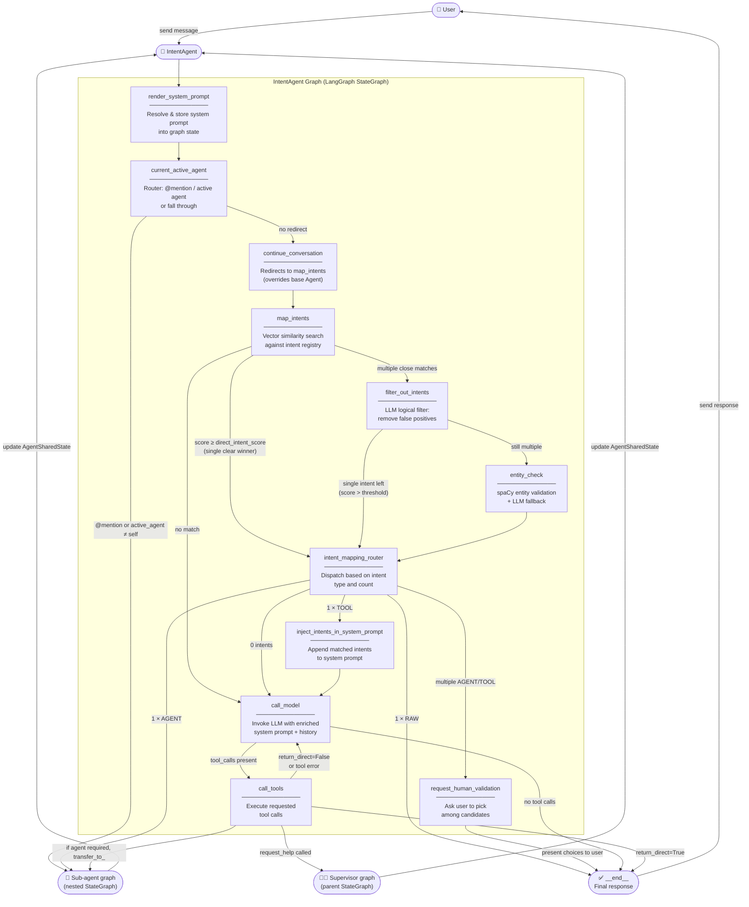

# IntentAgent Execution Flow

> How an `IntentAgent` routes a user message through intent matching before reaching the LLM.
>
> `IntentAgent` extends `Agent` — the first two nodes (`render_system_prompt`, `current_active_agent`) are identical. The divergence starts at `continue_conversation`, which sends the flow to `map_intents` instead of `call_model`.

---

## Graph Overview



---

## Step-by-Step

### 1. `render_system_prompt` *(inherited)*
Evaluates the system prompt (static string or callable) and writes it into graph state. Identical to the base `Agent`.

### 2. `current_active_agent` *(inherited)*
Routes directly to a sub-agent via `@mention` or stored `current_active_agent`. If neither applies, falls through to `continue_conversation`.

### 3. `continue_conversation` *(overridden)*
In the base `Agent` this goes to `call_model`. Here it redirects to `map_intents` — the entry point of the intent pipeline.

### 4. `map_intents`
Core of the intent system. Two-pass vector search:

| Pass | Method | Description |
|---|---|---|
| 1st | `map_intent(text, k=10)` | Embed the raw user message, cosine similarity against intent index |
| 2nd *(fallback)* | `map_prompt(text, k=10)` | Re-run the same search if pass 1 returned nothing |

After scoring, three routing decisions:

| Condition | Next node |
|---|---|
| No result above `threshold` (0.85) | `call_model` |
| Single result with score ≥ `direct_intent_score` (0.90) and clearly best | `intent_mapping_router` (fast path) |
| Multiple results within `threshold_neighbor` (0.05) of the top score | `filter_out_intents` |

Special case: if the user replied with a digit (`"1"`, `"2"`, …) after a `request_human_validation` message, `map_intents` resolves the choice and routes directly to the selected agent.

### 5. `filter_out_intents`
Calls the LLM with a dedicated `filter_intents` tool. The model receives the list of candidate intents and the user message, then returns a boolean list — `true` keeps the intent, `false` drops it.

Filters out intents that are **logically incompatible** despite surface similarity (e.g. wrong named entities, over-specific conditions).

| Result | Next node |
|---|---|
| 1 intent remaining above `threshold` | `intent_mapping_router` |
| Still multiple | `entity_check` |

### 6. `entity_check`
Uses **spaCy** (`en_core_web_sm`) to extract named entities from each candidate intent value.

- Intent with **no entities** → kept as-is.
- Intent with entities → check if every entity appears in the user message.
  - If entity sets match → kept.
  - Ambiguous → LLM asked to answer `"true"` / `"false"`.

Always routes to `intent_mapping_router`.

### 7. `intent_mapping_router`
Final dispatch based on the cleaned intent set:

| State | Action |
|---|---|
| 0 intents | `call_model` — no usable match, let the LLM handle it |
| 1 × **RAW** | Emit `intent_target` string directly as `AIMessage` → `__end__` |
| 1 × **AGENT** | `goto=intent_target` — jump to that sub-agent node |
| 1 × **TOOL** | `inject_intents_in_system_prompt` — let the LLM call the tool |
| Multiple **AGENT/TOOL** | `request_human_validation` |
| Multiple with ≤ 1 non-RAW | `inject_intents_in_system_prompt` |

### 8. `request_human_validation`
Presents a numbered list of candidate agents/tools to the user and ends the turn. On the next message, `map_intents` detects the numeric reply and resolves the choice.

### 9. `inject_intents_in_system_prompt`
Appends an `<intents_rules>` block to the system prompt containing the matched intent(s) and their targets. The LLM then knows which tool to call or which response pattern to follow.

### 10. `call_model` + `call_tools` *(inherited)*
Identical to the base `Agent` — see [Agent Execution Flow](./Agent-Execution-Flow.md).

---

## Intent Types & Scope

### Types

| Type | `intent_target` | LLM involved? | Description |
|---|---|---|---|
| `RAW` | A plain string | No | Short-circuit: return the string directly |
| `TOOL` | Tool name (e.g. `list_tools_available`) | Yes | Inject intent → LLM calls the tool |
| `AGENT` | Agent name (e.g. `AnalyticsAgent`) | No | Redirect to that sub-agent graph node |

### Scope

| Scope | Meaning |
|---|---|
| `DIRECT` | Matched only against the current message |
| `ALL` | May be matched across the full conversation context |

---

## Scoring Thresholds

| Parameter | Default | Role |
|---|---|---|
| `threshold` | `0.85` | Minimum cosine similarity for any intent to be considered |
| `threshold_neighbor` | `0.05` | Maximum score gap to be considered a "close competitor" |
| `direct_intent_score` | `0.90` | Above this with a clear lead → skip filtering, route immediately |

---

## Intent Pipeline Summary

```
User message
    │
    ▼
map_intents ──(no match)──────────────────────────────► call_model
    │
    ├─(score ≥ 0.90, single winner)──────────────────► intent_mapping_router
    │
    └─(multiple close)──► filter_out_intents
                                │
                                ├─(1 left)────────────► intent_mapping_router
                                │
                                └─(still many)──► entity_check
                                                        │
                                                        └────────────► intent_mapping_router
                                                                            │
                                    ┌───────────────────────────────────────┤
                                    ▼                                       │
                            0 → call_model                                  │
                            RAW → __end__ (direct string)                   │
                            AGENT → sub-agent node                          │
                            TOOL → inject → call_model                      │
                            multiple → request_human_validation ────────────┘
```

---

## Default Intents

A set of built-in intents is always injected (unless `default_intents=False`):

| Category | Examples | Type |
|---|---|---|
| Identity | "what's your name?", "what do you do?" | `AGENT → call_model` |
| Greetings | "Hello", "Hi", "Salut", "Bonjour" | `RAW` |
| Thanks | "Thank you", "Merci" | `RAW` |
| Discovery | "List tools available", "List sub-agents available" | `TOOL` |
