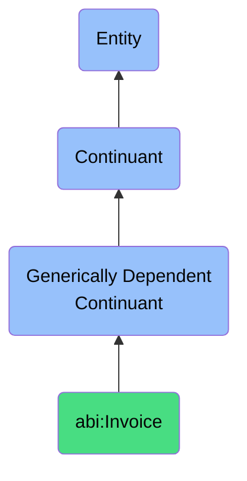

# Invoice

## Definition
An invoice is a generically dependent continuant that records a payment request for goods or services delivered.

## Hierarchy in BFO

## Related Classes
- **abi:ContractDocument** - A generically dependent continuant that expresses the agreed obligations and rights between agents.
- **abi:Report** - A generically dependent continuant that communicates structured analysis or findings about a specific topic.
- **abi:MeetingNote** - A generically dependent continuant that documents key points and decisions from a scheduled discussion. 