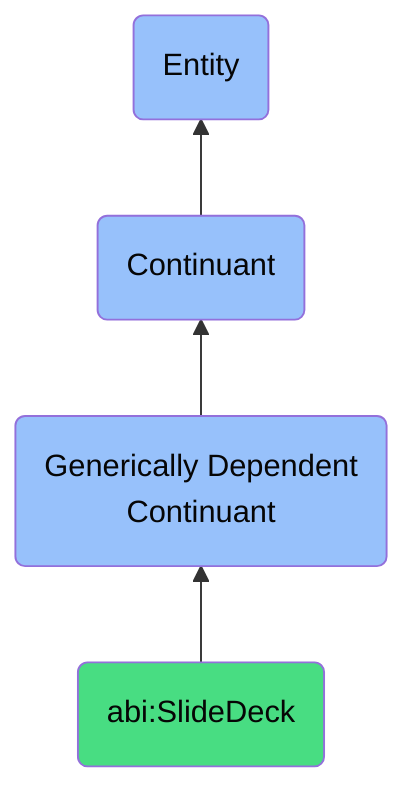

# SlideDeck

## Definition
A slide deck is a generically dependent continuant that conveys ideas or insights through a sequential set of visual or textual frames.

## Hierarchy in BFO

## Related Classes
- **abi:Report** - A generically dependent continuant that communicates structured analysis or findings about a specific topic.
- **abi:Presentation** - A generically dependent continuant that structures arrangements of messages or claims meant to inform, persuade, or explain in a time-bound setting.
- **abi:ContractDocument** - A generically dependent continuant that expresses the agreed obligations and rights between agents.
