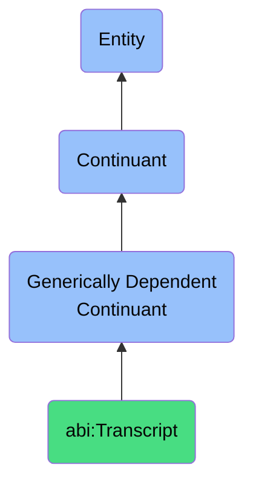

# Transcript

## Definition
A transcript is a generically dependent continuant that provides a verbatim or summarized textual representation of spoken dialogue captured during a conversation.

## Hierarchy in BFO

## Related Classes
- **abi:MeetingNote** - A generically dependent continuant that documents key points and decisions from a scheduled discussion.
- **abi:Report** - A generically dependent continuant that communicates structured analysis or findings about a specific topic.
- **abi:Presentation** - A generically dependent continuant that structures arrangements of messages or claims meant to inform, persuade, or explain in a time-bound setting. 