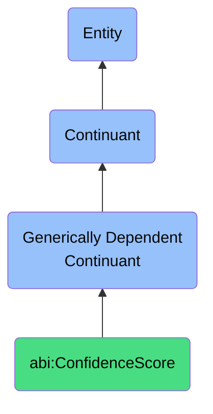

# ConfidenceScore

## Definition
A confidence score is a generically dependent continuant that provides a scalar measure expressing the strength or certainty of a prediction, classification, or evaluation.

## Hierarchy in BFO

## Related Classes
- **abi:TrustScore** - A generically dependent continuant that represents a numerical or ordinal value estimating the perceived reliability of an entity or claim.
- **abi:SentimentScore** - A generically dependent continuant that characterizes the emotional valence of a statement, message, or document.
- **abi:Forecast** - A generically dependent continuant that provides a data projection estimating future states or outcomes based on historical or modeled inputs. 