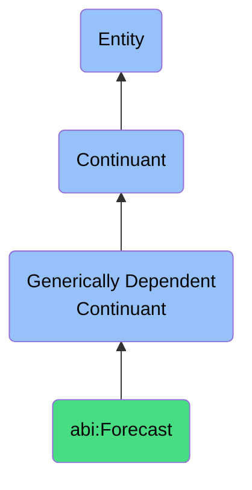

# Forecast

## Definition
A forecast is a generically dependent continuant that provides a data projection estimating future states or outcomes based on historical or modeled inputs.

## Hierarchy in BFO

## Related Classes
- **abi:ConfidenceScore** - A generically dependent continuant that provides a scalar measure expressing the strength or certainty of a prediction, classification, or evaluation.
- **abi:KPIValue** - A generically dependent continuant that provides a measured outcome that quantifies performance against a defined business objective.
- **abi:EngagementMetric** - A generically dependent continuant that provides a quantifiable measure reflecting the degree of interaction between users and content or campaigns. 