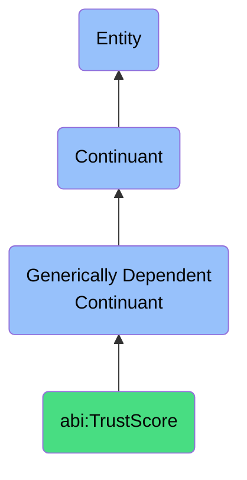

# TrustScore

## Definition
A trust score is a generically dependent continuant that represents a numerical or ordinal value estimating the perceived reliability of an entity or claim.

## Hierarchy in BFO

## Related Classes
- **abi:EngagementMetric** - A generically dependent continuant that reflects the degree of interaction between users and content or campaigns.
- **abi:ConfidenceScore** - A generically dependent continuant that expresses the strength or certainty of a prediction, classification, or evaluation.
- **abi:SentimentScore** - A generically dependent continuant that characterizes the emotional valence of a statement, message, or document. 