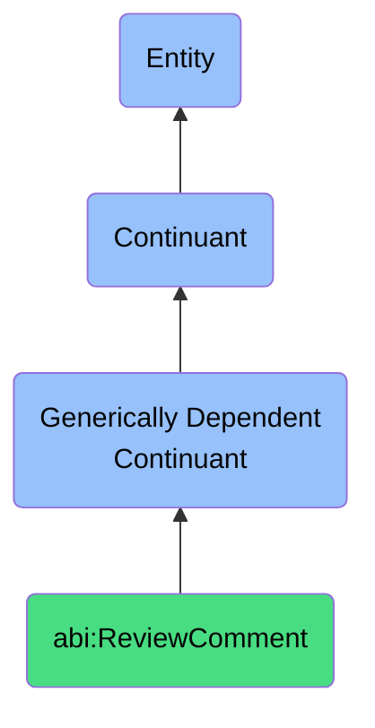

# ReviewComment

## Definition
A review comment is a generically dependent continuant that captures a human-authored critique, affirmation, or clarification associated with an entity or decision.

## Hierarchy in BFO

## Related Classes
- **abi:ObservationRecord** - A generically dependent continuant that provides a traceable record of an observed event or outcome, including its context and agent.
- **abi:AuditLogEntry** - A generically dependent continuant that provides a time-stamped trace of an activity performed by an agent, often used for compliance or review.
- **abi:VersionTag** - A generically dependent continuant that provides a label assigned to a specific state or iteration of a resource. 