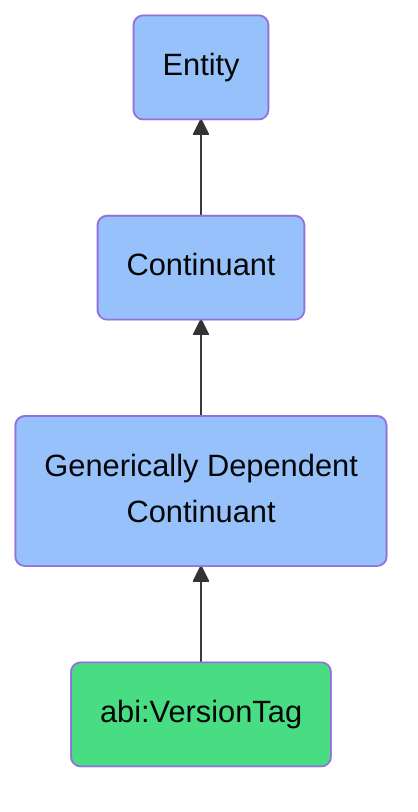

# VersionTag

## Definition
A version tag is a generically dependent continuant that provides a label assigned to a specific state or iteration of a resource.

## Hierarchy in BFO

## Related Classes
- **abi:DataLineageStatement** - A generically dependent continuant that documents a chain describing the origin, transformation, and usage of data assets.
- **abi:ObservationRecord** - A generically dependent continuant that provides a traceable record of an observed event or outcome, including its context and agent.
- **abi:ReviewComment** - A generically dependent continuant that captures a human-authored critique, affirmation, or clarification associated with an entity or decision. 