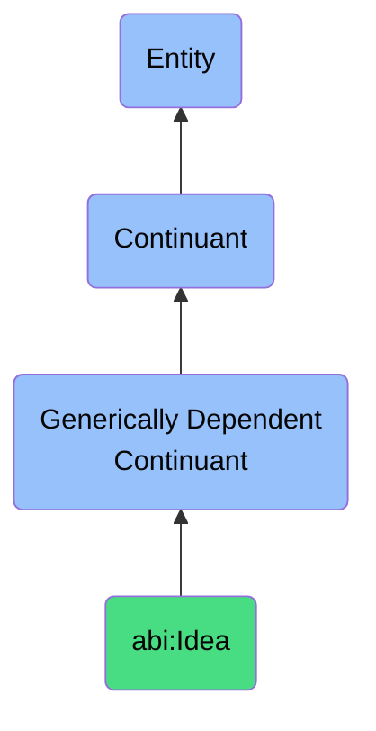

# Idea

## Definition
An idea is a generically dependent continuant that represents a conceptual unit that originates from creative or inferential reasoning and may serve as input to actions or communication.

## Hierarchy in BFO

## Related Classes
- **abi:ObservationContent** - A generically dependent continuant that provides a structured representation of an insight or finding derived from an event or process.
- **abi:Recommendation** - A generically dependent continuant that expresses a proposal for action based on observed facts, learned patterns, or reasoning.
- **abi:BusinessQuestion** - A generically dependent continuant that expresses a natural-language or formal inquiry posed to elicit decision-relevant knowledge. 