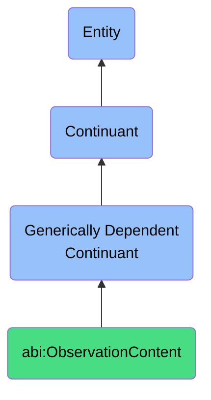

# ObservationContent

## Definition
An observation content is a generically dependent continuant that provides a structured representation of an insight or finding derived from an event or process.

## Hierarchy in BFO

## Related Classes
- **abi:Idea** - A generically dependent continuant that represents a conceptual unit originating from creative or inferential reasoning.
- **abi:Recommendation** - A generically dependent continuant that expresses a proposal for action based on observed facts, learned patterns, or reasoning.
- **abi:ScoredAnswer** - A generically dependent continuant that provides a response to a question or observation including a value expressing confidence or quality. 