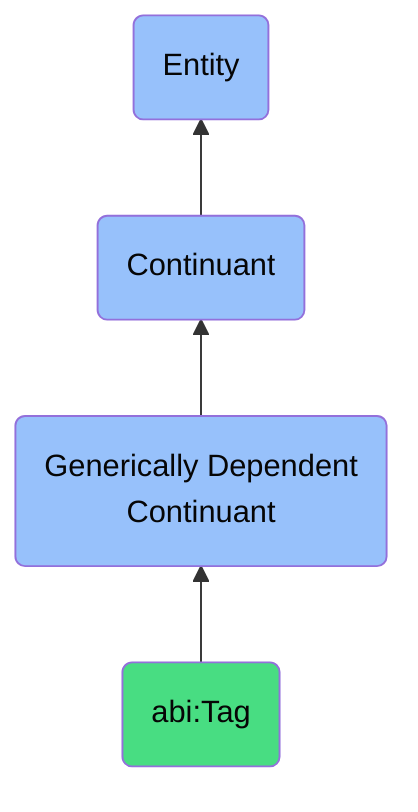

# Tag

## Definition
A tag is a generically dependent continuant that provides a minimal semantic label used to classify, group, or annotate resources.

## Hierarchy in BFO

## Related Classes
- **abi:Annotation** - A generically dependent continuant that provides a contextual note or label that enriches a resource with additional meaning or reference.
- **abi:Label** - A generically dependent continuant that represents a natural-language or symbolic designation assigned to an entity to distinguish or describe it.
- **abi:Definition** - A generically dependent continuant that specifies the necessary and sufficient conditions for class membership. 