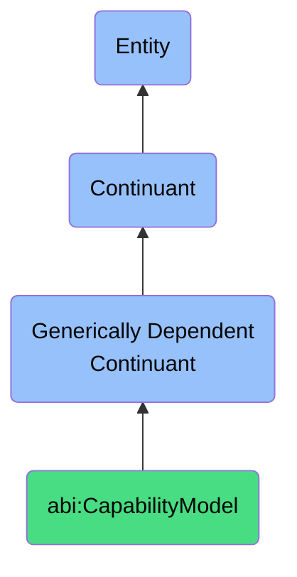

# CapabilityModel

## Definition
A capability model is a generically dependent continuant that offers a structured map of functional and enabling capabilities within an enterprise or team.

## Hierarchy in BFO

## Related Classes
- **abi:PersonaProfile** - A generically dependent continuant that provides a synthesized information artifact describing the characteristics of a typical or target user.
- **abi:Policy** - A generically dependent continuant that articulates formal guiding principles or rules for decision-making or behavior within a context.
- **abi:BusinessRule** - A generically dependent continuant that expresses a declarative constraint that governs or influences business behavior. 