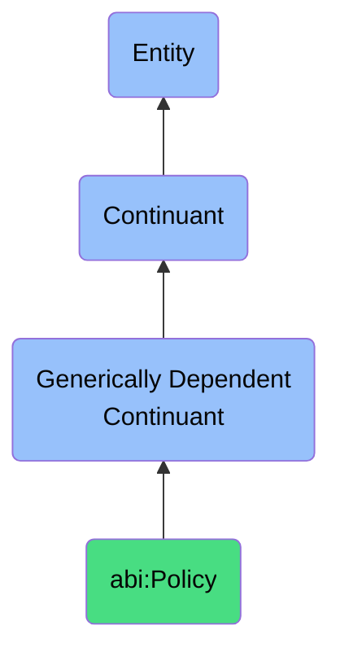

# Policy

## Definition
A policy is a generically dependent continuant that articulates formal guiding principles or rules for decision-making or behavior within a context.

## Hierarchy in BFO

## Related Classes
- **abi:SOP** - A generically dependent continuant that provides a codified sequence of actions or responsibilities used to standardize recurring procedures.
- **abi:BusinessRule** - A generically dependent continuant that expresses a declarative constraint that governs or influences business behavior.
- **abi:AgreementTerm** - A generically dependent continuant that defines a clause or statement within a contract that specifies duties, restrictions, or conditions.
- **abi:PersonaProfile** - A generically dependent continuant that provides a synthesized information artifact describing the characteristics of a typical or target user.
- **abi:CapabilityModel** - A generically dependent continuant that offers a structured map of functional and enabling capabilities within an enterprise or team. 