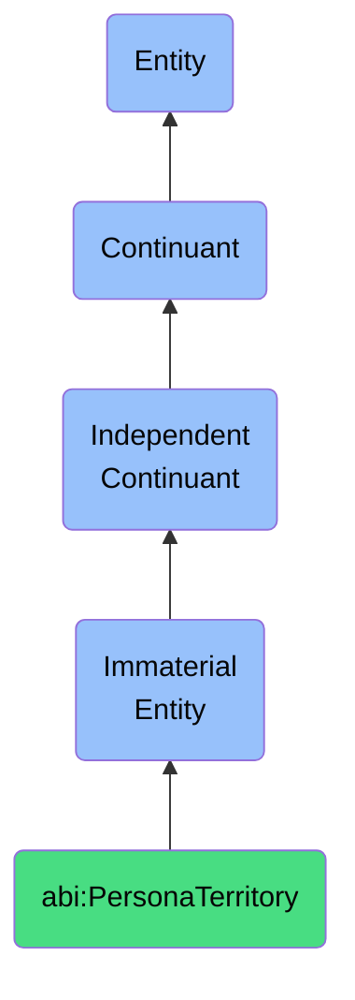

# PersonaTerritory

## Definition
A persona territory is an immaterial entity that represents a segmentation based on audience behavior or job roles, establishing targeted interaction boundaries that facilitate tailored communication, product development, and service delivery based on specific user characteristics.

## Hierarchy in BFO


## Ontological Schema (TBox)
```turtle
abi:PersonaTerritory a owl:Class ;
  rdfs:subClassOf bfo:0000141 ;
  rdfs:label "Persona Territory" ;
  skos:definition "An immaterial entity that represents a segmentation based on audience behavior or job roles, establishing targeted interaction boundaries that facilitate tailored communication, product development, and service delivery based on specific user characteristics." .

abi:defines_audience_segment a owl:ObjectProperty ;
  rdfs:domain abi:PersonaTerritory ;
  rdfs:range abi:AudienceSegment ;
  rdfs:label "defines audience segment" .

abi:characterizes_behavioral_patterns a owl:ObjectProperty ;
  rdfs:domain abi:PersonaTerritory ;
  rdfs:range abi:BehavioralPattern ;
  rdfs:label "characterizes behavioral patterns" .

abi:encompasses_job_roles a owl:ObjectProperty ;
  rdfs:domain abi:PersonaTerritory ;
  rdfs:range abi:JobRole ;
  rdfs:label "encompasses job roles" .

abi:guides_targeted_messaging a owl:ObjectProperty ;
  rdfs:domain abi:PersonaTerritory ;
  rdfs:range abi:MessagingStrategy ;
  rdfs:label "guides targeted messaging" .

abi:has_priority_level a owl:DatatypeProperty ;
  rdfs:domain abi:PersonaTerritory ;
  rdfs:range xsd:integer ;
  rdfs:label "has priority level" .
```

## Ontological Instance (ABox)
```turtle
ex:ExecutiveDecisionMakerTerritory a abi:PersonaTerritory ;
  rdfs:label "Executive Decision Maker Territory" ;
  abi:defines_audience_segment ex:CSuiteSegment, ex:DirectorLevelSegment ;
  abi:characterizes_behavioral_patterns ex:StrategicFocusPattern, ex:ROIOrientedDecisionMaking ;
  abi:encompasses_job_roles ex:ChiefExecutiveOfficer, ex:ChiefFinancialOfficer, ex:DirectorOfOperations ;
  abi:guides_targeted_messaging ex:ValuePropositionMessaging, ex:StrategicImpactMessaging ;
  abi:has_priority_level "1"^^xsd:integer .

ex:OperationalStaffTerritory a abi:PersonaTerritory ;
  rdfs:label "Operational Staff Territory" ;
  abi:defines_audience_segment ex:FieldWorkersSegment, ex:AdministrativeStaffSegment ;
  abi:characterizes_behavioral_patterns ex:TaskOrientedPattern, ex:EfficiencyFocusedPattern ;
  abi:encompasses_job_roles ex:Technician, ex:Administrator, ex:FieldServiceAgent ;
  abi:guides_targeted_messaging ex:UsabilityMessaging, ex:EfficiencyGainMessaging ;
  abi:has_priority_level "3"^^xsd:integer .
```

## Related Classes
- **abi:BusinessZone** - An immaterial entity that constitutes a logical grouping of related capabilities, roles, or functions within an organizational context.
- **abi:AudienceSegment** - An immaterial entity that identifies a subdivision of a market based on shared characteristics, behaviors, and needs.
- **abi:MarketingContext** - An immaterial entity that defines the environmental and situational factors that influence marketing communications and strategies.
- **abi:UserJourney** - An immaterial entity that represents the complete sequence of interactions a user experiences with a product, service, or organization. 