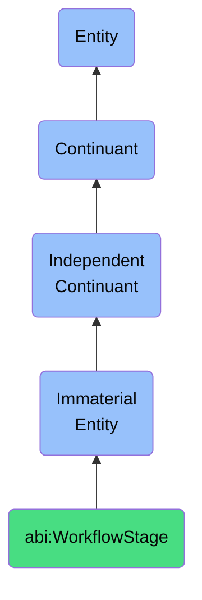

# WorkflowStage

## Definition
A workflow stage is an immaterial entity that delineates a distinct phase within a broader business or operational process, establishing boundaries for related activities, decisions, and transitions that enable coordinated progression toward process completion.

## Hierarchy in BFO


## Ontological Schema (TBox)
```turtle
abi:WorkflowStage a owl:Class ;
  rdfs:subClassOf bfo:0000141 ;
  rdfs:label "Workflow Stage" ;
  skos:definition "An immaterial entity that delineates a distinct phase within a broader business or operational process, establishing boundaries for related activities, decisions, and transitions that enable coordinated progression toward process completion." .

abi:belongs_to_process a owl:ObjectProperty ;
  rdfs:domain abi:WorkflowStage ;
  rdfs:range abi:BusinessProcess ;
  rdfs:label "belongs to process" .

abi:contains_activities a owl:ObjectProperty ;
  rdfs:domain abi:WorkflowStage ;
  rdfs:range abi:BusinessActivity ;
  rdfs:label "contains activities" .

abi:requires_decisions a owl:ObjectProperty ;
  rdfs:domain abi:WorkflowStage ;
  rdfs:range abi:BusinessDecision ;
  rdfs:label "requires decisions" .

abi:transitions_to a owl:ObjectProperty ;
  rdfs:domain abi:WorkflowStage ;
  rdfs:range abi:WorkflowStage ;
  rdfs:label "transitions to" .

abi:has_completion_criteria a owl:ObjectProperty ;
  rdfs:domain abi:WorkflowStage ;
  rdfs:range abi:CompletionCriteria ;
  rdfs:label "has completion criteria" .

abi:has_stage_duration a owl:DatatypeProperty ;
  rdfs:domain abi:WorkflowStage ;
  rdfs:range xsd:duration ;
  rdfs:label "has stage duration" .
```

## Ontological Instance (ABox)
```turtle
ex:LeadQualificationStage a abi:WorkflowStage ;
  rdfs:label "Lead Qualification Stage" ;
  abi:belongs_to_process ex:SalesProcess ;
  abi:contains_activities ex:LeadScoring, ex:InitialContactActivity, ex:NeedsAssessment ;
  abi:requires_decisions ex:QualifiedLeadDecision, ex:DemographicFitDecision ;
  abi:transitions_to ex:OpportunityCreationStage ;
  abi:has_completion_criteria ex:QualificationThresholdMet ;
  abi:has_stage_duration "P3D"^^xsd:duration .

ex:ContractApprovalStage a abi:WorkflowStage ;
  rdfs:label "Contract Approval Stage" ;
  abi:belongs_to_process ex:ContractManagementProcess ;
  abi:contains_activities ex:LegalReview, ex:FinancialTermsReview, ex:StakeholderConsultation ;
  abi:requires_decisions ex:TermsAcceptanceDecision, ex:RiskAssessmentDecision ;
  abi:transitions_to ex:ContractSigningStage ;
  abi:has_completion_criteria ex:AllApprovalsObtained ;
  abi:has_stage_duration "P5D"^^xsd:duration .
```

## Related Classes
- **abi:BusinessProcess** - An immaterial entity that represents a coordinated sequence of activities designed to accomplish a specific organizational goal.
- **abi:LifecycleSegment** - An immaterial entity that identifies a specific stretch of time or state within a content, contract, or asset lifecycle.
- **abi:BusinessActivity** - An immaterial entity that represents a discrete unit of work performed as part of a business process or workflow stage.
- **abi:ProcessGate** - An immaterial entity that represents a decision point or checkpoint within a business process where specific criteria must be met before proceeding. 