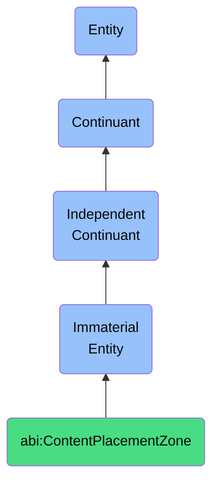

# ContentPlacementZone

## Definition
A content placement zone is an immaterial entity that defines a designated surface within a web page, slide deck, or digital document where specific types of information are organized and displayed, establishing coherent contextual boundaries that facilitate user comprehension, information hierarchy, and effective communication of related content.

## Hierarchy in BFO


## Ontological Schema (TBox)
```turtle
abi:ContentPlacementZone a owl:Class ;
  rdfs:subClassOf bfo:0000141 ;
  rdfs:label "Content Placement Zone" ;
  skos:definition "An immaterial entity that defines a designated surface within a web page, slide deck, or digital document where specific types of information are organized and displayed, establishing coherent contextual boundaries that facilitate user comprehension, information hierarchy, and effective communication of related content." .

abi:contains_content_elements a owl:ObjectProperty ;
  rdfs:domain abi:ContentPlacementZone ;
  rdfs:range abi:ContentElement ;
  rdfs:label "contains content elements" .

abi:has_content_purpose a owl:ObjectProperty ;
  rdfs:domain abi:ContentPlacementZone ;
  rdfs:range abi:ContentPurpose ;
  rdfs:label "has content purpose" .

abi:belongs_to_layout a owl:ObjectProperty ;
  rdfs:domain abi:ContentPlacementZone ;
  rdfs:range abi:DigitalLayout ;
  rdfs:label "belongs to layout" .

abi:follows_design_guidelines a owl:ObjectProperty ;
  rdfs:domain abi:ContentPlacementZone ;
  rdfs:range abi:DesignGuideline ;
  rdfs:label "follows design guidelines" .

abi:targets_audience a owl:ObjectProperty ;
  rdfs:domain abi:ContentPlacementZone ;
  rdfs:range abi:AudienceType ;
  rdfs:label "targets audience" .

abi:has_prominence_level a owl:DatatypeProperty ;
  rdfs:domain abi:ContentPlacementZone ;
  rdfs:range xsd:integer ;
  rdfs:label "has prominence level" .

abi:has_content_type_restriction a owl:DatatypeProperty ;
  rdfs:domain abi:ContentPlacementZone ;
  rdfs:range xsd:string ;
  rdfs:label "has content type restriction" .
```

## Ontological Instance (ABox)
```turtle
ex:KPITileArea a abi:ContentPlacementZone ;
  rdfs:label "KPI Tile Area on Executive Summary Slide" ;
  abi:contains_content_elements ex:RevenueKPITile, ex:CustomerRetentionKPITile, ex:MarketShareKPITile ;
  abi:has_content_purpose ex:PerformanceHighlightPurpose, ex:ExecutiveDecisionSupportPurpose ;
  abi:belongs_to_layout ex:ExecutiveSummarySlideLayout ;
  abi:follows_design_guidelines ex:DataVisualizationGuideline, ex:ExecutiveBriefingGuideline ;
  abi:targets_audience ex:CSuiteAudience, ex:BoardMembersAudience ;
  abi:has_prominence_level "1"^^xsd:integer ;
  abi:has_content_type_restriction "Key Performance Indicators and Metrics" .

ex:ProductFeaturesZone a abi:ContentPlacementZone ;
  rdfs:label "Product Features Section on Landing Page" ;
  abi:contains_content_elements ex:FeatureHighlightCard, ex:BenefitIllustration, ex:FeatureComparisonTable ;
  abi:has_content_purpose ex:ProductValueCommunicationPurpose, ex:ConversionOptimizationPurpose ;
  abi:belongs_to_layout ex:ProductLandingPageLayout ;
  abi:follows_design_guidelines ex:WebConversionGuideline, ex:VisualHierarchyGuideline ;
  abi:targets_audience ex:ProspectiveCustomerAudience, ex:IndustryAnalystAudience ;
  abi:has_prominence_level "2"^^xsd:integer ;
  abi:has_content_type_restriction "Product Features, Benefits, and Differentiators" .
```

## Related Classes
- **abi:DigitalLayout** - An immaterial entity that represents the overall structural arrangement of content zones and elements within a digital document or interface.
- **abi:DashboardZone** - An immaterial entity that constitutes a semantic region of a digital dashboard used to cluster or filter data presentations.
- **abi:VisualHierarchy** - An immaterial entity that establishes the relative importance of visual elements through organizational principles of size, color, contrast, and positioning.
- **abi:InformationArchitecture** - An immaterial entity that defines the structural design of information environments to facilitate intuitive access to content. 