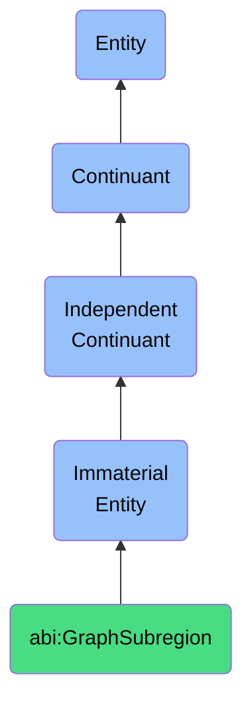

# GraphSubregion

## Definition
A graph subregion is an immaterial entity that represents a contextually defined cluster within a graph where related entities and edges are grouped based on semantic, functional, or structural relationships, establishing a coherent boundary that facilitates focused analysis, navigation, and comprehension of complex interconnected data.

## Hierarchy in BFO


## Ontological Schema (TBox)
```turtle
abi:GraphSubregion a owl:Class ;
  rdfs:subClassOf bfo:0000141 ;
  rdfs:label "Graph Subregion" ;
  skos:definition "An immaterial entity that represents a contextually defined cluster within a graph where related entities and edges are grouped based on semantic, functional, or structural relationships, establishing a coherent boundary that facilitates focused analysis, navigation, and comprehension of complex interconnected data." .

abi:contains_nodes a owl:ObjectProperty ;
  rdfs:domain abi:GraphSubregion ;
  rdfs:range abi:GraphNode ;
  rdfs:label "contains nodes" .

abi:encompasses_edges a owl:ObjectProperty ;
  rdfs:domain abi:GraphSubregion ;
  rdfs:range abi:GraphEdge ;
  rdfs:label "encompasses edges" .

abi:defined_by_criteria a owl:ObjectProperty ;
  rdfs:domain abi:GraphSubregion ;
  rdfs:range abi:GroupingCriteria ;
  rdfs:label "defined by criteria" .

abi:connects_to_subregion a owl:ObjectProperty ;
  rdfs:domain abi:GraphSubregion ;
  rdfs:range abi:GraphSubregion ;
  rdfs:label "connects to subregion" .

abi:belongs_to_graph a owl:ObjectProperty ;
  rdfs:domain abi:GraphSubregion ;
  rdfs:range abi:Graph ;
  rdfs:label "belongs to graph" .

abi:has_density_measure a owl:DatatypeProperty ;
  rdfs:domain abi:GraphSubregion ;
  rdfs:range xsd:float ;
  rdfs:label "has density measure" .

abi:has_thematic_label a owl:DatatypeProperty ;
  rdfs:domain abi:GraphSubregion ;
  rdfs:range xsd:string ;
  rdfs:label "has thematic label" .
```

## Ontological Instance (ABox)
```turtle
ex:ProjectManagementSubgraph a abi:GraphSubregion ;
  rdfs:label "Project Management Subgraph" ;
  abi:contains_nodes ex:ProjectNode, ex:TaskNode, ex:MilestoneNode, ex:ResourceNode ;
  abi:encompasses_edges ex:TaskDependencyEdge, ex:ResourceAssignmentEdge, ex:MilestoneCompletionEdge ;
  abi:defined_by_criteria ex:ProjectManagementDomainCriteria, ex:WorkflowRelationshipCriteria ;
  abi:connects_to_subregion ex:ResourceManagementSubgraph, ex:FinancialTrackingSubgraph ;
  abi:belongs_to_graph ex:EnterpriseKnowledgeGraph ;
  abi:has_density_measure "0.75"^^xsd:float ;
  abi:has_thematic_label "Project Execution and Tracking" .

ex:CustomerDataSubgraph a abi:GraphSubregion ;
  rdfs:label "Customer Data Subgraph" ;
  abi:contains_nodes ex:CustomerProfileNode, ex:TransactionNode, ex:PreferenceNode, ex:InteractionNode ;
  abi:encompasses_edges ex:CustomerPurchaseEdge, ex:CustomerPreferenceEdge, ex:InteractionHistoryEdge ;
  abi:defined_by_criteria ex:CustomerRelationshipCriteria, ex:ConsumerBehaviorCriteria ;
  abi:connects_to_subregion ex:ProductCatalogSubgraph, ex:MarketingCampaignSubgraph ;
  abi:belongs_to_graph ex:CustomerInsightGraph ;
  abi:has_density_measure "0.82"^^xsd:float ;
  abi:has_thematic_label "Customer Behavior and Relationships" .
```

## Related Classes
- **abi:Graph** - An immaterial entity that represents a structured collection of nodes and edges modeling relationships between entities.
- **abi:KnowledgeSubdomain** - An immaterial entity that represents a specialized area within a broader knowledge domain, characterized by distinct concepts, relationships, and principles.
- **abi:DashboardZone** - An immaterial entity that constitutes a semantic region of a digital dashboard used to cluster or filter data presentations.
- **abi:SemanticBoundary** - An immaterial entity that establishes the limits of meaning and context for a particular domain or discourse. 