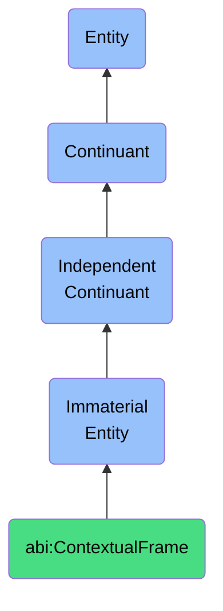

# ContextualFrame

## Definition
A contextual frame is an immaterial entity that provides a specific perspective or reference structure through which information, events, or entities are organized, interpreted, and assigned meaning.

## Hierarchy in BFO


## Ontological Schema (TBox)
```turtle
abi:ContextualFrame a owl:Class ;
  rdfs:subClassOf bfo:0000141 ;
  rdfs:label "Contextual Frame" ;
  skos:definition "An immaterial entity that provides a specific perspective or reference structure through which information, events, or entities are organized, interpreted, and assigned meaning." .

abi:provides_context_for a owl:ObjectProperty ;
  rdfs:domain abi:ContextualFrame ;
  rdfs:range owl:Thing ;
  rdfs:label "provides context for" .

abi:has_interpretation_rule a owl:ObjectProperty ;
  rdfs:domain abi:ContextualFrame ;
  rdfs:range abi:InterpretationRule ;
  rdfs:label "has interpretation rule" .

abi:links_to_situation a owl:ObjectProperty ;
  rdfs:domain abi:ContextualFrame ;
  rdfs:range abi:Situation ;
  rdfs:label "links to situation" .

abi:has_stability_level a owl:DatatypeProperty ;
  rdfs:domain abi:ContextualFrame ;
  rdfs:range xsd:string ;
  rdfs:label "has stability level" .
```

## Ontological Instance (ABox)
```turtle
ex:HistoricalAnalysisFrame a abi:ContextualFrame ;
  rdfs:label "Historical Analysis Frame" ;
  abi:provides_context_for ex:PrimaryHistoricalDocuments, ex:HistoricalEvents ;
  abi:has_interpretation_rule ex:ChronologicalProgressionRule, ex:CausalityDeterminationRule ;
  abi:links_to_situation ex:HistoricalPeriodSituation ;
  abi:has_stability_level "High" .

ex:StrategicDecisionFrame a abi:ContextualFrame ;
  rdfs:label "Strategic Decision Frame" ;
  abi:provides_context_for ex:CompetitiveAnalysisData, ex:MarketTrendReports ;
  abi:has_interpretation_rule ex:OpportunityIdentificationRule, ex:RiskAssessmentRule ;
  abi:links_to_situation ex:CompetitiveMarketSituation ;
  abi:has_stability_level "Medium" .
```

## Related Classes
- **abi:InterpretationContext** - An immaterial entity that provides the environment and rules for understanding and assigning meaning to information.
- **abi:PerspectiveStructure** - An immaterial entity that represents a specific viewpoint or angle from which information is perceived and processed.
- **abi:ReferenceFramework** - An immaterial entity that establishes a system of coordinates or parameters used to measure, compare, or evaluate phenomena within a given domain. 