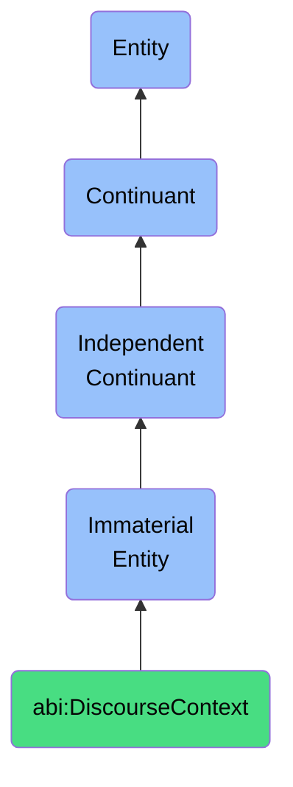

# DiscourseContext

## Definition
A discourse context is an immaterial entity that constitutes the set of shared backgrounds, presuppositions, and conditions which frame and govern the interpretation, production, and exchange of linguistic utterances and communicative acts among participants in a specific domain of discourse.

## Hierarchy in BFO


## Ontological Schema (TBox)
```turtle
abi:DiscourseContext a owl:Class ;
  rdfs:subClassOf bfo:0000141 ;
  rdfs:label "Discourse Context" ;
  skos:definition "An immaterial entity that constitutes the set of shared backgrounds, presuppositions, and conditions which frame and govern the interpretation, production, and exchange of linguistic utterances and communicative acts among participants in a specific domain of discourse." .

abi:establishes_communicative_norms a owl:ObjectProperty ;
  rdfs:domain abi:DiscourseContext ;
  rdfs:range abi:CommunicativeNorm ;
  rdfs:label "establishes communicative norms" .

abi:delimits_topic_boundaries a owl:ObjectProperty ;
  rdfs:domain abi:DiscourseContext ;
  rdfs:range abi:TopicDomain ;
  rdfs:label "delimits topic boundaries" .

abi:governs_participant_roles a owl:ObjectProperty ;
  rdfs:domain abi:DiscourseContext ;
  rdfs:range abi:DiscourseRole ;
  rdfs:label "governs participant roles" .

abi:encompasses_shared_knowledge a owl:ObjectProperty ;
  rdfs:domain abi:DiscourseContext ;
  rdfs:range abi:KnowledgeBase ;
  rdfs:label "encompasses shared knowledge" .

abi:has_formality_level a owl:DatatypeProperty ;
  rdfs:domain abi:DiscourseContext ;
  rdfs:range xsd:string ;
  rdfs:label "has formality level" .
```

## Ontological Instance (ABox)
```turtle
ex:AcademicConferenceContext a abi:DiscourseContext ;
  rdfs:label "Academic Conference Context" ;
  abi:establishes_communicative_norms ex:PeerReviewProtocol, ex:PresentationConventions ;
  abi:delimits_topic_boundaries ex:ResearchDomain, ex:DisciplinaryBoundaries ;
  abi:governs_participant_roles ex:Presenter, ex:Discussant, ex:Attendee ;
  abi:encompasses_shared_knowledge ex:DisciplinaryKnowledge, ex:CurrentResearchTrends ;
  abi:has_formality_level "High" .

ex:CasualConversationContext a abi:DiscourseContext ;
  rdfs:label "Casual Conversation Context" ;
  abi:establishes_communicative_norms ex:TurnTakingPractices, ex:InformalSpeechPatterns ;
  abi:delimits_topic_boundaries ex:SocialTolerableTopics, ex:ContextualRelevance ;
  abi:governs_participant_roles ex:Speaker, ex:Listener, ex:GroupMember ;
  abi:encompasses_shared_knowledge ex:CulturalReferences, ex:SocialNorms ;
  abi:has_formality_level "Low" .
```

## Related Classes
- **abi:SemanticFramework** - An immaterial entity that structures the conceptual relationships and meaning assignments within a specific domain, providing the constraints through which information is organized and interpreted according to established ontological commitments, taxonomic hierarchies, and domain-specific terminologies.
- **abi:InterpretationContext** - An immaterial entity that provides the framework of presuppositions, background knowledge, and inferential patterns that an agent employs to make sense of information, determining relevance, disambiguating meanings, and enabling appropriate interpretive responses within a specific domain.
- **abi:CommunicationSituation** - An immaterial entity that represents the spatiotemporal and social configuration in which communicative exchanges occur, encompassing the specific participants, physical settings, channels, and purpose-driven contexts that shape communication events. 