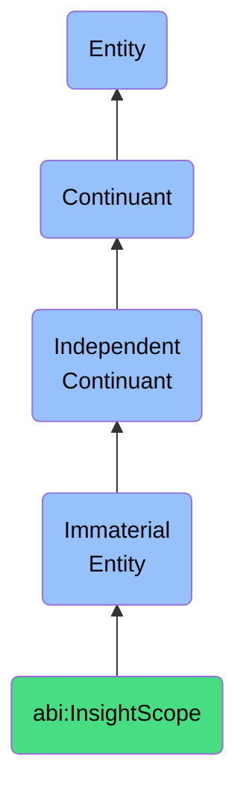

# InsightScope

## Definition
An insight scope is an immaterial entity that delineates a conceptual boundary within which specific analytical observations, patterns, or conclusions are derived and contextualized.

## Hierarchy in BFO


## Ontological Schema (TBox)
```turtle
abi:InsightScope a owl:Class ;
  rdfs:subClassOf bfo:0000141 ;
  rdfs:label "Insight Scope" ;
  skos:definition "A conceptual boundary within which specific analytical observations, patterns, or conclusions are derived and contextualized." .

abi:analyzes_data a owl:ObjectProperty ;
  rdfs:domain abi:InsightScope ;
  rdfs:range abi:DataSet ;
  rdfs:label "analyzes data" .

abi:generates_insight a owl:ObjectProperty ;
  rdfs:domain abi:InsightScope ;
  rdfs:range abi:Insight ;
  rdfs:label "generates insight" .

abi:has_analytical_method a owl:ObjectProperty ;
  rdfs:domain abi:InsightScope ;
  rdfs:range abi:AnalyticalMethod ;
  rdfs:label "has analytical method" .

abi:has_confidence_level a owl:DatatypeProperty ;
  rdfs:domain abi:InsightScope ;
  rdfs:range xsd:decimal ;
  rdfs:label "has confidence level" .
```

## Ontological Instance (ABox)
```turtle
ex:MarketTrendAnalysisScope a abi:InsightScope ;
  rdfs:label "Market Trend Analysis Scope" ;
  abi:analyzes_data ex:MarketTransactionData, ex:ConsumerBehaviorData ;
  abi:generates_insight ex:MarketGrowthTrend, ex:ConsumerPreferenceShift ;
  abi:has_analytical_method ex:TimeSeriesAnalysis, ex:PatternRecognition ;
  abi:has_confidence_level "0.85"^^xsd:decimal .

ex:OperationalEfficiencyScope a abi:InsightScope ;
  rdfs:label "Operational Efficiency Analysis Scope" ;
  abi:analyzes_data ex:ProcessPerformanceData, ex:ResourceAllocationData ;
  abi:generates_insight ex:BottleneckIdentification, ex:OptimizationOpportunity ;
  abi:has_analytical_method ex:ProcessMining, ex:ComparativeAnalysis ;
  abi:has_confidence_level "0.92"^^xsd:decimal .
```

## Related Classes
- **abi:DecisionSpace** - An immaterial entity that encompasses the set of possible choices and their associated parameters in a decision-making context.
- **abi:AnalyticalDomain** - An immaterial entity that defines a field of analysis with consistent methodologies and objectives.
- **abi:ValidationBoundary** - An immaterial entity that is a rule-defined scope where certain logical or business constraints are enforced.
- **abi:BusinessZone** - An immaterial entity that represents a grouping of related capabilities, roles, or functions. 