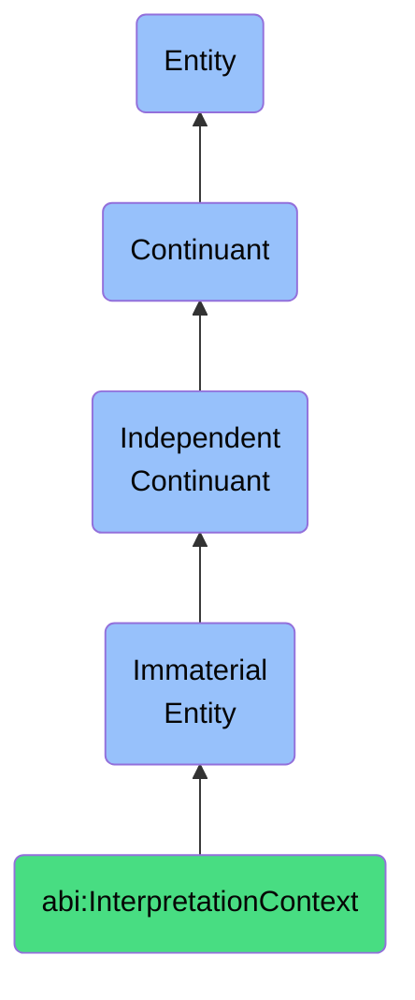

# InterpretationContext

## Definition
An interpretation context is an immaterial entity that provides the framework of presuppositions, background knowledge, and inferential patterns that an agent employs to make sense of information, determining relevance, disambiguating meanings, and enabling appropriate interpretive responses within a specific domain of discourse.

## Hierarchy in BFO


## Ontological Schema (TBox)
```turtle
abi:InterpretationContext a owl:Class ;
  rdfs:subClassOf bfo:0000141 ;
  rdfs:label "Interpretation Context" ;
  skos:definition "An immaterial entity that provides the framework of presuppositions, background knowledge, and inferential patterns that an agent employs to make sense of information, determining relevance, disambiguating meanings, and enabling appropriate interpretive responses within a specific domain of discourse." .

abi:contains_presuppositions a owl:ObjectProperty ;
  rdfs:domain abi:InterpretationContext ;
  rdfs:range abi:Presupposition ;
  rdfs:label "contains presuppositions" .

abi:incorporates_background_knowledge a owl:ObjectProperty ;
  rdfs:domain abi:InterpretationContext ;
  rdfs:range abi:BackgroundKnowledge ;
  rdfs:label "incorporates background knowledge" .

abi:guides_inferential_patterns a owl:ObjectProperty ;
  rdfs:domain abi:InterpretationContext ;
  rdfs:range abi:InferentialPattern ;
  rdfs:label "guides inferential patterns" .

abi:establishes_relevance_criteria a owl:ObjectProperty ;
  rdfs:domain abi:InterpretationContext ;
  rdfs:range abi:RelevanceCriteria ;
  rdfs:label "establishes relevance criteria" .

abi:has_domain_specificity a owl:DatatypeProperty ;
  rdfs:domain abi:InterpretationContext ;
  rdfs:range xsd:string ;
  rdfs:label "has domain specificity" .
```

## Ontological Instance (ABox)
```turtle
ex:MedicalDiagnosticContext a abi:InterpretationContext ;
  rdfs:label "Medical Diagnostic Context" ;
  abi:contains_presuppositions ex:BiologicalCausationPresupposition, ex:PatientHistoryRelevance ;
  abi:incorporates_background_knowledge ex:MedicalEducationKnowledge, ex:ClinicalExperienceKnowledge ;
  abi:guides_inferential_patterns ex:DiagnosticReasoning, ex:SymptomPatternRecognition ;
  abi:establishes_relevance_criteria ex:SymptomSeverityRelevance, ex:PatientRiskFactorRelevance ;
  abi:has_domain_specificity "Clinical Medicine" .

ex:LegalJurisprudenceContext a abi:InterpretationContext ;
  rdfs:label "Legal Jurisprudence Context" ;
  abi:contains_presuppositions ex:LegalPrecedentAuthority, ex:StatutoryInterpretationPrinciples ;
  abi:incorporates_background_knowledge ex:CaseLawKnowledge, ex:LegalDoctrineKnowledge ;
  abi:guides_inferential_patterns ex:LegalAnalogicalReasoning, ex:StatutoryInterpretation ;
  abi:establishes_relevance_criteria ex:LegalMaterialityThreshold, ex:JurisdictionalRelevance ;
  abi:has_domain_specificity "Legal Practice" .
```

## Related Classes
- **abi:ConceptualScheme** - An immaterial entity that provides a systematic arrangement of concepts and their interrelationships, serving as a framework within which experiences, objects, and events are categorized, interpreted, and understood according to particular theoretical orientations or worldviews.
- **abi:SemanticFramework** - An immaterial entity that structures the conceptual relationships and meaning assignments within a specific domain, providing the constraints through which information is organized and interpreted according to established ontological commitments, taxonomic hierarchies, and domain-specific terminologies.
- **abi:KnowledgeStructure** - An immaterial entity that organizes informational content into coherent patterns that facilitate comprehension, retrieval, and application of knowledge within specific domains of understanding, characterized by taxonomic relationships, propositional networks, and conceptual hierarchies.
- **abi:DiscourseContext** - An immaterial entity that encompasses the situational, linguistic, and social parameters that shape the production and interpretation of communicative exchanges, establishing the shared background against which utterances acquire particular meanings and functions. 