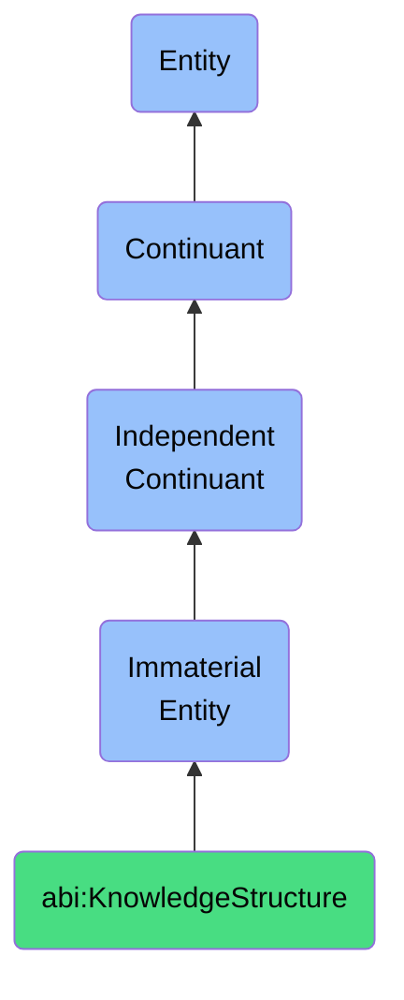

# KnowledgeStructure

## Definition
A knowledge structure is an immaterial entity that organizes informational content into coherent patterns that facilitate comprehension, retrieval, and application of knowledge within specific domains of understanding, characterized by taxonomic relationships, propositional networks, and conceptual hierarchies.

## Hierarchy in BFO


## Ontological Schema (TBox)
```turtle
abi:KnowledgeStructure a owl:Class ;
  rdfs:subClassOf bfo:0000141 ;
  rdfs:label "Knowledge Structure" ;
  skos:definition "An immaterial entity that organizes informational content into coherent patterns that facilitate comprehension, retrieval, and application of knowledge within specific domains of understanding, characterized by taxonomic relationships, propositional networks, and conceptual hierarchies." .

abi:organizes_concept_hierarchy a owl:ObjectProperty ;
  rdfs:domain abi:KnowledgeStructure ;
  rdfs:range abi:ConceptHierarchy ;
  rdfs:label "organizes concept hierarchy" .

abi:establishes_propositional_networks a owl:ObjectProperty ;
  rdfs:domain abi:KnowledgeStructure ;
  rdfs:range abi:PropositionalNetwork ;
  rdfs:label "establishes propositional networks" .

abi:facilitates_information_retrieval a owl:ObjectProperty ;
  rdfs:domain abi:KnowledgeStructure ;
  rdfs:range abi:InformationRetrievalPattern ;
  rdfs:label "facilitates information retrieval" .

abi:supports_inferential_processes a owl:ObjectProperty ;
  rdfs:domain abi:KnowledgeStructure ;
  rdfs:range abi:InferentialProcess ;
  rdfs:label "supports inferential processes" .

abi:has_knowledge_domain a owl:DatatypeProperty ;
  rdfs:domain abi:KnowledgeStructure ;
  rdfs:range xsd:string ;
  rdfs:label "has knowledge domain" .
```

## Ontological Instance (ABox)
```turtle
ex:BiologicalKnowledgeStructure a abi:KnowledgeStructure ;
  rdfs:label "Biological Knowledge Structure" ;
  abi:organizes_concept_hierarchy ex:TaxonomicHierarchy, ex:PhylogeneticTree ;
  abi:establishes_propositional_networks ex:MetabolicPathwayNetwork, ex:EcosystemInteractionNetwork ;
  abi:facilitates_information_retrieval ex:SpeciesIdentificationPattern, ex:GeneticMechanismRetrieval ;
  abi:supports_inferential_processes ex:EvolutionaryInference, ex:HomologyInference ;
  abi:has_knowledge_domain "Biological sciences" .

ex:EngineeringKnowledgeStructure a abi:KnowledgeStructure ;
  rdfs:label "Engineering Knowledge Structure" ;
  abi:organizes_concept_hierarchy ex:MechanicalComponentHierarchy, ex:MaterialPropertiesHierarchy ;
  abi:establishes_propositional_networks ex:StructuralStressNetwork, ex:ElectricalCircuitNetwork ;
  abi:facilitates_information_retrieval ex:FailureModeIdentification, ex:DesignPatternRetrieval ;
  abi:supports_inferential_processes ex:StructuralAnalysisInference, ex:SystemOptimizationInference ;
  abi:has_knowledge_domain "Engineering and design" .
```

## Related Classes
- **abi:SemanticFramework** - An immaterial entity that structures the conceptual relationships and meaning assignments within a specific domain, providing the constraints through which information is organized and interpreted according to established ontological commitments, taxonomic hierarchies, and domain-specific terminologies.
- **abi:ConceptualScheme** - An immaterial entity that provides a systematic arrangement of concepts and their interrelationships, serving as a framework within which experiences, objects, and events are categorized, interpreted, and understood according to particular theoretical orientations or worldviews.
- **abi:InterpretationContext** - An immaterial entity that provides the framework of presuppositions, background knowledge, and inferential patterns that an agent employs to make sense of information, determining relevance, disambiguating meanings, and enabling appropriate interpretive responses within a specific domain of discourse. 