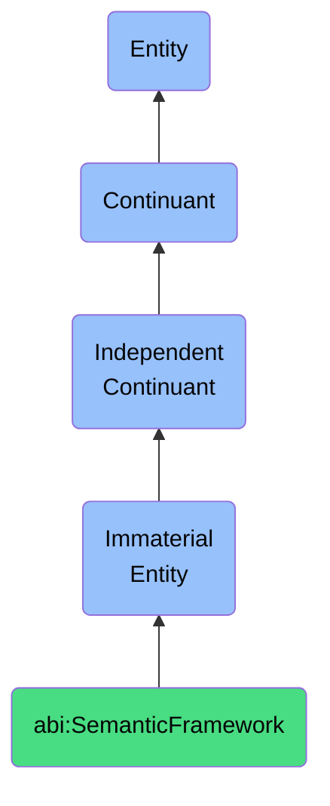

# SemanticFramework

## Definition
A semantic framework is an immaterial entity that structures the conceptual relationships and meaning assignments within a specific domain, providing the constraints through which information is organized and interpreted according to established ontological commitments, taxonomic hierarchies, and domain-specific terminologies.

## Hierarchy in BFO


## Ontological Schema (TBox)
```turtle
abi:SemanticFramework a owl:Class ;
  rdfs:subClassOf bfo:0000141 ;
  rdfs:label "Semantic Framework" ;
  skos:definition "An immaterial entity that structures the conceptual relationships and meaning assignments within a specific domain, providing the constraints through which information is organized and interpreted according to established ontological commitments, taxonomic hierarchies, and domain-specific terminologies." .

abi:defines_ontological_commitments a owl:ObjectProperty ;
  rdfs:domain abi:SemanticFramework ;
  rdfs:range abi:OntologicalCommitment ;
  rdfs:label "defines ontological commitments" .

abi:establishes_taxonomic_hierarchy a owl:ObjectProperty ;
  rdfs:domain abi:SemanticFramework ;
  rdfs:range abi:TaxonomicHierarchy ;
  rdfs:label "establishes taxonomic hierarchy" .

abi:specifies_domain_terminology a owl:ObjectProperty ;
  rdfs:domain abi:SemanticFramework ;
  rdfs:range abi:DomainTerminology ;
  rdfs:label "specifies domain terminology" .

abi:constrains_conceptual_relations a owl:ObjectProperty ;
  rdfs:domain abi:SemanticFramework ;
  rdfs:range abi:ConceptualRelation ;
  rdfs:label "constrains conceptual relations" .

abi:has_scope_of_application a owl:DatatypeProperty ;
  rdfs:domain abi:SemanticFramework ;
  rdfs:range xsd:string ;
  rdfs:label "has scope of application" .
```

## Ontological Instance (ABox)
```turtle
ex:MedicalSemanticFramework a abi:SemanticFramework ;
  rdfs:label "Medical Semantic Framework" ;
  abi:defines_ontological_commitments ex:BiologicalMaterialism, ex:MedicalInterventionism ;
  abi:establishes_taxonomic_hierarchy ex:DiseaseTaxonomy, ex:AnatomicalStructureTaxonomy ;
  abi:specifies_domain_terminology ex:MedicalTerminology, ex:PharmaceuticalNomenclature ;
  abi:constrains_conceptual_relations ex:DiseaseSymptomRelation, ex:TreatmentOutcomeRelation ;
  abi:has_scope_of_application "Clinical medicine and healthcare" .

ex:LegalSemanticFramework a abi:SemanticFramework ;
  rdfs:label "Legal Semantic Framework" ;
  abi:defines_ontological_commitments ex:LegalPositivism, ex:JudicialProceduralism ;
  abi:establishes_taxonomic_hierarchy ex:LegalCodeHierarchy, ex:JurisdictionalHierarchy ;
  abi:specifies_domain_terminology ex:LegalTerminology, ex:JudicialPhraseology ;
  abi:constrains_conceptual_relations ex:StatuteInterpretationRelation, ex:PrecedentApplicationRelation ;
  abi:has_scope_of_application "Legal practice and jurisprudence" .
```

## Related Classes
- **abi:InterpretationContext** - An immaterial entity that provides the framework of presuppositions, background knowledge, and inferential patterns that an agent employs to make sense of information, determining relevance, disambiguating meanings, and enabling appropriate interpretive responses within a specific domain of discourse.
- **abi:KnowledgeStructure** - An immaterial entity that organizes informational content into coherent patterns that facilitate comprehension, retrieval, and application of knowledge within specific domains of understanding, characterized by taxonomic relationships, propositional networks, and conceptual hierarchies.
- **abi:ConceptualScheme** - An immaterial entity that provides a systematic arrangement of concepts and their interrelationships, serving as a framework within which experiences, objects, and events are categorized, interpreted, and understood according to particular theoretical orientations or worldviews. 