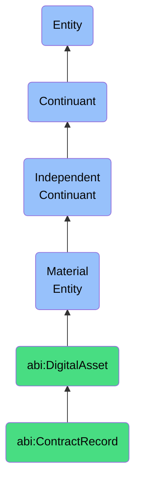

# ContractRecord

## Definition
A contract record is a material entity that is a legally binding instance of an agreement between two or more parties, stored in a system with semantic links to conditions and deliverables.

## Hierarchy in BFO


## Ontological Schema (TBox)
```turtle
abi:ContractRecord a owl:Class ;
  rdfs:subClassOf abi:DigitalAsset ;
  rdfs:label "Contract Record" ;
  skos:definition "A legally binding instance of an agreement between two or more parties, stored in a system with semantic links to conditions and deliverables." .

abi:has_party a owl:ObjectProperty ;
  rdfs:domain abi:ContractRecord ;
  rdfs:range abi:Organization ;
  rdfs:label "has party" .

abi:has_term a owl:ObjectProperty ;
  rdfs:domain abi:ContractRecord ;
  rdfs:range abi:AgreementTerm ;
  rdfs:label "has term" .

abi:effective_date a owl:DatatypeProperty ;
  rdfs:domain abi:ContractRecord ;
  rdfs:range xsd:date ;
  rdfs:label "effective date" .

abi:expiration_date a owl:DatatypeProperty ;
  rdfs:domain abi:ContractRecord ;
  rdfs:range xsd:date ;
  rdfs:label "expiration date" .

abi:has_status a owl:DatatypeProperty ;
  rdfs:domain abi:ContractRecord ;
  rdfs:range xsd:string ;
  rdfs:label "has status" .
```

## Ontological Instance (ABox)
```turtle
ex:MSA2023 a abi:ContractRecord ;
  rdfs:label "Master Service Agreement 2023" ;
  abi:has_party ex:AcmeCorp, ex:ClientOrganization ;
  abi:has_term ex:PaymentTerm, ex:TerminationClause, ex:LiabilityClause ;
  abi:effective_date "2023-01-15"^^xsd:date ;
  abi:expiration_date "2025-01-14"^^xsd:date ;
  abi:has_status "Active" .

ex:SoftwareLicense a abi:ContractRecord ;
  rdfs:label "Enterprise Software License" ;
  abi:has_party ex:SoftwareVendor, ex:CompanyX ;
  abi:has_term ex:UsageRestriction, ex:SupportTerm ;
  abi:effective_date "2023-06-01"^^xsd:date ;
  abi:expiration_date "2026-05-31"^^xsd:date ;
  abi:has_status "Active" .
```

## Related Classes
- **abi:DigitalAsset** - A material entity that is a file-based or database-stored resource that represents content, knowledge, or configuration, and can be versioned, deployed, or referenced.
- **abi:ClientEntity** - A material entity that is an external organization that engages with the ABI platform in a commercial or collaborative relationship.
- **abi:AgreementTerm** - A material entity that is a clause or statement within a contract that defines duties, restrictions, or conditions. 