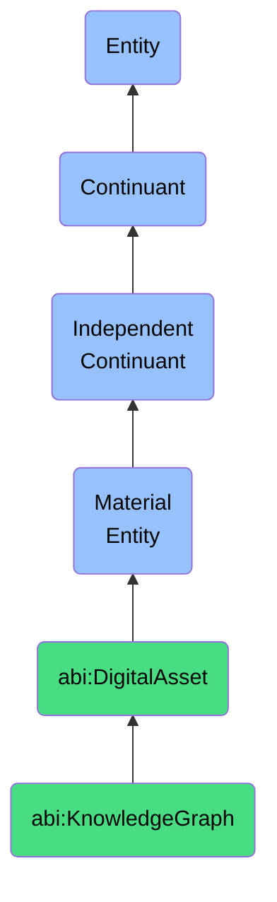

# KnowledgeGraph

## Definition
A knowledge graph is a material entity that is a stored network of semantically linked entities, relationships, and annotations deployed within the ABI system.

## Hierarchy in BFO


## Ontological Schema (TBox)
```turtle
abi:KnowledgeGraph a owl:Class ;
  rdfs:subClassOf abi:DigitalAsset ;
  rdfs:label "Knowledge Graph" ;
  skos:definition "A stored network of semantically linked entities, relationships, and annotations deployed within the ABI system." .

abi:contains_entity a owl:ObjectProperty ;
  rdfs:domain abi:KnowledgeGraph ;
  rdfs:range abi:Entity ;
  rdfs:label "contains entity" .

abi:implements_ontology a owl:ObjectProperty ;
  rdfs:domain abi:KnowledgeGraph ;
  rdfs:range abi:Ontology ;
  rdfs:label "implements ontology" .

abi:has_query_endpoint a owl:DatatypeProperty ;
  rdfs:domain abi:KnowledgeGraph ;
  rdfs:range xsd:anyURI ;
  rdfs:label "has query endpoint" .

abi:has_triple_count a owl:DatatypeProperty ;
  rdfs:domain abi:KnowledgeGraph ;
  rdfs:range xsd:integer ;
  rdfs:label "has triple count" .
```

## Ontological Instance (ABox)
```turtle
ex:CustomerKnowledgeGraph a abi:KnowledgeGraph ;
  rdfs:label "Customer Knowledge Graph" ;
  abi:contains_entity ex:Customer, ex:Product, ex:Purchase ;
  abi:implements_ontology ex:CustomerOntology ;
  abi:has_query_endpoint "https://example.org/sparql/customers" ;
  abi:has_triple_count "2500000"^^xsd:integer .

ex:DomainKnowledgeGraph a abi:KnowledgeGraph ;
  rdfs:label "Domain Knowledge Graph" ;
  abi:contains_entity ex:Industry, ex:Company, ex:Person ;
  abi:implements_ontology ex:DomainOntology ;
  abi:has_query_endpoint "https://example.org/sparql/domain" ;
  abi:has_triple_count "5000000"^^xsd:integer .
```

## Related Classes
- **abi:DigitalAsset** - A material entity that is a file-based or database-stored resource that represents content, knowledge, or configuration, and can be versioned, deployed, or referenced.
- **abi:DatabaseInstance** - A material entity that is a container that stores structured information used by ABI components.
- **abi:WorkflowInstance** - A material entity that is a materialized instantiation of a process or set of tasks executing across systems or agents. 