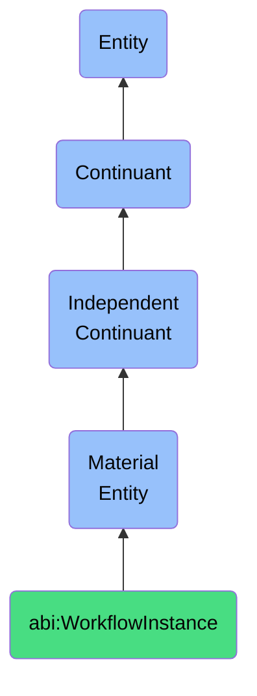

# WorkflowInstance

## Definition
A workflow instance is a material entity that is a materialized instantiation of a process or set of tasks executing across systems or agents.

## Hierarchy in BFO


## Ontological Schema (TBox)
```turtle
abi:WorkflowInstance a owl:Class ;
  rdfs:subClassOf bfo:0000040 ;
  rdfs:label "Workflow Instance" ;
  skos:definition "A materialized instantiation of a process or set of tasks executing across systems or agents." .

abi:implements_workflow a owl:ObjectProperty ;
  rdfs:domain abi:WorkflowInstance ;
  rdfs:range abi:WorkflowSpecification ;
  rdfs:label "implements workflow" .

abi:has_current_status a owl:DatatypeProperty ;
  rdfs:domain abi:WorkflowInstance ;
  rdfs:range xsd:string ;
  rdfs:label "has current status" .

abi:started_at a owl:DatatypeProperty ;
  rdfs:domain abi:WorkflowInstance ;
  rdfs:range xsd:dateTime ;
  rdfs:label "started at" .

abi:coordinated_by a owl:ObjectProperty ;
  rdfs:domain abi:WorkflowInstance ;
  rdfs:range abi:SoftwareAgent ;
  rdfs:label "coordinated by" .
```

## Ontological Instance (ABox)
```turtle
ex:DataIngestionWorkflow1 a abi:WorkflowInstance ;
  rdfs:label "Data Ingestion Workflow #1" ;
  abi:implements_workflow ex:StandardDataIngestionWorkflow ;
  abi:has_current_status "Running" ;
  abi:started_at "2023-11-20T09:15:00Z"^^xsd:dateTime ;
  abi:coordinated_by ex:WorkflowEngine .

ex:CustomerAnalysisWorkflow3 a abi:WorkflowInstance ;
  rdfs:label "Customer Analysis Workflow #3" ;
  abi:implements_workflow ex:CustomerInsightWorkflow ;
  abi:has_current_status "Completed" ;
  abi:started_at "2023-11-19T14:30:00Z"^^xsd:dateTime ;
  abi:coordinated_by ex:AnalyticsEngine .
```

## Related Classes
- **abi:Task** - A material entity that is a discrete unit of work assigned to an agent with a clear objective, often linked to a broader workflow or capability.
- **abi:DigitalAsset** - A material entity that is a file-based or database-stored resource that represents content, knowledge, or configuration, and can be versioned, deployed, or referenced.
- **abi:ComputeContainer** - A material entity that is a software-deployed, bounded material system that runs a defined set of tasks, often mapped to an ABI workflow or service. 