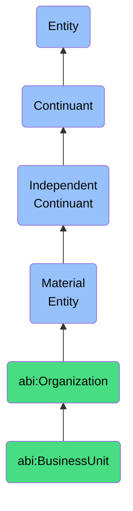

# BusinessUnit

## Definition
A business unit is a material entity that is a subdivision of an organization that operates semi-independently in delivering specific functions or services.

## Hierarchy in BFO


## Ontological Schema (TBox)
```turtle
abi:BusinessUnit a owl:Class ;
  rdfs:subClassOf abi:Organization ;
  rdfs:label "Business Unit" ;
  skos:definition "A subdivision of an organization that operates semi-independently in delivering specific functions or services." .

abi:part_of a owl:ObjectProperty ;
  rdfs:domain abi:BusinessUnit ;
  rdfs:range abi:Organization ;
  rdfs:label "part of" .

abi:delivers a owl:ObjectProperty ;
  rdfs:domain abi:BusinessUnit ;
  rdfs:range abi:Service ;
  rdfs:label "delivers" .

abi:has_lead a owl:ObjectProperty ;
  rdfs:domain abi:BusinessUnit ;
  rdfs:range abi:Person ;
  rdfs:label "has lead" .
```

## Ontological Instance (ABox)
```turtle
ex:EngineeringDepartment a abi:BusinessUnit ;
  rdfs:label "Engineering Department" ;
  abi:part_of ex:TechCorp ;
  abi:delivers ex:SoftwareDevelopment, ex:SystemDesign ;
  abi:has_lead ex:SeniorEngineer .

ex:MarketingTeam a abi:BusinessUnit ;
  rdfs:label "Marketing Team" ;
  abi:part_of ex:RetailCompany ;
  abi:delivers ex:BrandStrategy, ex:DigitalMarketing ;
  abi:has_lead ex:MarketingDirector .
```

## Related Classes
- **abi:Organization** - A material entity that coordinates the behavior and resources of individuals to achieve goals.
- **abi:ClientEntity** - A material entity that is an external organization that engages with the ABI platform in a commercial or collaborative relationship.
- **abi:Project** - A material entity that aggregates actions, tasks, and resources toward a defined outcome over a finite period. 