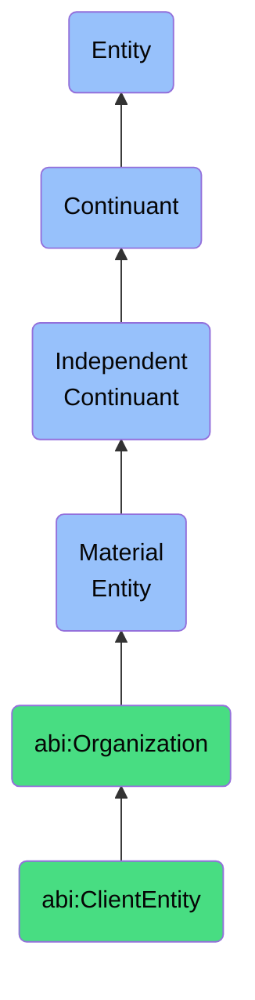

# ClientEntity

## Definition
A client entity is a material entity that is an external organization that engages with the ABI platform in a commercial or collaborative relationship.

## Hierarchy in BFO


## Ontological Schema (TBox)
```turtle
abi:ClientEntity a owl:Class ;
  rdfs:subClassOf abi:Organization ;
  rdfs:label "Client Entity" ;
  skos:definition "An external organization that engages with the ABI platform in a commercial or collaborative relationship." .

abi:has_subscription a owl:ObjectProperty ;
  rdfs:domain abi:ClientEntity ;
  rdfs:range abi:SubscriptionPlan ;
  rdfs:label "has subscription" .

abi:has_contract a owl:ObjectProperty ;
  rdfs:domain abi:ClientEntity ;
  rdfs:range abi:ContractRecord ;
  rdfs:label "has contract" .

abi:has_primary_contact a owl:ObjectProperty ;
  rdfs:domain abi:ClientEntity ;
  rdfs:range abi:Person ;
  rdfs:label "has primary contact" .
```

## Ontological Instance (ABox)
```turtle
ex:EnterpriseClient a abi:ClientEntity ;
  rdfs:label "Enterprise Solutions Corp" ;
  abi:has_subscription ex:EnterprisePlan ;
  abi:has_contract ex:MSA2023Q4 ;
  abi:has_primary_contact ex:ClientExecutive .

ex:ResearchPartner a abi:ClientEntity ;
  rdfs:label "Advanced Research Institute" ;
  abi:has_subscription ex:ResearchPlan ;
  abi:has_contract ex:ResearchAgreement2023 ;
  abi:has_primary_contact ex:ResearchDirector .
```

## Related Classes
- **abi:Organization** - A material entity that coordinates the behavior and resources of individuals to achieve goals.
- **abi:BusinessUnit** - A material entity that is a subdivision of an organization that operates semi-independently in delivering specific functions or services.
- **abi:ContractRecord** - A material entity that is a legally binding instance of an agreement between two or more parties, stored in a system with semantic links to conditions and deliverables. 