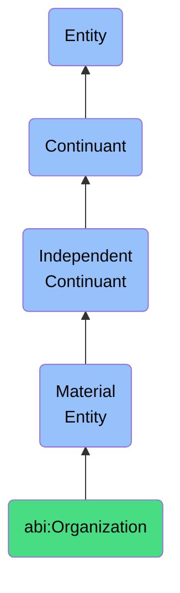

# Organization

## Definition
An organization is a material entity that coordinates the behavior and resources of individuals to achieve goals.

## Hierarchy in BFO


## Ontological Schema (TBox)
```turtle
abi:Organization a owl:Class ;
  rdfs:subClassOf bfo:0000040 ;
  rdfs:label "Organization" ;
  skos:definition "A collective material entity that coordinates the behavior and resources of individuals to achieve goals." .

abi:has_business_unit a owl:ObjectProperty ;
  rdfs:domain abi:Organization ;
  rdfs:range abi:BusinessUnit ;
  rdfs:label "has business unit" .

abi:employs a owl:ObjectProperty ;
  rdfs:domain abi:Organization ;
  rdfs:range abi:Person ;
  rdfs:label "employs" .

abi:has_goal a owl:ObjectProperty ;
  rdfs:domain abi:Organization ;
  rdfs:range abi:Goal ;
  rdfs:label "has goal" .
```

## Ontological Instance (ABox)
```turtle
ex:Acme a abi:Organization ;
  rdfs:label "Acme Corporation" ;
  abi:has_business_unit ex:AcmeResearch, ex:AcmeSales ;
  abi:employs ex:JohnDoe, ex:JaneSmith ;
  abi:has_goal ex:IncreaseProfitability, ex:ExpandMarketShare .

ex:TechStartup a abi:Organization ;
  rdfs:label "TechStartup Inc." ;
  abi:has_business_unit ex:EngineeringTeam, ex:MarketingTeam ;
  abi:employs ex:AlexJohnson, ex:SamLee ;
  abi:has_goal ex:ProductLaunch, ex:SecureFunding .
```

## Related Classes
- **abi:BusinessUnit** - A material entity that is a subdivision of an organization that operates semi-independently in delivering specific functions or services.
- **abi:ClientEntity** - A material entity that is an external organization that engages with the ABI platform in a commercial or collaborative relationship.
- **abi:Person** - A material entity that has the capacity for intentional action, language, and social participation. 