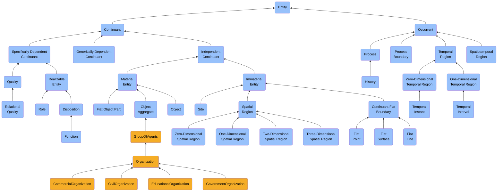
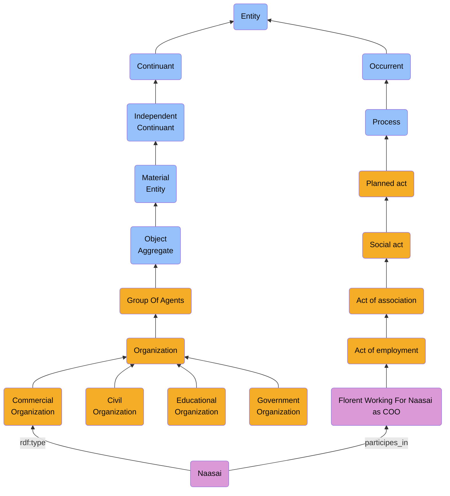
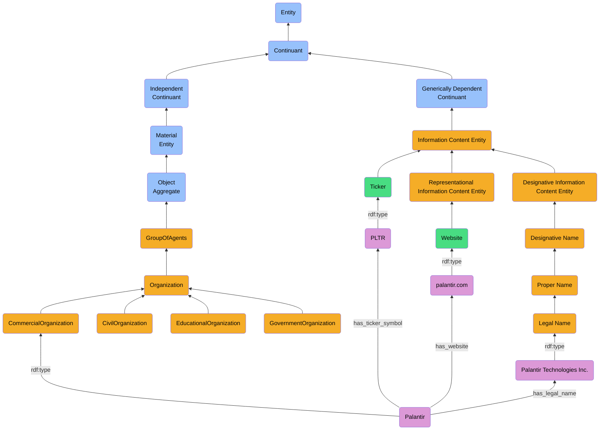

# Organization

## Hierarchy Representation




## Class & subClassOf

```turtle
cco:ont00001180 a owl:Class ;
    rdfs:subClassOf cco:ont00000300 ;
    rdfs:comment "Members of organizations are either Organizations themselves or individual Persons. Members can bear specific Organization Member Roles that are determined in the organization rules. The organization rules also determine how decisions are made on behalf of the Organization by the organization members."@en ;
    rdfs:label "Organization"@en ;
    skos:definition "A Group of Agents which can be the bearer of roles, has members, and has a set of organization rules."@en ;
    cco:ont00001754 "http://purl.bfolibrary.org/bfo/OBI_0000245" ;
    cco:ont00001760 "https://www.commoncoreontologies.org/AgentOntology"^^xsd:anyURI .

cco:ont00000443 a owl:Class ;
    rdfs:subClassOf cco:ont00001180 ;
    rdfs:label "Commercial Organization"@en ;
    skos:definition "An Organization that is the bearer of a Commercial Role and whose primary objective is to make a profit from the provision of goods or services."@en ;
    cco:ont00001760 "https://www.commoncoreontologies.org/AgentOntology"^^xsd:anyURI .

cco:ont00001302 rdf:type owl:Class ;
    owl:equivalentClass [ owl:intersectionOf ( cco:ont00001180
                                            [ rdf:type owl:Restriction ;
                                                owl:onProperty bfo:BFO_0000196 ;
                                                owl:someValuesFrom cco:ont00000173
                                            ]
                                            ) ;
                        rdf:type owl:Class
                        ] ;
    rdfs:subClassOf cco:ont00001180 ;
    rdfs:label "Civil Organization"@en ;
    skos:definition "An Organization that is not commercial or military and is the bearer of a Civilian Role."@en ;
    cco:ont00001760 "https://www.commoncoreontologies.org/AgentOntology"^^xsd:anyURI .

cco:ont00000564 a owl:Class ;
    rdfs:subClassOf cco:ont00001180 ;
    rdfs:label "Educational Organization"@en ;
    skos:definition "An Organization whose primary purpose is to provide training or otherwise facilitate learning or the acquisition of knowledge, Skills, values, beliefs, or habits."@en ;
    cco:ont00001754 "https://en.wikipedia.org/w/index.php?title=Education&oldid=1064011752"^^xsd:anyURI ;
    cco:ont00001760 "https://www.commoncoreontologies.org/AgentOntology"^^xsd:anyURI .

cco:ont00000408 a owl:Class ;
    rdfs:subClassOf cco:ont00001180 ,
                    [ rdf:type owl:Restriction ;
                    owl:onProperty bfo:BFO_0000176 ;
                    owl:someValuesFrom cco:ont00001335
                    ] ;
    rdfs:label "Government Organization"@en ;
    skos:definition "An Organization that is part of a Government and is responsible for the oversight or administration of specific governmental functions."@en ;
    cco:ont00001760 "https://www.commoncoreontologies.org/AgentOntology"^^xsd:anyURI .
```

## Object Properties & subPropertyOf

### Representing: participates_in (BFO_0000056)

The "participates_in" property (BFO_0000056) is defined as an ObjectProperty in the ontology with the following characteristics:

1. It has an inverse property "has_participant" (BFO_0000057)

2. Its domain (the types of things that can participate) is defined as a union of:
   - Specifically dependent continuants (BFO_0000020)
   - Generically dependent continuants (BFO_0000031) 
   - Independent continuants (BFO_0000004) that are not spatial regions (BFO_0000006)

3. Its range (the types of things that can be participated in) is Process (BFO_0000015)

4. It has the identifier "250-BFO"

5. It is labeled in English as "participates in"

6. Its definition states that it represents a relationship between:
   - A continuant (either specifically dependent, generically dependent, or independent but not a spatial region)
   - And a process that the continuant participates in

7. There is a scope note indicating that users needing more complex temporal representations should use the BFO temporal extensions

**Turtle representation**
```turtle
<http://purl.obolibrary.org/obo/BFO_0000056> rdf:type owl:ObjectProperty ;
                                             owl:inverseOf <http://purl.obolibrary.org/obo/BFO_0000057> ;
                                             rdfs:domain [ rdf:type owl:Class ;
                                                           owl:unionOf ( <http://purl.obolibrary.org/obo/BFO_0000020>
                                                                         <http://purl.obolibrary.org/obo/BFO_0000031>
                                                                         [ owl:intersectionOf ( <http://purl.obolibrary.org/obo/BFO_0000004>
                                                                                                [ rdf:type owl:Class ;
                                                                                                  owl:complementOf <http://purl.obolibrary.org/obo/BFO_0000006>
                                                                                                ]
                                                                                              ) ;
                                                                           rdf:type owl:Class
                                                                         ]
                                                                       )
                                                         ] ;
                                             rdfs:range <http://purl.obolibrary.org/obo/BFO_0000015> ;
                                             dc11:identifier "250-BFO" ;
                                             rdfs:label "participates in"@en ;
                                             skos:definition "(Elucidation) participates in holds between some b that is either a specifically dependent continuant or generically dependent continuant or independent continuant that is not a spatial 
                                             region & some process p such that b participates in p some way"@en ;
                                             skos:scopeNote "Users that require more sophisticated representations of time are encouraged to import a temporal extension of BFO-Core provided by the BFO development team. See documentation for 
                                             guidance: <https://github.com/BFO-ontology/BFO-2020/tree/master/src/owl/profiles/temporal%20extensions>"@en .
```

This property is used to connect Organizations (which are Independent Continuants) to the Processes they participate in, such as Acts of Employment.

#### Organizations "participates in" Act of employment (ont00001226)

The following represents the relationship between Organizations and Acts of employment. 
An Organization can participate in an Act of employment, which is a type of Social act and Planned act. 
This relationship is represented using the BFO participates_in (BFO_0000056) object property.
The inverse property "has_participant" (BFO_0000057) will be represented in "Act of employment" (ont00001226) documentation.

For example, when an Organization hires an employee, the Organization participates_in an Act of employment.
This is shown in the diagram where "Naasai" (a Commercial Organization) participates_in "Florent Working For Naasai as COO" (an Act of employment).

The participates_in property has:
- Domain: Independent Continuant (which includes Organizations)
- Range: Process (which includes Acts of employment)



### Representing: is_carrier_of (BFO_0000101)

The "is_carrier_of" property (BFO_0000101) is defined as an ObjectProperty in the ontology with the following characteristics:

1. It has an inverse property "has_carrier" (BFO_0000102)

2. Its domain (the types of things that can be carriers) is:
   - Independent continuants (BFO_0000004) that are not spatial regions (BFO_0000006)

3. Its range (the types of things that can be carried) is:
   - Generically dependent continuants (BFO_0000031)

**Turtle representation**
```turtle
<http://purl.obolibrary.org/obo/BFO_0000101> rdf:type owl:ObjectProperty ;
                                             rdfs:domain [ owl:intersectionOf ( <http://purl.obolibrary.org/obo/BFO_0000004>
                                                                                [ rdf:type owl:Class ;
                                                                                  owl:complementOf <http://purl.obolibrary.org/obo/BFO_0000006>
                                                                                ]
                                                                              ) ;
                                                           rdf:type owl:Class
                                                         ] ;
                                             rdfs:range <http://purl.obolibrary.org/obo/BFO_0000031> ;
                                             dc11:identifier "254-BFO" ;
                                             rdfs:label "is carrier of"@en ;
                                             skos:definition "b is carrier of c =Def there is some time t such that c generically depends on b at t"@en ;
                                             skos:scopeNote "Users that require more sophisticated representations of time are encouraged to import a temporal extension of BFO-Core provided by the BFO development team. See documentation for guidance: <https://github.com/BFO-ontology/BFO-2020/tree/master/src/owl/profiles/temporal%20extensions>"@en .
```

This property is used to connect Organizations (which are Independent Continuants) to the Processes they are carriers of, such as Acts of Employment.

#### Organizations "is carrier of" a multiples Information Content Entities

The following represents the relationship between Organizations and Information Content Entities.
An Organization can be the carrier of multiple Information Content Entities, which can be of different types such as Ticker, Website, or Legal Name.
This relationship is represented using the BFO carrier_of (BFO_0000101) object property.
The inverse property "has_carrier" (BFO_0000102) will be represented in "Information Content Entity" (ont00000958) documentation.

For example, the Organization "Naasai" has a Ticker (ont00000958), a Website (ont00001069), and a Legal Name (ont00001331).




```turtle
abi:hasTickerSymbol a owl:ObjectProperty ;
    rdfs:subPropertyOf bfo:BFO_0000101 ; # is carrier of
    rdfs:domain cco:ont00001180 ;
    rdfs:range abi:Ticker ;
    rdfs:label "has ticker"@en ;
    skos:definition "Relates an Organization to its ticker, which is a unique symbol assigned to a publicly traded company for identification purposes on stock exchanges."@en .

abi:hasLegalName a owl:ObjectProperty ;
    rdfs:subPropertyOf bfo:BFO_0000101 ; # is carrier of
    rdfs:domain cco:ont00001180 ;
    rdfs:range cco:ont00001331 ;
    rdfs:label "has legal name"@en ;
    skos:definition "Relates an Organization to its legal name, which is a formally registered designation of the organization."@en .

abi:hasWebsite a owl:ObjectProperty ;
    rdfs:subPropertyOf bfo:BFO_0000101 ; # is carrier of
    rdfs:domain cco:ont00001180 ;
    rdfs:range abi:Website ;
    rdfs:label "has website"@en ;
    skos:definition "Relates an organization to its website."@en ;
```