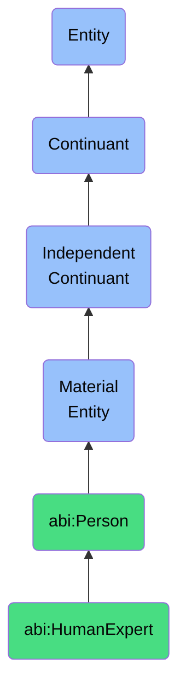

# HumanExpert

## Definition
A human expert is a material entity that is a person who possesses recognized domain knowledge and participates in review, validation, or creation processes.

## Hierarchy in BFO


## Ontological Schema (TBox)
```turtle
abi:HumanExpert a owl:Class ;
  rdfs:subClassOf abi:Person ;
  rdfs:label "Human Expert" ;
  skos:definition "A person that possesses recognized domain knowledge and participates in review, validation, or creation processes." .

abi:has_expertise a owl:ObjectProperty ;
  rdfs:domain abi:HumanExpert ;
  rdfs:range abi:ExpertiseDomain ;
  rdfs:label "has expertise" .

abi:validates a owl:ObjectProperty ;
  rdfs:domain abi:HumanExpert ;
  rdfs:range abi:ObservationRecord ;
  rdfs:label "validates" .
```

## Ontological Instance (ABox)
```turtle
ex:DrJaneSmith a abi:HumanExpert ;
  rdfs:label "Dr. Jane Smith" ;
  abi:has_role ex:DomainExpert ;
  abi:has_expertise ex:MachineLearning, ex:ArtificialIntelligence ;
  abi:validates ex:AIObservation123, ex:ModelPrediction456 .

ex:ProfRobert a abi:HumanExpert ;
  rdfs:label "Professor Robert Chen" ;
  abi:has_expertise ex:ComputerVision, ex:DataScience ;
  abi:validates ex:ImageAnnotation789 .
```

## Related Classes
- **abi:Person** - A material entity that has the capacity for intentional action, language, and social participation.
- **abi:Organization** - A material entity that is a collective coordinating the behavior and resources of individuals to achieve goals.
- **abi:AIAssistant** - A material entity that is a software-controlled agent performing tasks on behalf of a user but represented ontologically as a service-deployed entity with memory, identity, and role. 