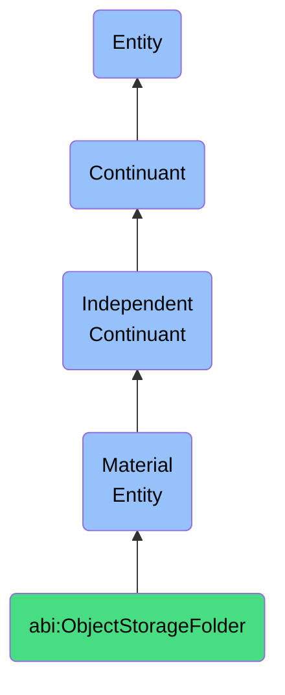

# ObjectStorageFolder

## Definition
An object storage folder is a material entity that is a physical or virtual folder within a file system that holds time-versioned or semantically grouped resources.

## Hierarchy in BFO


## Ontological Schema (TBox)
```turtle
abi:ObjectStorageFolder a owl:Class ;
  rdfs:subClassOf bfo:0000040 ;
  rdfs:label "Object Storage Folder" ;
  skos:definition "A physical or virtual folder within a file system that holds time-versioned or semantically grouped resources." .

abi:located_in a owl:ObjectProperty ;
  rdfs:domain abi:ObjectStorageFolder ;
  rdfs:range abi:StorageSystem ;
  rdfs:label "located in" .

abi:contains_file a owl:ObjectProperty ;
  rdfs:domain abi:ObjectStorageFolder ;
  rdfs:range abi:DigitalAsset ;
  rdfs:label "contains file" .

abi:has_path a owl:DatatypeProperty ;
  rdfs:domain abi:ObjectStorageFolder ;
  rdfs:range xsd:string ;
  rdfs:label "has path" .

abi:has_access_policy a owl:ObjectProperty ;
  rdfs:domain abi:ObjectStorageFolder ;
  rdfs:range abi:AccessPolicy ;
  rdfs:label "has access policy" .
```

## Ontological Instance (ABox)
```turtle
ex:DocumentBucket a abi:ObjectStorageFolder ;
  rdfs:label "Document Storage Bucket" ;
  abi:located_in ex:S3Storage ;
  abi:contains_file ex:Contract123, ex:Proposal456, ex:Report789 ;
  abi:has_path "s3://company-documents/" ;
  abi:has_access_policy ex:RestrictedAccess .

ex:ImageRepository a abi:ObjectStorageFolder ;
  rdfs:label "Marketing Image Repository" ;
  abi:located_in ex:CloudStorage ;
  abi:contains_file ex:Logo, ex:ProductImages, ex:BannerGraphics ;
  abi:has_path "/marketing/images/" ;
  abi:has_access_policy ex:MarketingTeamAccess .
```

## Related Classes
- **abi:DatabaseInstance** - A material entity that is a container that stores structured information used by ABI components.
- **abi:ComputeContainer** - A material entity that is a software-deployed, bounded material system that runs a defined set of tasks, often mapped to an ABI workflow or service.
- **abi:DigitalAsset** - A material entity that is a file-based or database-stored resource that represents content, knowledge, or configuration, and can be versioned, deployed, or referenced. 