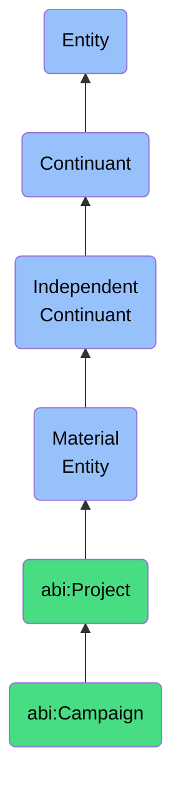

# Campaign

## Definition
A campaign is a material entity that is a time-bounded sequence of communications, promotions, or interactions targeting a goal (usually in growth or engagement).

## Hierarchy in BFO


## Ontological Schema (TBox)
```turtle
abi:Campaign a owl:Class ;
  rdfs:subClassOf abi:Project ;
  rdfs:label "Campaign" ;
  skos:definition "A time-bounded sequence of communications, promotions, or interactions targeting a goal (usually in growth or engagement)." .

abi:has_target_audience a owl:ObjectProperty ;
  rdfs:domain abi:Campaign ;
  rdfs:range abi:AudienceSegment ;
  rdfs:label "has target audience" .

abi:has_channel a owl:ObjectProperty ;
  rdfs:domain abi:Campaign ;
  rdfs:range abi:CommunicationChannel ;
  rdfs:label "has channel" .

abi:has_budget a owl:DatatypeProperty ;
  rdfs:domain abi:Campaign ;
  rdfs:range xsd:decimal ;
  rdfs:label "has budget" .

abi:has_engagement_metric a owl:ObjectProperty ;
  rdfs:domain abi:Campaign ;
  rdfs:range abi:EngagementMetric ;
  rdfs:label "has engagement metric" .
```

## Ontological Instance (ABox)
```turtle
ex:SummerSaleCampaign a abi:Campaign ;
  rdfs:label "Summer Sale 2023" ;
  abi:has_target_audience ex:ExistingCustomers, ex:ProspectCustomers ;
  abi:has_channel ex:Email, ex:SocialMedia, ex:WebsiteBanner ;
  abi:has_start_date "2023-06-01"^^xsd:date ;
  abi:has_end_date "2023-08-31"^^xsd:date ;
  abi:has_budget "50000.00"^^xsd:decimal ;
  abi:has_engagement_metric ex:ClickThroughRate, ex:ConversionRate .

ex:ProductAwarenessCampaign a abi:Campaign ;
  rdfs:label "New Product Launch Awareness" ;
  abi:has_target_audience ex:IndustryProfessionals, ex:EarlyAdopters ;
  abi:has_channel ex:LinkedIn, ex:IndustryWebinars, ex:PaidAdvertising ;
  abi:has_start_date "2023-09-15"^^xsd:date ;
  abi:has_end_date "2023-12-15"^^xsd:date ;
  abi:has_budget "75000.00"^^xsd:decimal ;
  abi:has_engagement_metric ex:BrandAwareness, ex:LeadGeneration .
```

## Related Classes
- **abi:Project** - A material entity that aggregates actions, tasks, and resources toward a defined outcome over a finite period.
- **abi:Task** - A material entity that is a discrete unit of work assigned to an agent with a clear objective, often linked to a broader workflow or capability.
- **abi:EngagementMetric** - A material entity that is a quantifiable measure that reflects the degree of interaction between users and content or campaigns. 