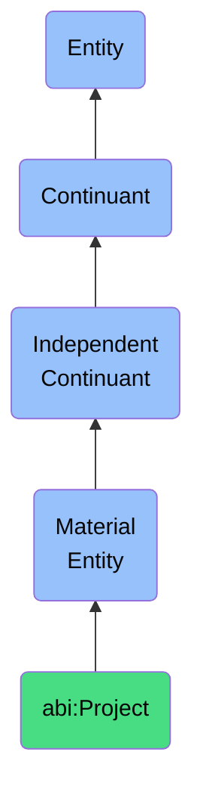

# Project

## Definition
A project is a material entity that aggregates actions, tasks, and resources toward a defined outcome over a finite period.

## Hierarchy in BFO


## Ontological Schema (TBox)
```turtle
abi:Project a owl:Class ;
  rdfs:subClassOf bfo:0000040 ;
  rdfs:label "Project" ;
  skos:definition "A material entity that aggregates actions, tasks, and resources toward a defined outcome over a finite period." .

abi:has_task a owl:ObjectProperty ;
  rdfs:domain abi:Project ;
  rdfs:range abi:Task ;
  rdfs:label "has task" .

abi:has_project_lead a owl:ObjectProperty ;
  rdfs:domain abi:Project ;
  rdfs:range abi:Person ;
  rdfs:label "has project lead" .

abi:has_start_date a owl:DatatypeProperty ;
  rdfs:domain abi:Project ;
  rdfs:range xsd:date ;
  rdfs:label "has start date" .

abi:has_end_date a owl:DatatypeProperty ;
  rdfs:domain abi:Project ;
  rdfs:range xsd:date ;
  rdfs:label "has end date" .

abi:has_status a owl:DatatypeProperty ;
  rdfs:domain abi:Project ;
  rdfs:range xsd:string ;
  rdfs:label "has status" .
```

## Ontological Instance (ABox)
```turtle
ex:MarketExpansionProject a abi:Project ;
  rdfs:label "Market Expansion Project" ;
  abi:has_task ex:MarketResearch, ex:StrategyDevelopment, ex:Implementation ;
  abi:has_project_lead ex:ProjectManager ;
  abi:has_start_date "2023-06-01"^^xsd:date ;
  abi:has_end_date "2024-05-31"^^xsd:date ;
  abi:has_status "In Progress" .

ex:ProductLaunchProject a abi:Project ;
  rdfs:label "Product Launch Project" ;
  abi:has_task ex:ProductDevelopment, ex:Marketing, ex:Distribution ;
  abi:has_project_lead ex:ProductManager ;
  abi:has_start_date "2023-09-15"^^xsd:date ;
  abi:has_end_date "2024-03-15"^^xsd:date ;
  abi:has_status "Active" .
```

## Related Classes
- **abi:Task** - A material entity that is a discrete unit of work assigned to an agent with a clear objective, often linked to a broader workflow or capability.
- **abi:Campaign** - A material entity that is a time-bounded sequence of communications, promotions, or interactions targeting a goal (usually in growth or engagement).
- **abi:WorkflowInstance** - A material entity that is a materialized instantiation of a process or set of tasks executing across systems or agents. 